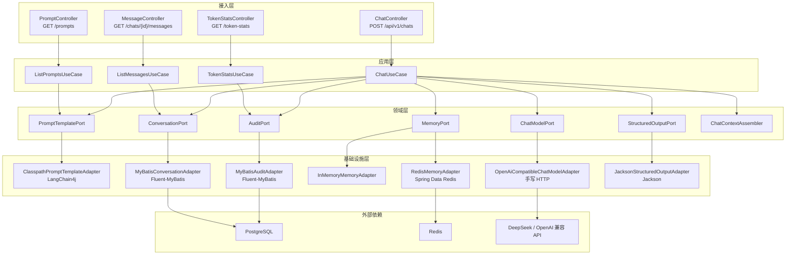
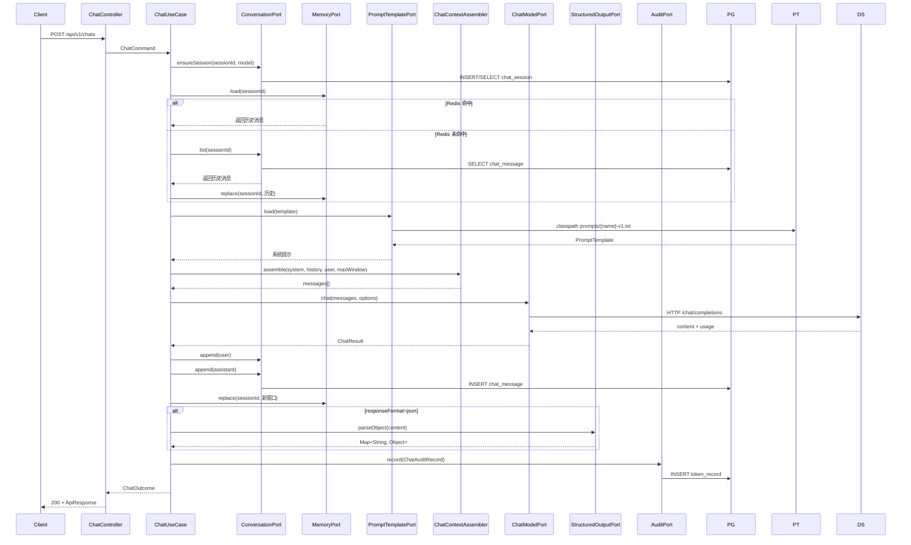

# Week 02 架构图 — spring-ai-demo

> 对应 Spec：`docs/specs/week-02.md`  
> 对应代码：`apps/spring-ai-demo`

## 1. 分层架构



## 2. 一次聊天请求的完整数据流



## 3. 各层职责

| 层 | 职责 | 示例类 |
|----|------|--------|
| 接入层 | HTTP 路由、参数校验、协议转换 | `ChatController` |
| 应用层 | 业务用例编排、事务边界 | `ChatUseCase` |
| 领域层 | 领域模型、端口接口、业务规则 | `ChatMessage`、`MemoryPort`、`ChatContextAssembler` |
| 基础设施层 | 外部服务适配、数据库、缓存、文件 | `JpaConversationAdapter`、`RedisMemoryAdapter` |

## 4. 中间件使用位置

| 中间件 | 对应代码 | 说明 |
|--------|----------|------|
| PostgreSQL | `infrastructure.persistence.*`<br>`infrastructure.persistence.mapper.*`<br>`db/migration/V2__chat_tables.sql` | 三张表：chat_session、chat_message、token_record |
| Redis | `infrastructure.memory.RedisMemoryAdapter` | 可选，存 `chat:memory:{sessionId}` |
| LangChain4j | `infrastructure.prompt.ClasspathPromptTemplateAdapter` | Prompt 模板渲染 |
| Jackson | `infrastructure.structured.JacksonStructuredOutputAdapter` | JSON 输出解析 |
| OpenAI 兼容 API | `infrastructure.llm.OpenAiCompatibleChatModelAdapter` | 第1周保留 |

## 5. 配置与实现对应关系

```yaml
llm.api-key:            → OpenAiCompatibleChatModelAdapter
llm.base-url:           → OpenAiCompatibleChatModelAdapter
llm.model:              → ChatRuntimeConfig / ChatModelPort

spring.datasource.*:    → MyBatisConversationAdapter / MyBatisAuditAdapter
spring.flyway.*:        → db/migration/V2__chat_tables.sql
spring.data.redis.*:    → RedisMemoryAdapter

chat.memory-provider:   → MemoryPort 实现切换
chat.audit-provider:    → AuditPort 实现切换（mybatis / memory）
chat.max-memory-messages: → ChatContextAssembler 截断窗口
```

## 6. YAGNI 边界

本周**没有引入**以下能力，后续周次按需扩展：

- RAG / Embedding / 向量数据库
- Agent / Tool Calling / Workflow
- 登录鉴权 / RBAC
- 网关 / 注册中心 / Kafka
- OpenTelemetry / Langfuse / SkyWalking
