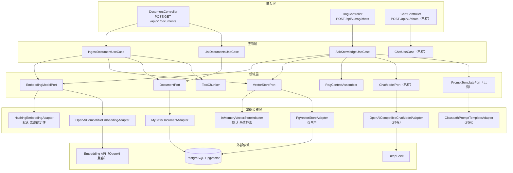
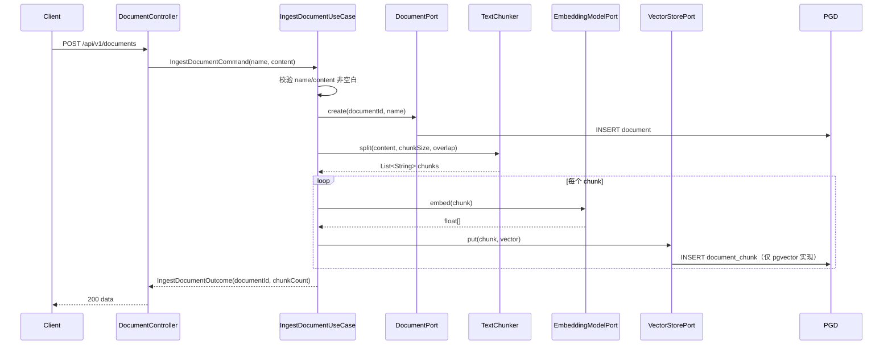
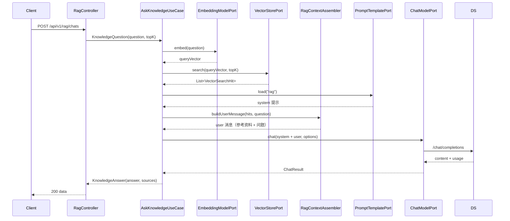

# Week 03 架构图 — RAG 知识库

> 对应 Spec：`docs/specs/week-03.md`  
> 对应代码：`apps/spring-ai-demo`

## 1. 分层架构



## 2. 文档入库数据流



## 3. RAG 问答数据流



## 4. 各层职责

| 层 | 职责 | 示例类 |
|----|------|--------|
| 接入层 | HTTP 路由、参数校验、协议转换 | `DocumentController`、`RagController` |
| 应用层 | 用例编排：入库 / 检索增强问答 | `IngestDocumentUseCase`、`AskKnowledgeUseCase` |
| 领域层 | 端口接口、切片、上下文组装 | `EmbeddingModelPort`、`TextChunker`、`RagContextAssembler` |
| 基础设施层 | 厂商适配、向量库、数据库、文件 | `HashingEmbeddingAdapter`、`PgVectorStoreAdapter`、`MyBatisDocumentAdapter` |

## 5. 中间件使用位置

| 中间件 | 对应代码 | 说明 |
|--------|----------|------|
| pgvector | `infrastructure.vector.PgVectorStoreAdapter`<br>`db/postgresql/V4__document_chunk_pgvector.sql` | 仅生产；`RAG_VECTOR_STORE=pgvector` 时启用 |
| PostgreSQL | `infrastructure.persistence.MyBatisDocumentAdapter`<br>`db/migration/V3__document_table.sql` | `document` 表 |
| Embedding（阿里云百炼） | `infrastructure.embedding.OpenAiCompatibleEmbeddingAdapter` | `EMBEDDING_PROVIDER=openai` 时启用，默认 `qwen3.7-text-embedding-flash`（1024 维） |
| 离线向量化 | `infrastructure.embedding.HashingEmbeddingAdapter` | 默认，确定性词袋哈希 |
| LangChain4j | 不涉及（本周 Embedding 走手写 HTTP） | Prompt 渲染沿用第 2 周 |
| DeepSeek | `infrastructure.llm.OpenAiCompatibleChatModelAdapter`（已有） | RAG 最终回答 |

## 6. 配置与实现对应关系

```yaml
embedding.provider:      → HashingEmbeddingAdapter / OpenAiCompatibleEmbeddingAdapter 切换
embedding.base-url:      → OpenAiCompatibleEmbeddingAdapter
embedding.api-key:       → OpenAiCompatibleEmbeddingAdapter（密钥，只走环境变量）
embedding.model:         → OpenAiCompatibleEmbeddingAdapter
embedding.dimension:     → HashingEmbeddingAdapter 向量维度（与 pgvector 列一致，固定 1024）

rag.vector-store:        → VectorStorePort 实现切换（memory / pgvector）
rag.default-top-k:       → AskKnowledgeUseCase 默认检索条数
rag.chunk-size:          → TextChunker 切片窗口
rag.chunk-overlap:       → TextChunker 切片重叠

spring.flyway.locations: → db/migration（共享）+ db/postgresql（仅生产）
```

## 7. YAGNI 边界

本周**没有引入**以下能力，后续周次按需扩展：

- 意图识别 / 路由（先识别意图再决定是否检索，属第 5 周 Agent）
- PDF / Word / Office 解析（Tika / POI，本周纯文本）
- RAG 问答的 Token 审计（留待第 4 周企业知识库 Agent）
- 跨端口入库事务（入库中断的孤儿切片处理，留待第 4 周）
- 登录鉴权 / RBAC、多知识库隔离
