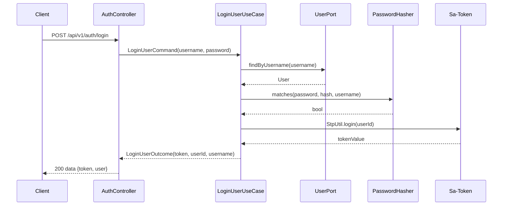
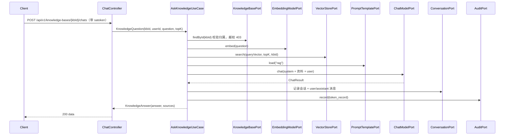

# Week 04 架构图 — enterprise-knowledge-agent（企业知识库 Agent V1）

> 对应 Spec：`docs/specs/week-04.md`  
> 对应代码：`apps/enterprise-knowledge-agent`

## 1. 分层架构

```mermaid
flowchart TB
    subgraph 接入层["接入层"]
        AC["AuthController"]
        KBC["KnowledgeBaseController"]
        DC["DocumentController"]
        CC["ChatController"]
        TSC["TokenStatsController"]
        FC["FileController"]
        OC["OcrController"]
    end

    subgraph 鉴权["鉴权 Sa-Token"]
        ST["StpUtil + SaInterceptor @SaCheckLogin"]
    end

    subgraph 应用层["应用层"]
        RU["Register/Login/Logout/GetCurrentUser"]
        KBU["Create/List/Get/Update/Delete KB"]
        DU["Ingest/List/Delete Document"]
        AU["AskKnowledgeUseCase"]
        HU["ListChatHistoryUseCase"]
        TU["TokenStatsUseCase"]
        FU["Upload/GetFile"]
        OU["RecognizeOcrUseCase"]
    end

    subgraph 领域层["领域层"]
        UP["UserPort"]
        KBP["KnowledgeBasePort"]
        DP["DocumentPort"]
        EP["EmbeddingModelPort"]
        VP["VectorStorePort"]
        CP["ConversationPort"]
        AP["AuditPort"]
        MP["ChatModelPort"]
        PP["PromptTemplatePort"]
        FSP["FileStoragePort"]
        IDP["ImageDownloadPort"]
        PH["PasswordHasher"]
        FUA["FileUrlAssembler"]
        OIP["OcrMarkdownImageProcessor"]
        TC["TextChunker"]
        RCA["RagContextAssembler"]
    end

    subgraph 基础设施层["基础设施层"]
        MBU["MyBatisUserAdapter"]
        MBK["MyBatisKnowledgeBaseAdapter"]
        MBD["MyBatisDocumentAdapter"]
        MBC["MyBatisConversationAdapter"]
        MBA["MyBatisAuditAdapter"]
        HE["HashingEmbeddingAdapter"]
        OE["OpenAiCompatibleEmbeddingAdapter"]
        IM["InMemoryVectorStoreAdapter"]
        PG["PgVectorStoreAdapter"]
        LLM["OpenAiCompatibleChatModelAdapter"]
        PT["ClasspathPromptTemplateAdapter"]
        LFS["LocalFileStorageAdapter"]
        HID["HttpImageDownloadAdapter"]
        SAA["SaTokenAuthTokenAdapter"]
        SMH["SaTokenMd5PasswordHasher"]
    end

    subgraph 外部依赖["外部依赖"]
        PGD[(PostgreSQL + pgvector)]
        EMB["Embedding API（阿里云百炼）"]
        DS["DeepSeek"]
        OCR["PaddleOCR-VL（千帆）"]
        DISK[(本地文件目录)]
    end

    AC --> ST
    KBC --> ST
    DC --> ST
    CC --> ST
    TSC --> ST
    FC --> ST
    OC --> ST

    AC --> RU
    KBC --> KBU
    DC --> DU
    CC --> AU
    CC --> HU
    TSC --> TU
    FC --> FU
    OC --> OU

    RU --> UP
    KBU --> KBP
    DU --> DP
    DU --> EP
    DU --> VP
    AU --> EP
    AU --> VP
    AU --> MP
    AU --> PP
    HU --> CP
    TU --> AP
    FU --> FSP
    OU --> OIP
    OIP --> IDP
    OIP --> FSP
    OIP --> FUA

    UP --> MBU
    KBP --> MBK
    DP --> MBD
    CP --> MBC
    AP --> MBA
    EP --> HE
    EP --> OE
    VP --> IM
    VP --> PG
    MP --> LLM
    PP --> PT
    FSP --> LFS
    IDP --> HID

    MBU --> PGD
    MBK --> PGD
    MBD --> PGD
    MBC --> PGD
    MBA --> PGD
    PG --> PGD
    OE --> EMB
    LLM --> DS
    OCR --> OCR
    LFS --> DISK
```



## 2. 登录时序



## 3. 知识库问答时序



## 4. 数据模型（多租户三级：用户 → 知识库 → 文档）

| 表 | 关键字段 | 说明 |
|----|----------|------|
| app_user | id, username(UK), password_hash | 用户，密码加盐 md5 哈希 |
| knowledge_base | id, user_id(FK), name, description | 知识库，归属用户 |
| document | id, knowledge_base_id(FK), name, chunk_count | 文档元数据 |
| document_chunk | id, document_id(FK), content, vector | 切片 + 向量（仅 pgvector） |
| chat_session | id, user_id, knowledge_base_id, title | 会话 |
| chat_message | id, session_id, role, content | 消息历史 |
| token_record | id, user_id, session_id, model, prompt/completion/total_tokens | Token 审计 |
| file_record | id, file_id(UK), original_name, storage_type, storage_key, user_id | 文件元数据 |

## 5. 各层职责

| 层 | 职责 | 示例类 |
|----|------|--------|
| 接入层 | HTTP 路由、参数校验、Sa-Token 取当前用户、协议转换 | `AuthController`、`KnowledgeBaseController` |
| 应用层 | 用例编排、多租户归属校验、事务边界 | `AskKnowledgeUseCase`、`IngestDocumentUseCase` |
| 领域层 | 端口接口、领域服务、值对象 | `FileUrlAssembler`、`OcrMarkdownImageProcessor`、`TextChunker` |
| 基础设施层 | 厂商适配、数据库、向量库、文件存储 | `PgVectorStoreAdapter`、`LocalFileStorageAdapter`、`SaTokenMd5PasswordHasher` |

## 6. 中间件使用位置

| 中间件 | 对应代码 | 说明 |
|--------|----------|------|
| Sa-Token | `infrastructure.security.SaTokenAuthTokenAdapter`、`SaTokenConfig` | 登录/令牌/RBAC，header `satoken` |
| PostgreSQL | `infrastructure.persistence.MyBatis*Adapter` | 7 张表（V1~V5 迁移） |
| pgvector | `infrastructure.vector.PgVectorStoreAdapter`、`db/postgresql/V6__document_chunk_pgvector.sql` | 仅生产，`RAG_VECTOR_STORE=pgvector` |
| Fluent-MyBatis | `infrastructure.persistence.*` | 仓储实现 |
| Flyway | `db/migration` + `db/postgresql` | 建表 + pgvector 扩展 |
| Embedding（阿里云百炼） | `infrastructure.embedding.OpenAiCompatibleEmbeddingAdapter` | `EMBEDDING_PROVIDER=openai`，默认 `qwen3.7-text-embedding-flash` |
| DeepSeek | `infrastructure.llm.OpenAiCompatibleChatModelAdapter` | RAG 最终回答 |
| PaddleOCR-VL | `infrastructure.ocr.PaddleOcrVlAdapter` | OCR 识别（千帆） |
| LangChain4j | `infrastructure.prompt.ClasspathPromptTemplateAdapter` | 仅 Prompt 渲染 |
| 本地文件 | `infrastructure.storage.LocalFileStorageAdapter` | 默认存储，OSS/OBS 接口预留 |

## 7. 配置与实现对应关系

```yaml
sa-token.token-name:      → 鉴权 header 名（satoken）
llm.*:                    → OpenAiCompatibleChatModelAdapter
embedding.provider:       → HashingEmbeddingAdapter / OpenAiCompatibleEmbeddingAdapter 切换
embedding.base-url/api-key/model: → OpenAiCompatibleEmbeddingAdapter
rag.vector-store:         → VectorStorePort 实现切换（memory / pgvector）
rag.default-top-k/chunk-size/chunk-overlap: → 检索/切片参数
ocr.provider/base-url/api-key/model: → PaddleOcrVlAdapter
auth.password-salt:       → SaTokenMd5PasswordHasher（盐，生产必须环境变量覆盖）
file.storage-dir:         → LocalFileStorageAdapter
file.public-base-url:     → FileUrlAssembler（fileId 访问路径）
```

## 8. YAGNI 边界

本周**没有引入**以下能力，后续周次按需扩展：

- JWT（默认 Sa-Token 随机令牌）、Sa-Token 会话迁 Redis
- OSS/OBS 落地（仅接口预留，需密钥+SDK）
- Tika / POI 解析 Office；Spring Security 全家桶
- 共享库模块（等第 3 个模块出现再抽，见 week-04 ADR「规则三」）
- 意图路由 / Tool Calling / Agent（第 5 周起）
