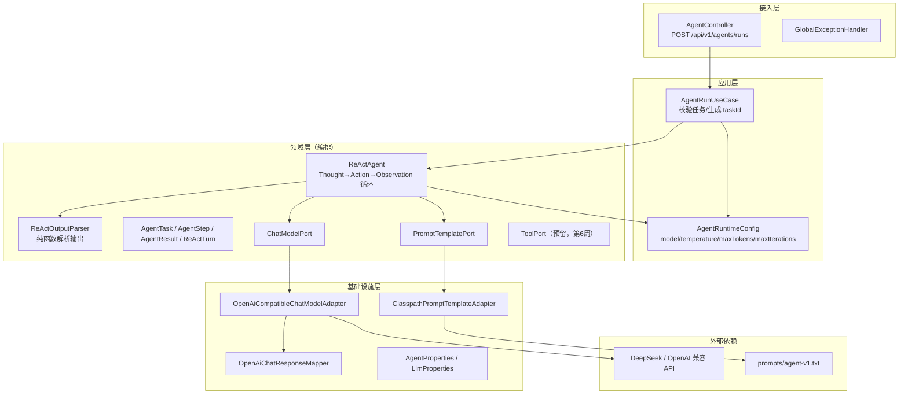
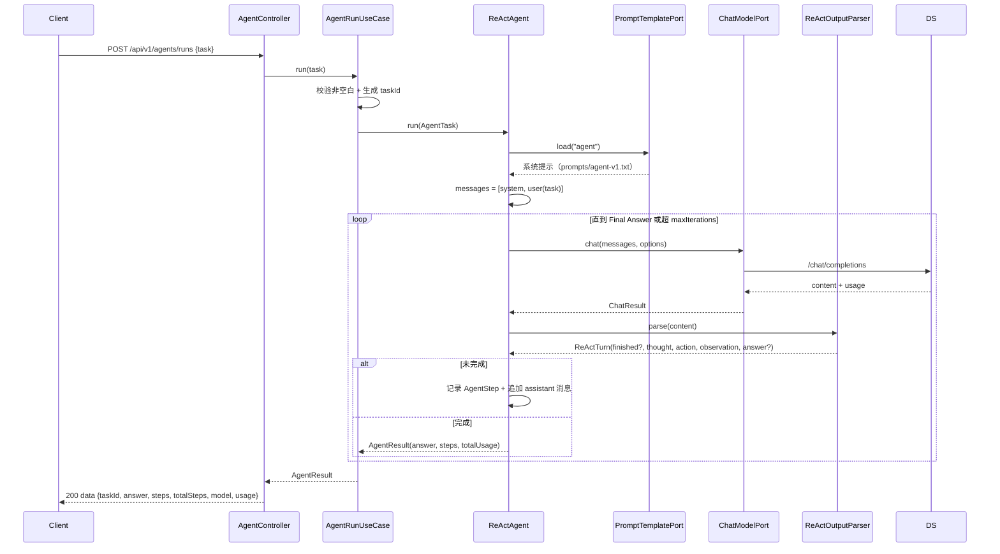

# Week 05 架构图 — patient-agent（ReAct Agent）

> 对应 Spec：`docs/specs/week-05.md`  
> 对应代码：`apps/patient-agent`

## 1. 分层架构



## 2. ReAct 循环数据流



## 3. 各层职责

| 层 | 职责 | 示例类 |
|----|------|--------|
| 接入层 | HTTP 路由、参数校验、协议转换 | `AgentController` |
| 应用层 | 用例编排：任务校验、taskId 生成 | `AgentRunUseCase` |
| 领域层 | ReAct 循环编排、输出解析、值对象、端口 | `ReActAgent`、`ReActOutputParser`、`ToolPort` |
| 基础设施层 | 模型厂商适配、Prompt 加载、配置装配 | `OpenAiCompatibleChatModelAdapter`、`ClasspathPromptTemplateAdapter` |

## 4. 中间件使用位置

| 中间件 | 对应代码 | 说明 |
|--------|----------|------|
| DeepSeek / OpenAI 兼容 API | `infrastructure.llm.OpenAiCompatibleChatModelAdapter` | ReAct 每轮思考/行动/观察 |
| LangChain4j | `infrastructure.prompt.ClasspathPromptTemplateAdapter` | 仅 Prompt 模板渲染（`langchain4j-core`） |
| 无数据库 / 无 Redis / 无鉴权 | — | 本周无状态演示，trace 随响应返回 |

## 5. 配置与实现对应关系

```yaml
llm.base-url:        → OpenAiCompatibleChatModelAdapter
llm.api-key:         → OpenAiCompatibleChatModelAdapter（密钥，只走环境变量）
llm.model:           → AgentRuntimeConfig.model
llm.temperature:     → AgentRuntimeConfig.temperature
llm.max-tokens:      → AgentRuntimeConfig.maxTokens

agent.prompt-version: → ClasspathPromptTemplateAdapter（对应 prompts/agent-v1.txt）
agent.max-iterations: → AgentRuntimeConfig.maxIterations（ReAct 循环兜底）
```

## 6. YAGNI 边界

本周**没有引入**以下能力，后续周次按需扩展：

- Tool 实现（`ToolPort` 仅接口预留，第 6 周 Function Calling）
- Agent Memory / Redis（第 7 周）
- Spring AI Alibaba / LangChain4j Agent 编排框架（第 8 周）
- 持久化执行记录（第 12 周 Agent 平台）
- 登录鉴权 / RBAC、数据库
