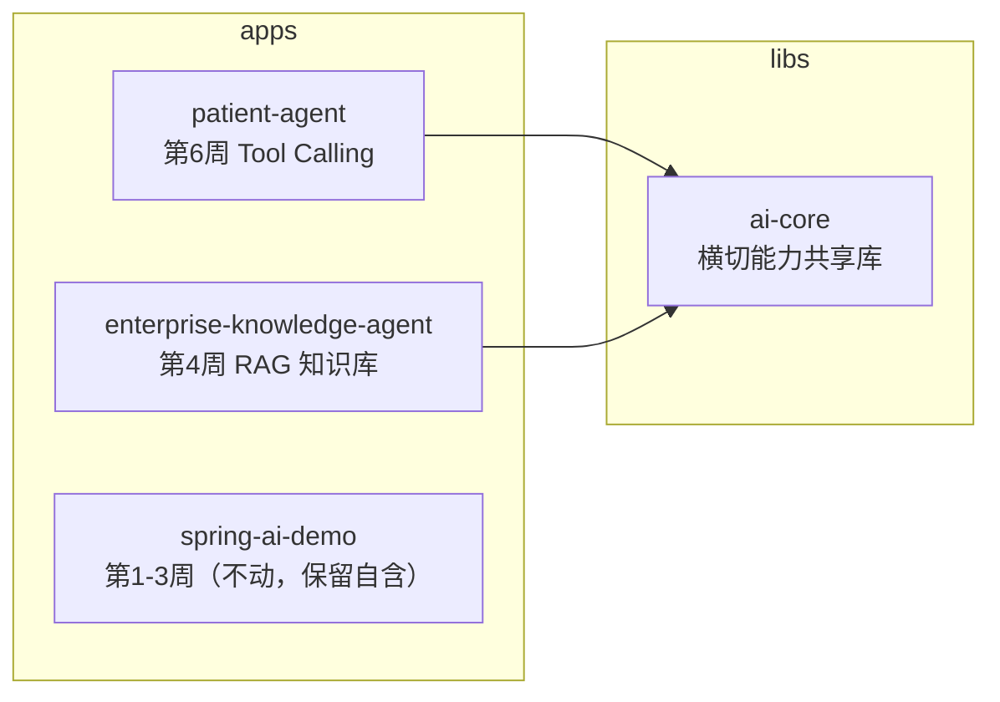
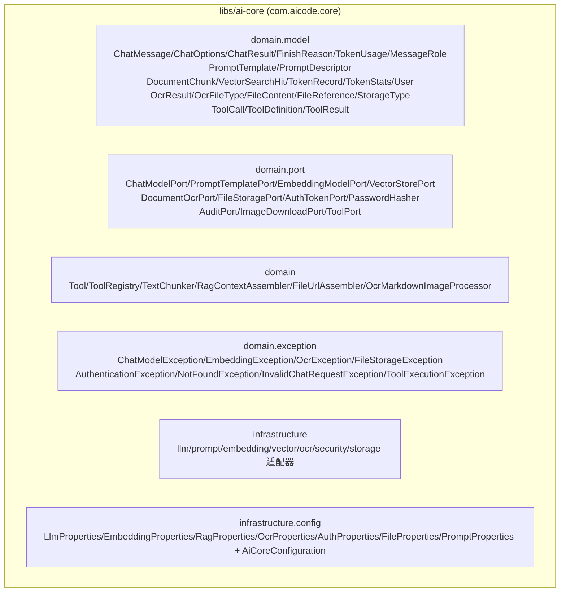
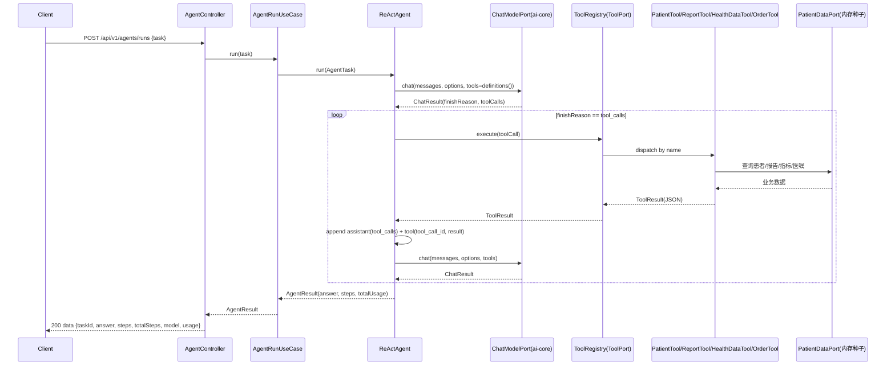

# Week 06 架构图 — ai-core 共享库 + patient-agent（Tool Calling）

> 对应 Spec：`docs/specs/week-06.md`  
> 对应代码：`libs/ai-core`、`apps/enterprise-knowledge-agent`、`apps/patient-agent`

## 1. 模块依赖关系



## 2. ai-core 分层（com.aicode.core）



## 3. patient-agent Tool Calling 数据流



## 4. 各层职责

| 层 | 职责 | 示例类 |
|----|------|--------|
| 接入层 | HTTP 路由、参数校验、协议转换 | `AgentController`、`GlobalExceptionHandler` |
| 应用层 | 用例编排：任务校验、taskId 生成 | `AgentRunUseCase` |
| 领域层 | Function Calling 循环编排、值对象、端口 | `ReActAgent`、`AgentStep`、`PatientDataPort` |
| 工具层 | 具体业务工具（定义 JSON Schema + 执行） | `PatientTool`/`ReportTool`/`HealthDataTool`/`OrderTool` |
| ai-core | 模型/Prompt/工具契约/Embedding/向量/RAG/OCR/鉴权/文件/审计 | `ToolRegistry`、`OpenAiCompatibleChatModelAdapter` 等 |
| 数据层 | 患者业务数据（内存种子，可替换 DB） | `InMemoryPatientDataAdapter` |

## 5. 工具调用链（关键咽喉点）

`ReActAgent` → `ToolPort`（`ToolRegistry`）→ 按 name 分发 → 具体 `Tool` → `PatientDataPort`。

`ToolRegistry` 是**所有工具执行的唯一咽喉点**，后续权限（第 13 周）、脱敏/Guardrails（第 14 周）、限流在此统一拦截。

## 6. 配置与实现对应关系

```yaml
prompt.version:        → ClasspathPromptTemplateAdapter（ai-core，对应 prompts/{name}-v1.txt）
llm.base-url/api-key:  → OpenAiCompatibleChatModelAdapter（ai-core）
agent.max-iterations:  → AgentRuntimeConfig.maxIterations（循环兜底）
```

## 7. YAGNI 边界

- 患者业务数据本周为**内存种子 + 端口**，DB 持久化留待第 9/12 周
- `spring-ai-demo` 未收敛到 ai-core，保持独立
- `LocalFileStorageAdapter`/`MyBatisAuditAdapter` 等绑定 app 持久化的适配器留在 enterprise
- SaToken 拦截器（路径规则）留在 enterprise，ai-core 只提供 Sa-Token 适配器
