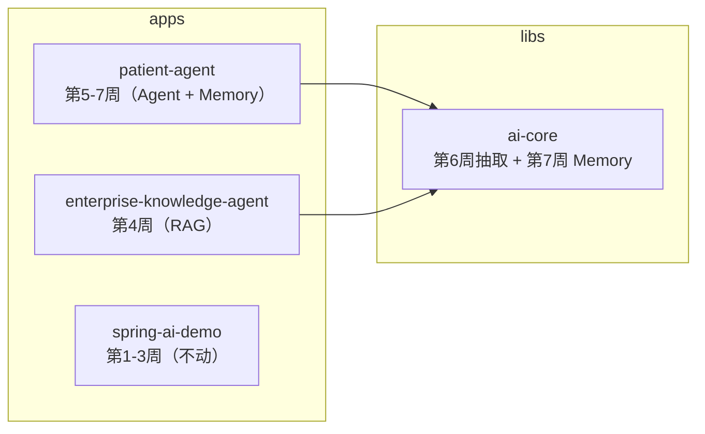
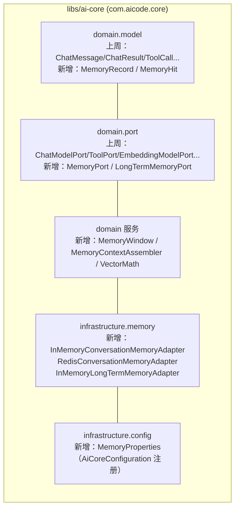
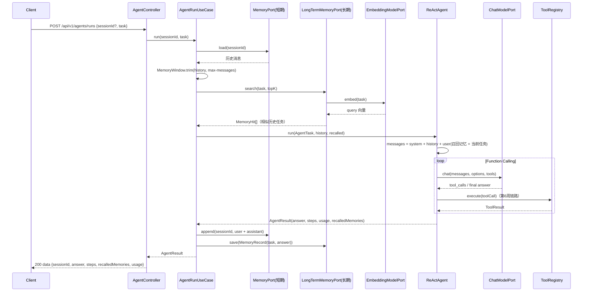

# Week 07 架构图 — Agent Memory（短期会话记忆 + 长期向量记忆）

> 对应 Spec：`docs/specs/week-07.md`
> 对应代码：`libs/ai-core`、`apps/patient-agent`

## 1. 模块依赖关系



## 2. ai-core 记忆分层（本周新增）



## 3. patient-agent 记忆数据流



## 4. 各层职责

| 层 | 职责 | 示例类 |
|----|------|--------|
| 接入层 | HTTP 路由、参数校验、协议转换 | `AgentController`、`GlobalExceptionHandler` |
| 应用层 | 用例编排：任务校验、sessionId、记忆读写 | `AgentRunUseCase` |
| 领域层 | Function Calling 循环 + 上下文装配 | `ReActAgent`、`AgentTask`、`AgentResult` |
| 记忆层（ai-core） | 记忆契约、窗口截断、召回拼装、余弦 | `MemoryPort`、`LongTermMemoryPort`、`MemoryWindow`、`MemoryContextAssembler`、`VectorMath` |
| 记忆适配（ai-core） | 内存 / Redis 短期，内存向量长期 | `InMemoryConversationMemoryAdapter`、`RedisConversationMemoryAdapter`、`InMemoryLongTermMemoryAdapter` |
| ai-core 其余 | 模型 / Prompt / 工具契约 / Embedding / 向量 / RAG / OCR / 鉴权 / 文件 / 审计 | 第 6 周已收敛 |

## 5. 关键咽喉点与安全

- 短期记忆只存 `user` / `assistant` 文本；`system` 提示始终来自 `prompts/agent-v1.txt`。
- 召回的历史任务通过 `MemoryContextAssembler` 作为 **user 消息正文** 注入（与 `RagContextAssembler` 同构），绝不拼进 system 提示，避免用户输入污染指令。
- `memory.max-messages` 限制会话窗口，防止上下文无限增长、Token 失控。
- `RedisConversationMemoryAdapter` 键带前缀 + TTL，脏数据回退空列表，不抛异常打断主流程。

## 6. 配置与实现对应关系

```yaml
memory.short-term-provider: memory|redis   → MemoryPort 适配器选择
memory.long-term-provider: memory          → LongTermMemoryPort 适配器选择
memory.max-messages: 20                    → AgentRuntimeConfig.maxMemoryMessages → MemoryWindow
memory.long-term-top-k: 3                  → AgentRuntimeConfig.longTermTopK → LongTermMemoryPort.search
memory.redis-ttl-hours: 24                 → RedisConversationMemoryAdapter TTL
embedding.provider: hashing|openai         → InMemoryLongTermMemoryAdapter 的向量来源（ai-core，第6周已有）
```

## 7. YAGNI 边界

- 长期记忆本周为**内存向量 + 端口**，不落 pgvector / DB（patient-agent 仍无 DB，留第 12 周）。
- 不改第 6 周工具链与 `ToolRegistry`。
- 不给 `enterprise-knowledge-agent` 接记忆（会话历史已由 `ConversationPort` 落库，属第 4 周范畴）。
- `spring-ai-demo` 保持独立，不收敛到 ai-core。
