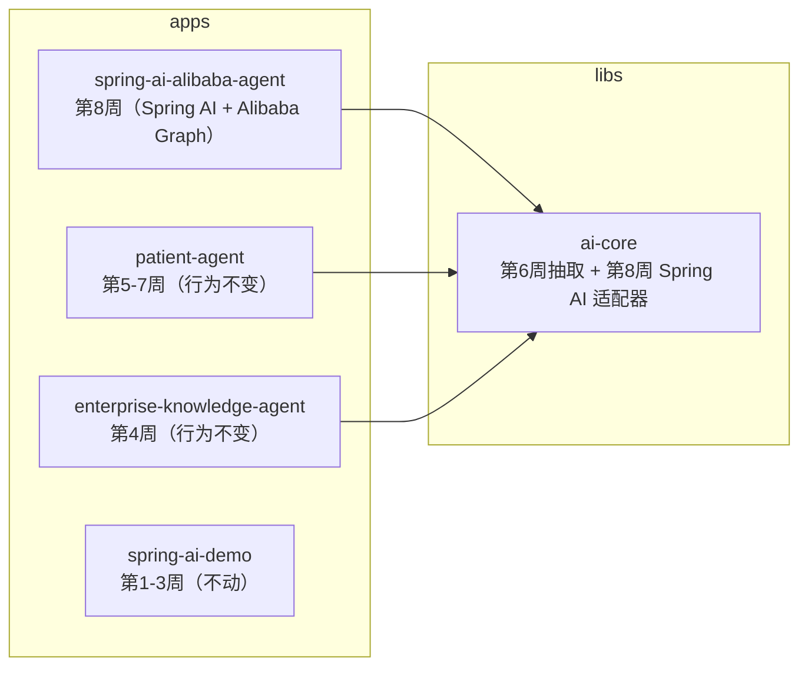
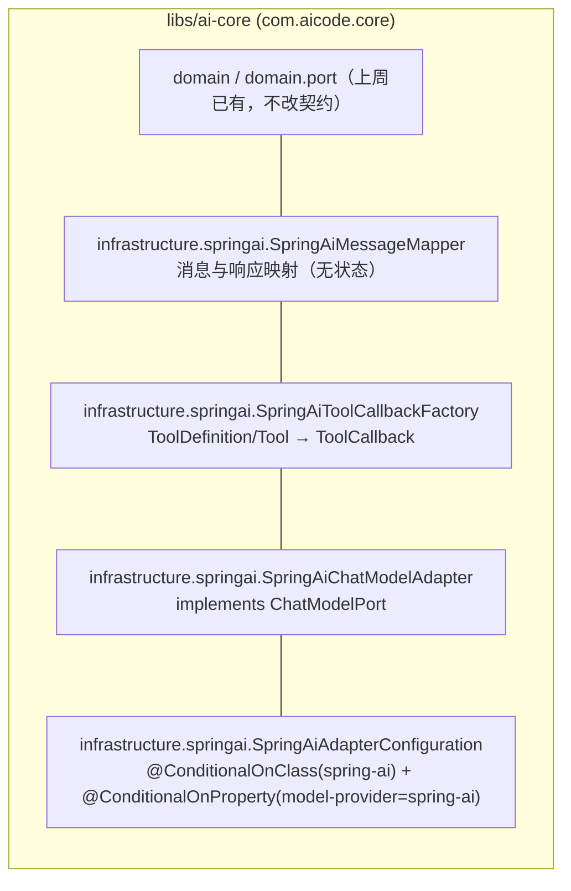
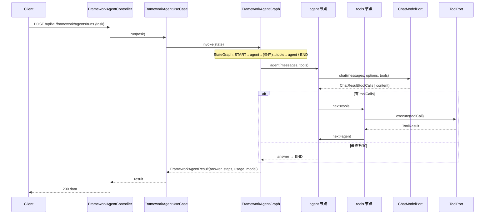
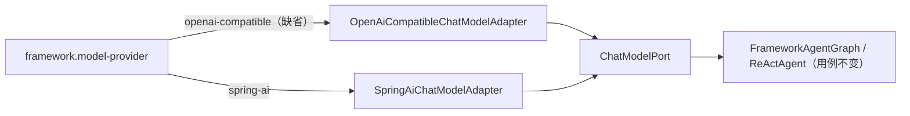
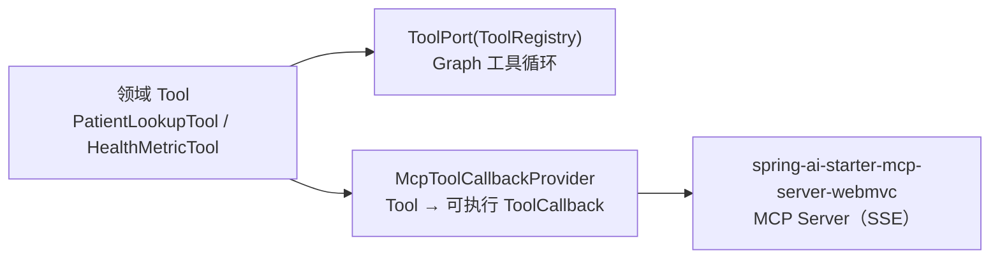

# Week 08 架构图 — Spring AI Alibaba 接入（框架适配器 + Graph Agent）

> 对应 Spec：`docs/specs/week-08.md`
> 对应代码：`libs/ai-core`、`apps/spring-ai-alibaba-agent`

## 1. 模块依赖关系



## 2. ai-core Spring AI 适配分层（本周新增）



`spring-ai-model:1.0.0` 在 ai-core 中声明为 `optional`：仅本适配器使用，不向 app 传递（规范 5.8.1）。

## 3. Graph Agent 数据流（新模块）



## 4. 适配器切换（换框架只换适配器）



## 5. MCP 工具暴露



## 6. 各层职责

| 层 | 职责 | 示例类 |
|----|------|--------|
| 接入层 | HTTP 路由、参数校验、协议转换 | `FrameworkAgentController`、`GlobalExceptionHandler` |
| 应用层 | 任务校验 + 调用 Graph | `FrameworkAgentUseCase` |
| 领域层 | Alibaba Graph 编排 `agent↔tools` | `FrameworkAgentGraph`、`FrameworkAgentResult`、`FrameworkAgentStep` |
| 框架适配（ai-core） | 领域端口 ↔ Spring AI 消息/工具/模型 | `SpringAiMessageMapper`、`SpringAiToolCallbackFactory`、`SpringAiChatModelAdapter` |
| 工具（app） | 实现 ai-core `Tool`，演示数据 | `PatientLookupTool`、`HealthMetricTool` |
| MCP（app） | 领域工具包成可执行回调供 MCP Server | `McpToolCallbackProvider` |

## 7. 关键咽喉点与安全

- **工具执行唯一咽喉点**：模型侧关闭 Spring AI 内部工具执行（`internalToolExecutionEnabled=false`），所有工具调用经 `ToolPort`（`ToolRegistry`）执行，便于后续权限/审计/脱敏统一拦截。
- **用户输入只作 user 消息**：任务文本由 `FrameworkAgentGraph` 组装进 user 消息，system 提示来自 `prompts/agent-v1.txt`（`PromptTemplatePort`），不拼接用户输入。
- **密钥**：模型密钥只来自 `spring.ai.openai.api-key=${LLM_API_KEY:}` 环境变量，不入库、不打印。
- **循环上限**：`framework.agent.max-iterations` + `CompiledGraph` 迭代上限双保险，防止死循环烧钱。
- **可选依赖隔离**：`spring-ai-model` 为 `optional` + `@ConditionalOnClass`，未引入 Spring AI 的 app 不受影响。

## 8. 配置与实现对应关系

```yaml
framework.model-provider: openai-compatible|spring-ai  → ChatModelPort 适配器选择
framework.agent.max-iterations: 5                       → FrameworkAgentGraph 循环上限
spring.ai.openai.base-url: ${LLM_BASE_URL}              → Spring AI OpenAI 兼容端点（DeepSeek）
spring.ai.openai.api-key:  ${LLM_API_KEY:}              → 密钥（仅环境变量）
spring.ai.openai.chat.options.model: ${LLM_MODEL}       → 模型名
spring.ai.mcp.server.name/version                       → MCP Server 标识
```

## 9. YAGNI 边界

- 本周不接 Nacos / Spring Cloud 注册中心；不引入未发布到 Central 的 `agent-framework`。
- 不改 `patient-agent` / `enterprise-knowledge-agent` 行为；`OpenAiCompatibleChatModelAdapter` 只加条件注解开关注入方式，`matchIfMissing` 保持既有 app 默认生效。
- 不把业务工具下沉 ai-core；ai-core 只放契约与无状态适配器。
- 不改 `spring-ai-demo`，保持独立。
