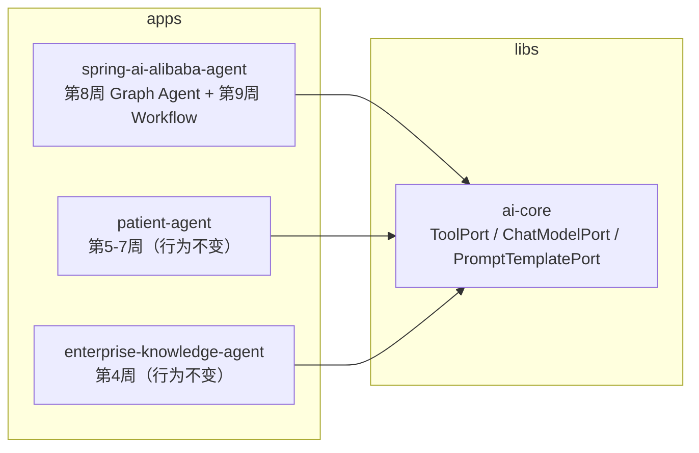
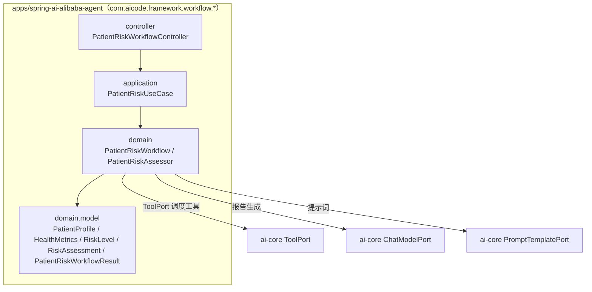
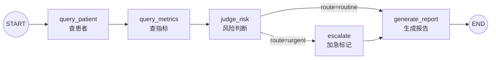
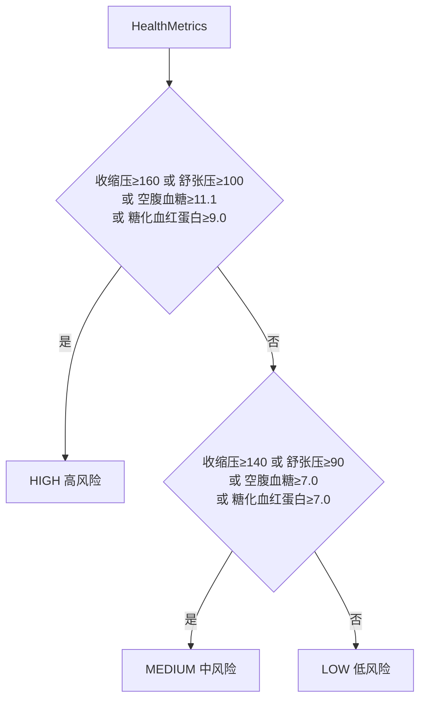

# Week 09 架构图 — Workflow（患者风险分析多节点流程）

> 对应 Spec：`docs/specs/week-09.md`
> 对应代码：`apps/spring-ai-alibaba-agent`（新增 `com.aicode.framework.workflow.*` 包）

## 1. 模块依赖关系



## 2. Workflow 分层（本周新增）



依赖规则：`workflow.*` 只依赖 ai-core 端口与模型；不依赖 `FrameworkAgentGraph`（第 8 周）；工具执行、模型调用、提示词加载均经端口。

## 3. 图结构（State / Node / Edge / Graph）



节点与状态键：

| 节点 | 职责 | 写回状态键 |
|------|------|-----------|
| `query_patient` | 经 `ToolPort` 执行 `PatientLookupTool`，解析为 `PatientProfile` | `patient` |
| `query_metrics` | 经 `ToolPort` 执行 `HealthMetricTool`，解析为 `HealthMetrics` | `metrics` |
| `judge_risk` | 调 `PatientRiskAssessor.assess(metrics)` | `riskLevel` / `justification` / `route` |
| `escalate` | 高风险时置 `escalated=true` 并注入加急指引 | `escalated` / `guidance` |
| `generate_report` | 组装 system + user（患者/指标/风险/指引），经 `ChatModelPort` 生成报告 | `report` / `usage` / `model` |

状态键（`ReplaceStrategy`）：`patientId` / `patient` / `metrics` / `riskLevel` / `justification` / `route` / `escalated` / `guidance` / `report` / `usage` / `model`。

## 4. 第 8 周 vs 第 9 周（对照）

| 维度 | 第 8 周 FrameworkAgentGraph（ReAct） | 第 9 周 PatientRiskWorkflow（Workflow） |
|------|--------------------------------------|------------------------------------------|
| 执行顺序 | 模型决定何时调工具、何时结束 | 固定顺序，节点依次执行 |
| 工具调度 | 模型返回 toolCalls → `tools` 节点执行 | 节点直接经 `ToolPort` 调度 |
| 分支 | 仅 `agent↔tools` 单一循环 | 条件边（`urgent`/`routine`）+ 固定边 |
| 模型角色 | 核心（规划 + 工具选择 + 总结） | 仅报告生成一步 |
| 规则 | 无确定性业务规则 | `PatientRiskAssessor` 确定性风险判断 |

## 5. 风险判断规则（`PatientRiskAssessor`）



阈值内聚为 `PatientRiskAssessor` 常量，避免魔法数字；`justification` 记录命中项（如「收缩压 148 达到 140 阈值」）。

## 6. 关键咽喉点与安全

- **工具执行唯一咽喉点**：`query_patient` / `query_metrics` 节点经 `ToolPort.execute` 调度，与第 6/8 周一致，后续权限/审计/脱敏统一拦截。
- **风险规则不进基础设施**：`PatientRiskAssessor` 是纯领域服务，阈值可单测；禁止把「高风险」判断散落到工具或配置。
- **用户/患者数据只作 user 消息**：报告生成的 system 提示来自 `prompts/patient-risk-report-v1.txt`（`PromptTemplatePort`），患者与指标数据装配进 user 消息，不拼 system。
- **密钥**：模型密钥只来自 `spring.ai.openai.api-key=${LLM_API_KEY:}` 环境变量，不入库、不打印。

## 7. 配置与实现对应关系

```yaml
framework.agent.max-iterations   → FrameworkAgentGraph（第8周）循环上限
spring.ai.openai.base-url/api-key → Spring AI OpenAI 兼容端点（DeepSeek，复用）
prompt.version                    → 报告提示词版本（PromptTemplatePort 统一读取）
```

本周不新增配置项（工作流为固定流程，无循环上限/采样参数需求；采样参数复用 `llm.*`）。

## 8. YAGNI 边界

- 不抽 ai-core 通用 `WorkflowPort`（第 12 周平台化再抽象）；不引入 `CheckpointSaver` 持久化（第 10 周 HITL 需要暂停/恢复时再加）。
- 不改第 8 周 `FrameworkAgentGraph` / `PatientLookupTool` / `HealthMetricTool` 行为。
- 不新增模块、不新增依赖、不新增端口；只新增 `workflow.*` 包与一个报告提示词文件。
