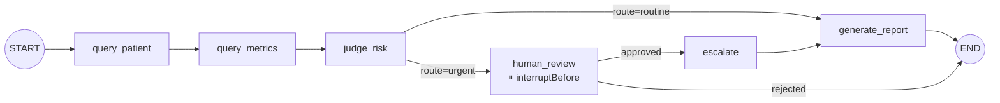
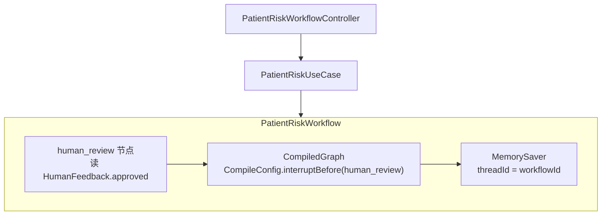

# Week 10 架构图 — Human In The Loop（高风险人工审核）

> 对应 Spec：`docs/specs/week-10.md`
> 对应代码：`apps/spring-ai-alibaba-agent`（扩展 `com.aicode.framework.workflow.*`）

## 1. 图结构变更（相对第 9 周）

## 2. HITL 组件

## 3. 状态与 API 映射

| WorkflowStatus | 触发条件 | report | escalated |
|----------------|----------|--------|-----------|
| COMPLETED | LOW/MEDIUM 同步完成；或 HIGH 审核通过 | 有 | HIGH 时为 true |
| PENDING_APPROVAL | HIGH 暂停于 human_review 前 | 无 | false |
| REJECTED | HIGH 审核拒绝 | 无 | false |

## 4. YAGNI

- 不引入 RedisSaver / DB checkpoint
- 不抽 ai-core WorkflowPort
- 不改 FrameworkAgentGraph
