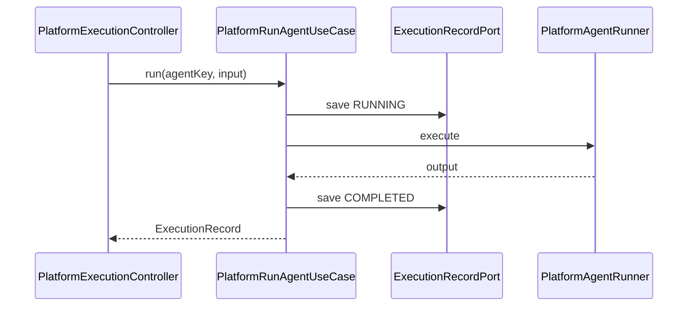

# Architecture: Week 12 — Agent 平台 V1

## 1. 模块与包

扩展 `apps/spring-ai-alibaba-agent`：

```
com.aicode.framework.platform/
  controller/
  dto/
  application/
  domain/
    model/
    port/
    exception/
    service/PlatformAgentRunner
  infrastructure/
    persistence/   # InMemory*Adapter
    seed/PlatformSeedDataInitializer
```

## 2. 领域模型

| 模型 | 说明 |
|------|------|
| `PlatformAgentDefinition` | agentKey、name、agentType、enabled |
| `PlatformAgentConfig` | maxIterations、temperature、model（可选覆盖） |
| `PlatformToolDefinition` | toolKey、toolName、description、enabled |
| `PlatformWorkflowDefinition` | workflowKey、name、boundAgentKey |
| `ExecutionRecord` | executionId、agentKey、status、input/output JSON、usage |

## 3. AgentType → 运行时映射

| agentType | 调度目标 | 输入 |
|-----------|----------|------|
| `FRAMEWORK_REACT` | `FrameworkAgentUseCase` | `task` |
| `PATIENT_RISK_WORKFLOW` | `PatientRiskUseCase` | `patientId` |
| `MEDICAL_ASSISTANT` | `MedicalAssistantUseCase` | `patientId`, `task?` |

## 4. 执行记录流



## 5. 与 Week 8–11 关系

- 既有 `/api/v1/framework/...`、`/workflows/...`、`/multi-agent/...` **不变**
- Platform 是**元数据 + 统一调度 + 执行审计**层，不替换 Graph 实现
