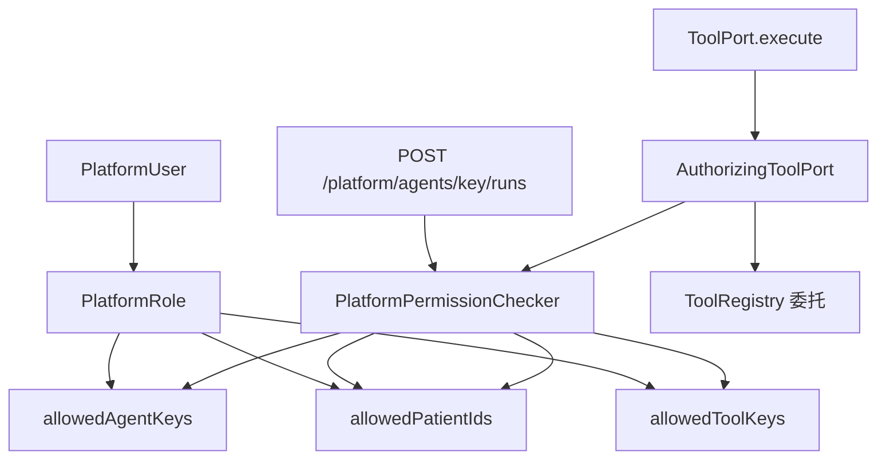

# Architecture: Week 13 — 权限体系

## 1. 包结构（扩展 `platform`）

```
com.aicode.framework.platform/
  domain/model/PlatformUser, PlatformRole
  domain/port/PlatformUserPort, PlatformRolePort
  domain/service/PlatformPermissionChecker
  domain/exception/PlatformAccessDeniedException
  application/PlatformAuthUseCase, PlatformRoleUseCase
  controller/PlatformAuthController, PlatformRoleController
  infrastructure/persistence/InMemoryPlatformUserAdapter, InMemoryPlatformRoleAdapter
  infrastructure/security/AuthorizingToolPort, PlatformSecurityProperties, PlatformSaTokenConfig, DirectRunAuthInterceptor
  infrastructure/seed/PlatformRbacSeedInitializer
  dto/...
```

## 2. 权限链



## 3. Gate 策略

| 路径 | 默认 | 配置 enforce-direct-runs=true |
|------|------|-------------------------------|
| POST /platform/agents/{key}/runs | 登录 + Agent/数据权限 | 同左 |
| GET /platform/executions* | 登录 + 用户隔离 | 同左 |
| POST /framework/agents/runs | 公开（Week 8–11 不变） | 登录 + Agent 权限 |
| POST /workflows/patient-risk/runs | 公开 | 登录 + Agent 权限 |
| POST /multi-agent/medical-assistant/runs | 公开 | 登录 + Agent 权限 |

有登录态时，Tool 执行一律经 `AuthorizingToolPort` 校验 Tool + patientId。

## 4. ExecutionRecord 变更

新增 `userId` 字段；`listExecutions`：admin 看全部，其他用户只看自己的。

## 5. 与 Week 12 关系

- Week 12 CRUD（agents/tools/workflows）本周仍公开（管理面演示）；Run 与 executions 强 gate
- Platform seed（3 Agent + 2 Tool）不变；RBAC seed 独立初始化
