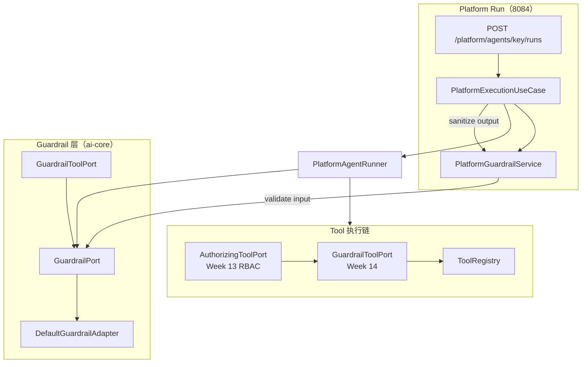
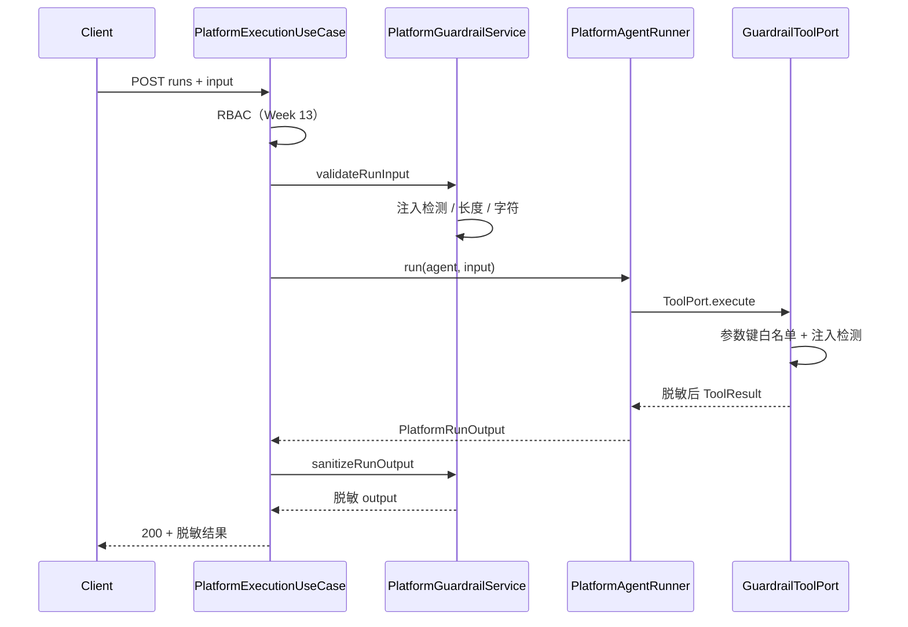

# Architecture: Week 14 — AI 安全（Guardrails）

## 1. 包结构

```
libs/ai-core/
  domain/port/GuardrailPort.java                    ← 本周新增
  domain/model/GuardrailContext.java              ← 本周新增
  domain/exception/GuardrailViolationException.java
  infrastructure/config/GuardrailProperties.java
  infrastructure/security/
    DefaultGuardrailAdapter.java
    GuardrailToolPort.java
    PiiMasker.java

apps/spring-ai-alibaba-agent/
  platform/application/PlatformGuardrailService.java  ← 本周新增（Run 入出参编排）
  controller/GlobalExceptionHandler.java            ← 新增 GUARDRAIL_VIOLATION 映射
  infrastructure/config/AppConfiguration.java       ← Tool 链：RBAC → Guardrail → Registry
```

## 2. 拦截链路



## 3. 数据流（Run 一次）



## 4. 与既有模块关系

| 模块 | 变更 |
|------|------|
| ai-core | 新增 GuardrailPort + 适配器 + Tool 装饰器 |
| spring-ai-alibaba-agent | Platform Run 集成；Tool 链加长一节 |
| enterprise / patient-agent | 无变更（可后续依赖 ai-core Guardrail） |
| Week 8–11 Graph | 无编排变更；经 ToolPort 间接受益 |

## 5. YAGNI 陈述

- 不用 LLM 做二次分类（规则足够演示注入/PII）。
- 不用外部 Guardrails 服务（NeMo 等留后续）。
- Tool 白名单仅校验**参数键名**，不校验值域（值域由 RBAC patientId + Bean Validation 覆盖）。
