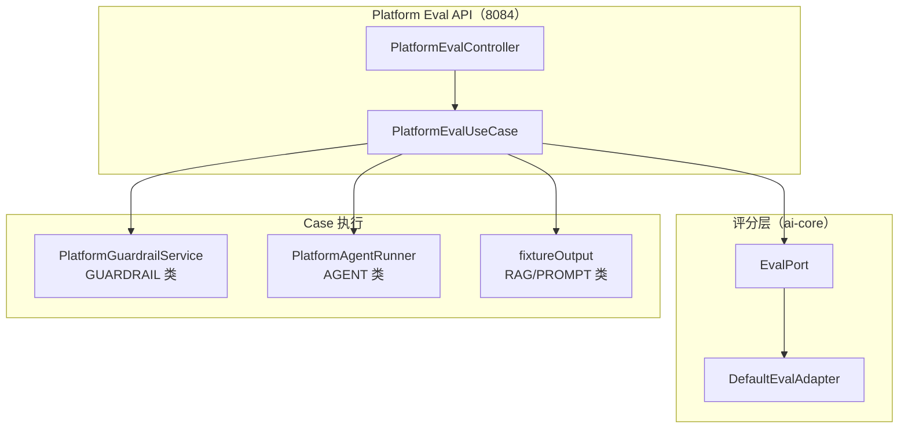
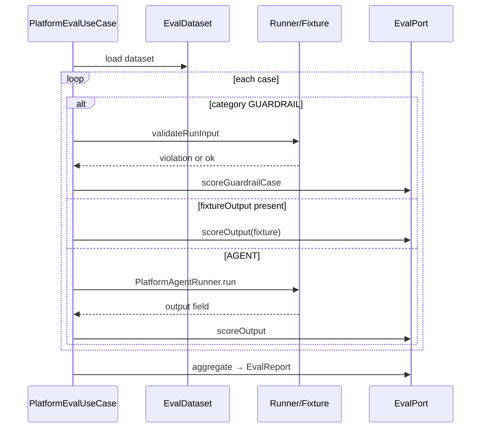

# Architecture: Week 15 — Agent Evaluation

## 1. 包结构

```
libs/ai-core/
  domain/model/
    EvalCategory.java
    EvalCriterionType.java
    EvalExpectation.java
    EvalCase.java
    EvalDataset.java
    EvalCaseResult.java
    EvalReport.java
  domain/port/EvalPort.java
  infrastructure/eval/DefaultEvalAdapter.java

apps/spring-ai-alibaba-agent/
  platform/application/PlatformEvalUseCase.java
  platform/controller/PlatformEvalController.java
  platform/domain/port/EvalDatasetPort.java
  platform/domain/port/EvalRunPort.java
  platform/infrastructure/eval/ClasspathEvalDatasetLoader.java
  platform/infrastructure/persistence/
    InMemoryEvalDatasetAdapter.java
    InMemoryEvalRunAdapter.java
  platform/infrastructure/seed/PlatformEvalSeedInitializer.java
  resources/eval/*.json
```

## 2. 评估链路



## 3. Case 执行策略



## 4. 与既有模块关系

| 模块 | 变更 |
|------|------|
| ai-core | 新增 EvalPort + 规则评分适配器 |
| spring-ai-alibaba-agent | Eval REST + 数据集加载 + 报告存储 |
| enterprise / patient-agent | 无变更（可后续依赖 ai-core EvalPort） |
| Week 8–14 Graph/RBAC/Guardrail | 无编排变更；Guardrail 攻击集纳入 Eval |

## 5. YAGNI 陈述

- 不用 LLM 做裁判（规则评分足够演示 Agent/RAG/Prompt Eval 框架）。
- 不做 enterprise 8083 在线 RAG 批量调用（fixture + 关键词评分）。
- 数据集不进 PostgreSQL（classpath JSON + 内存 Port，与 Week 12–13 一致）。
