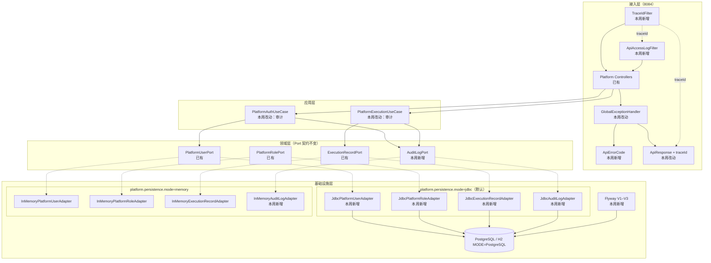
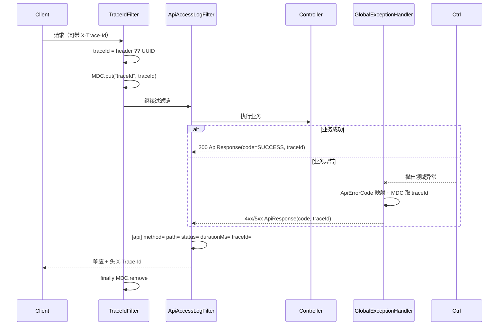
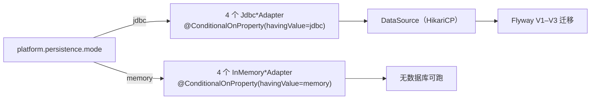

# Architecture: Week 16 — 企业规范 + RBAC 落库

> 只画本周**新增 / 改动**节点；标「已有」的节点本周不改契约。

## 1. 包结构（新增 / 改动）

```
apps/spring-ai-alibaba-agent/
  dto/
    ApiErrorCode.java                        ← 新增（错误码唯一来源）
    ApiResponse.java                          ← 改动（加 traceId）
  controller/
    GlobalExceptionHandler.java               ← 改动（错误码走枚举 + traceId）
  infrastructure/logging/
    TraceIdFilter.java                        ← 新增（traceId 进 MDC + 响应头）
    ApiAccessLogFilter.java                   ← 新增（统一访问日志）
  resources/db/migration/
    V1__platform_rbac.sql                     ← 新增
    V2__platform_execution_record.sql         ← 新增
    V3__platform_audit_log.sql                ← 新增
  platform/domain/model/
    AuditLogEntry.java / AuditAction.java / AuditResult.java   ← 新增
  platform/domain/port/
    AuditLogPort.java                         ← 新增
  platform/infrastructure/persistence/
    JdbcPlatformUserAdapter.java              ← 新增
    JdbcPlatformRoleAdapter.java              ← 新增
    JdbcExecutionRecordAdapter.java           ← 新增
    JdbcAuditLogAdapter.java                  ← 新增
    InMemoryAuditLogAdapter.java              ← 新增
    JdbcTime.java                             ← 新增（Instant ↔ OffsetDateTime）
    InMemoryPlatformUserAdapter.java          ← 改动（mode=memory 时生效）
    InMemoryPlatformRoleAdapter.java          ← 改动（同上）
    InMemoryExecutionRecordAdapter.java       ← 改动（同上）
  platform/application/
    PlatformAuthUseCase.java                  ← 改动（登录/失败审计）
    PlatformExecutionUseCase.java             ← 改动（Run 终态与越权读审计）
  platform/infrastructure/seed/
    PlatformRbacSeedInitializer.java          ← 改动（幂等，按 Port 判空，双模式通用）

apps/spring-ai-alibaba-agent/src/test/resources/
    application-test.yml                      ← 新增（H2 MODE=PostgreSQL + Flyway）
```

## 2. 本周增量拓扑



## 3. traceId 链路



## 4. 持久化装配（模式互斥）



## 5. 新增类型清单

| 类型 | 名称 | 职责 |
|------|------|------|
| Enum | `ApiErrorCode` | 错误码 + HTTP 状态 + 中文含义，唯一来源 |
| Filter | `TraceIdFilter` | traceId 生成/透传/MDC/响应头 |
| Filter | `ApiAccessLogFilter` | 统一访问日志 |
| Model | `AuditLogEntry` / `AuditAction` / `AuditResult` | 审计领域模型 |
| Port | `AuditLogPort` | 审计写入与查询 |
| Adapter | `JdbcPlatformUserAdapter` | `platform_user` 读写 |
| Adapter | `JdbcPlatformRoleAdapter` | `platform_role` + 三张授权子表读写 |
| Adapter | `JdbcExecutionRecordAdapter` | `execution_record` 读写 |
| Adapter | `JdbcAuditLogAdapter` | `audit_log` 读写 |
| Adapter | `InMemoryAuditLogAdapter` | 无库模式审计 |
| Util | `JdbcTime` | `Instant` ↔ `OffsetDateTime` |
| Migration | `V1` / `V2` / `V3` | RBAC / 执行记录 / 审计表 |

## 6. 与既有模块关系

| 模块 | 变更 |
|------|------|
| `spring-ai-alibaba-agent` | 本次主体：持久化适配器、审计、traceId、错误码、迁移脚本 |
| `libs/ai-core` | **无变更**（Port 契约已够用；`PiiMasker` 复用不修改） |
| `enterprise-knowledge-agent` | 无变更（其 Flyway/H2 模式被本周复用为参照） |
| `patient-agent` / `spring-ai-demo` | 无变更 |
| Week 8–15 Graph / Workflow / Multi-Agent / Guardrail / Eval | 编排与业务规则零改动 |

## 7. YAGNI 陈述

- 不引 MyBatis/JPA：本周 5 张表，裸 `JdbcTemplate` + 手写映射即可，ORM 留给 P6 SaaS。
- 不引 Testcontainers：H2 `MODE=PostgreSQL` 已能覆盖本周 SQL 与映射，真库验证留在启动段。
- 不改响应信封结构（`code` / `message` / `data` 自第 2 周起即全仓口径，规范 5.6 第 16 周已按实现校正）：本周只新增 `traceId`，属兼容扩展，不动 Week 8–15 的字段语义。
