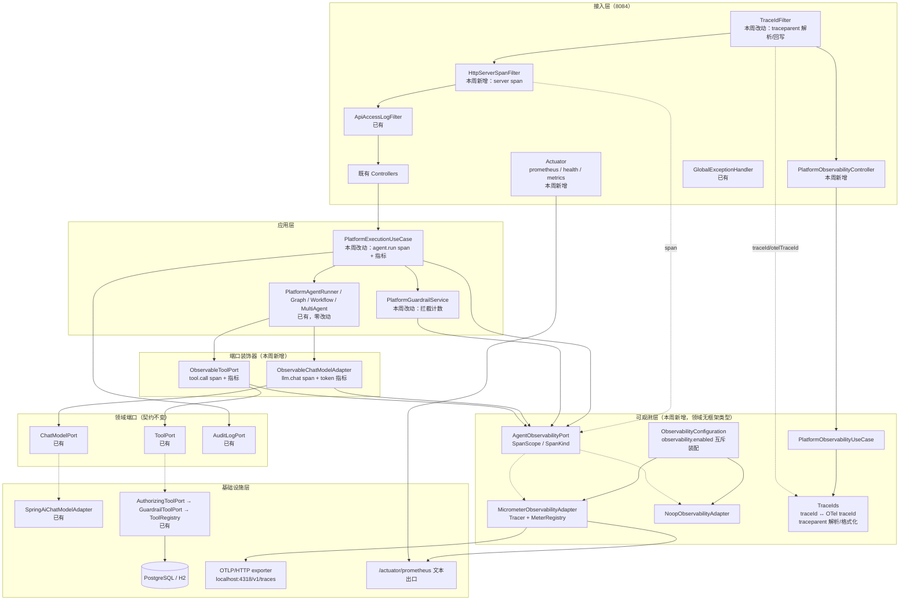
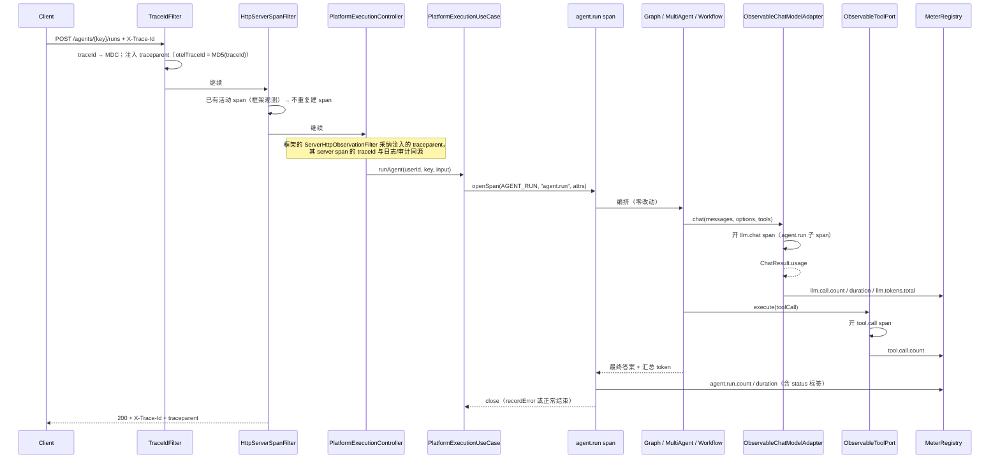
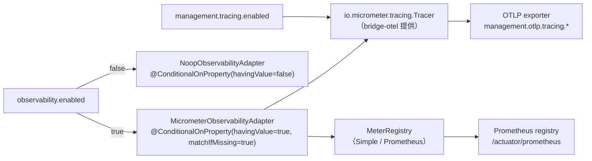

# Architecture: Week 17 — OpenTelemetry 接入

> 只画本周**新增 / 改动**节点；标「已有」的节点本周不改契约。

## 1. 包结构（新增 / 改动）

```
apps/spring-ai-alibaba-agent/
  observability/domain/
    SpanKind.java                          ← 新增（SERVER / AGENT_RUN / LLM_CALL / TOOL_CALL）
    SpanScope.java                          ← 新增（span 生命周期句柄，AutoCloseable）
    AgentObservabilityPort.java             ← 新增（唯一观测入口，无框架类型泄漏）
    ObservabilityAttributes.java            ← 新增（属性键名常量，禁魔法字符串）
  observability/infrastructure/
    MicrometerObservabilityAdapter.java     ← 新增（Tracer + MeterRegistry → Port 实现）
    NoopObservabilityAdapter.java           ← 新增（observability.enabled=false）
    ObservableChatModelAdapter.java         ← 新增（装饰 ChatModelPort → llm.chat span + 指标）
    ObservableToolPort.java                 ← 新增（装饰 ToolPort → tool.call span + 指标）
    ObservabilityConfiguration.java         ← 新增（端口/装饰器装配，开关互斥）
  observability/application/
    PlatformObservabilityUseCase.java       ← 新增（读当前链路上下文）
  observability/controller/
    PlatformObservabilityController.java    ← 新增（GET /observability/trace-context）
  observability/dto/
    TraceContextResponse.java               ← 新增（traceId / otelTraceId / spanId / traceparent / sampled）
  observability/domain/
    TraceContextView.java                   ← 新增（用例返回的领域视图）

  infrastructure/logging/
    TraceIds.java                           ← 改动（新增 otelTraceId 派生、traceparent 解析/格式化）
    TraceIdFilter.java                      ← 改动（解析 traceparent / 派生 OTel traceId / 回写 traceparent）
    HttpServerSpanFilter.java               ← 新增（把入站请求包进 OTel server span；开关控制）

  platform/application/
    PlatformExecutionUseCase.java           ← 改动（agent.run span + agent.run.* 指标）
    PlatformGuardrailService.java           ← 改动（guardrail.blocked.count）

  resources/
    application.yml                         ← 改动（management.* / observability.enabled）
    application-jdbc.yml                    ← 不改
  resources/db/migration/                   ← 本周无新增迁移（可观测数据不进业务库）

apps/spring-ai-alibaba-agent/pom.xml        ← 改动（tracing/otlp/actuator/prometheus/test 依赖）
apps/spring-ai-alibaba-agent/src/test/resources/application-test.yml  ← 改动（关导出 + 关埋点）

libs/ai-core                                ← 无变更（Port 契约零改动，规范 5.8.2）
```

## 2. 本周增量拓扑



## 3. 链路上下文：单源派生（本周核心决策）

```mermaid
flowchart LR
    REQ[HTTP 请求] --> Q{"有合法 traceparent?"}
    Q -->|是| W3C["traceId = traceparent.trace-id<br/>（真远程父）"]
    Q -->|否| Q2{"有 X-Trace-Id?"}
    Q2 -->|是| X["traceId = X-Trace-Id 原文<br/>otelTraceId = MD5(traceId)"]
    Q2 -->|否| N["traceId = 新 16hex<br/>otelTraceId = traceId"]
    W3C --> MDC["MDC.traceId"],
    X --> MDC,
    N --> MDC
    MDC --> LOG["既有日志 [%X{traceId}]<br/>审计 audit_log.trace_id"]
    MDC --> SPAN["OTel span 使用同一 traceId"]
    SPAN --> OTLP
    SPAN --> RESP["响应头：X-Trace-Id + traceparent"]
```

要点：**OTel traceId 由 traceId 确定性换算**，不新生成第二套 ID。响应同时回写两种头，
`GET /observability/trace-context` 让外部能验证「日志 ID ↔ 链路 ID」对应关系。

## 4. span 树（一次典型 Agent Run）



真实服务器实测 span 树（第 17 周验收，真实 LLM 调用医疗助手 Agent）：

```text
http post /api/v1/platform/agents/{agentKey}/runs   (SERVER, traceId=31061ddc…)
└── agent.run                                        (AGENT_RUN, execution.status=COMPLETED)
    ├── llm.chat                                     (LLM_CALL, gen_ai.usage.total_tokens=1996)
    │   ├── chat deepseek-v4-pro                     (Spring AI 自动埋点)
    │   └── http post                                (Spring AI HTTP 客户端自动埋点)
    ├── tool.call  PatientLookupTool                 (TOOL_CALL)
    └── tool.call  HealthMetricTool                  (TOOL_CALL)
```

## 5. 装配与开关（互斥）



单测：`observability.enabled=false` + `management.otlp.tracing.export.enabled=false`，既有用例零影响；
链路埋点专项测试用**真实 OTel SDK + `InMemorySpanExporter`**（`OtelSdkTestSupport`）手工装配，不依赖 Spring 上下文与外部 collector
（`SimpleTracer` 的 span context 不保证生成合法 traceId，无法验证「与既有 traceId 同源」）。

## 6. 与既有模块关系

| 模块 | 变更 |
|------|------|
| `spring-ai-alibaba-agent` | 本次主体：观测端口/适配器/装饰器、traceparent、span 埋点、指标、Actuator |
| `libs/ai-core` | **无变更**（`ChatModelPort` / `ToolPort` / `Port` 契约零改动，规范 5.8.2） |
| `enterprise-knowledge-agent` | 无变更（其链路可后续按同一 Port 接入，本周不扩散） |
| `patient-agent` / `spring-ai-demo` | 无变更 |
| Week 8–16 Graph / Workflow / Multi-Agent / RBAC / Guardrail / Eval | 编排与业务规则零改动（仅在 UseCase 与端口装饰器处埋点） |

## 7. YAGNI 陈述

- 不引 javaagent 自动探针：业务语义 span（`agent.run`）agent 打不出来，且要多一份启动参数与版本耦合。
- 不下沉到 `libs`：本周只有 8084 需要，8082/8083 是否接入留第 21 周；提前抽公共库会带来无收益的模块与发布成本。
- 不自研指标端点 / 不引 Prometheus 服务端与 Grafana：Micrometer + `/actuator/prometheus` 已是标准出口，服务端部署属第 20 周。
