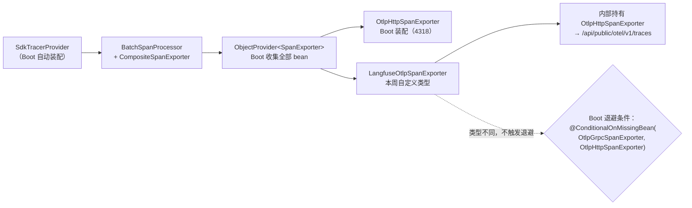
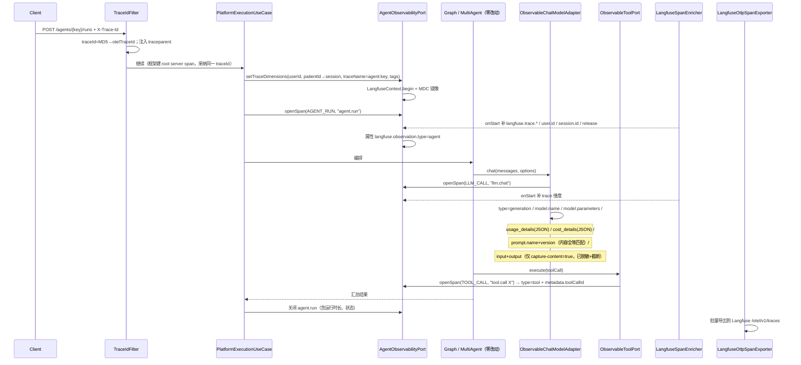
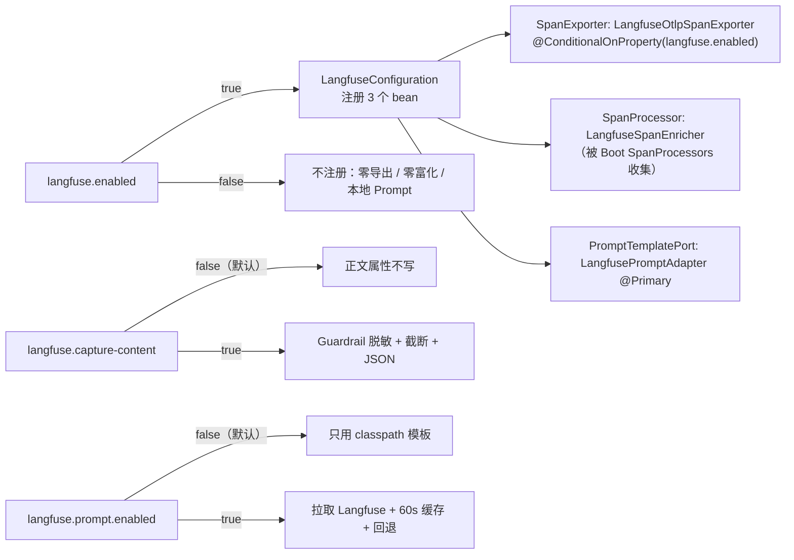

# Architecture: Week 18 — Langfuse 接入

> 只画本周**新增 / 改动**节点；标「已有」的节点本周不改契约。

## 1. 包结构（新增 / 改动）

```
apps/spring-ai-alibaba-agent/
  observability/domain/
    LangfuseAttributes.java                  ← 新增（langfuse.* 键名与观测类型常量，禁魔法字符串）
    TraceDimensions.java                     ← 新增（用户/会话/链路名/标签/发布版本）
    LlmGenerationRecord.java                 ← 新增（一次生成的可上报事实：模型/用量/成本/prompt/正文）
    LlmCost.java                             ← 新增（input/output/total，USD）
    ModelPrice.java                          ← 新增（每百万 token 单价）
    ModelPriceCatalog.java                   ← 新增（模型 → 单价，来自配置；未配置即未知）
    PromptReference.java                     ← 新增（prompt 名 + Langfuse 版本号）
    AgentObservabilityPort.java              ← 改动（新增 setTraceDimensions(TraceDimensions)）

  observability/infrastructure/
    LangfuseProperties.java                  ← 新增（langfuse.* 配置，含 prompt / model-prices 子配置）
    LangfuseContext.java                     ← 新增（TraceDimensions 的请求期持有者 + MDC 镜像）
    LangfuseSpanEnricher.java                ← 新增（SpanProcessor：把 trace 维度写到每个 span）
    LangfuseOtlpSpanExporter.java            ← 新增（包装 OtlpHttpSpanExporter：Basic 认证 + v4 头）
    LangfuseOtlpSpanExporterFactory.java     ← 新增（按 LangfuseProperties 构建内部 exporter，便于单测）
    LangfuseGenerationAttributes.java        ← 新增（LlmGenerationRecord → langfuse.* 属性 Map，纯函数）
    LangfuseContentPolicy.java               ← 新增（正文采集开关 + Guardrail 脱敏 + 截断 + JSON 序列化）
    LlmCostCalculator.java                   ← 新增（真实 usage × 价目表；未配价返回空）
    LangfusePromptAdapter.java               ← 新增（@Primary 装饰 PromptTemplatePort：拉取+缓存+回退）
    LangfusePromptTracker.java               ← 新增（本次请求加载过的 prompt：name/version/content）
    LangfuseConfiguration.java               ← 新增（导出器 / SpanProcessor / Prompt 装饰器 / 内容策略装配）
    ObservableChatModelAdapter.java          ← 改动（generation 属性、成本指标、prompt 关联、正文开关）
    ObservableToolPort.java                  ← 改动（tool 观测类型 + 正文开关）
    MicrometerObservabilityAdapter.java      ← 改动（setTraceDimensions → LangfuseContext）

  observability/application/
    PlatformObservabilityUseCase.java        ← 改动（Langfuse 自检视图 + 成本汇总用例入口）
    PlatformLlmCostUseCase.java              ← 新增（按模型聚合执行记录 token 与成本）
  observability/controller/
    PlatformObservabilityController.java     ← 改动（+/langfuse-status，+/llm-cost-summary）
  observability/dto/
    LangfuseStatusResponse.java              ← 新增（自检响应，不含密钥）
    TraceContextResponse.java                ← 改动（+langfuseTraceUrl，既有字段不变）
    LlmCostSummaryResponse.java              ← 新增（按模型的 token 与成本）

  platform/application/
    PlatformExecutionUseCase.java            ← 改动（开 agent.run span 前写入 trace 维度；正文开启时写 run 输入/输出）

  resources/
    application.yml                          ← 改动（langfuse.* 配置块）
    db/migration/                            ← 本周无新增迁移（可观测数据不进业务库）
apps/spring-ai-alibaba-agent/pom.xml         ← 不新增依赖（复用 opentelemetry-exporter-otlp / spring-web）
apps/spring-ai-alibaba-agent/src/test/resources/application-test.yml ← 改动（langfuse.enabled=false）
apps/spring-ai-alibaba-agent/.env.example    ← 改动（LANGFUSE_* 占位）
libs/ai-core                                 ← 无变更（PromptTemplatePort 契约零改动，规范 5.8.2）

deploy/langfuse/docker-compose.yml           ← 新增（Langfuse v4 六服务）
deploy/langfuse/.env.example                 ← 新增（密钥占位 + headless 初始化）
docs/deploy/week-18-langfuse.md              ← 新增（部署 / 运维 / 故障 / 验收）
```

## 2. 本周增量拓扑

```mermaid
flowchart TB
    subgraph Access["接入层（8084）"]
        TF[TraceIdFilter<br/>已有：traceparent / X-Trace-Id]
        CTRL[既有 Controllers]
        OBS[PlatformObservabilityController<br/>本周改动：+langfuse-status +llm-cost-summary]
    end

    subgraph Obs["可观测层（本周新增，领域无框架类型）"]
        PORT[AgentObservabilityPort<br/>已有 +setTraceDimensions]
        MASK[MicrometerObservabilityAdapter<br/>本周改动：写 LangfuseContext]
        LCTX[LangfuseContext<br/>TraceDimensions 请求期持有者]
        ENR[LangfuseSpanEnricher<br/>SpanProcessor：每个 span 带 trace 维度]
        GEN[LangfuseGenerationAttributes<br/>+ LlmCostCalculator<br/>+ LangfuseContentPolicy]
        PROMPT[LangfusePromptAdapter<br/>@Primary 装饰 PromptTemplatePort]
        TRACK[LangfusePromptTracker]
        CFG2[LangfuseConfiguration<br/>langfuse.enabled 互斥装配]
    end

    subgraph Export["导出（本周新增）"]
        LEXP["LangfuseOtlpSpanExporter<br/>SpanExporter 包装<br/>Basic + x-langfuse-ingestion-version: 4"]
        CEXP["Boot OtlpHttpSpanExporter<br/>已有（4318 通用 collector）"]
        SPANEXP["Boot SpanExporters<br/>收集容器内全部 SpanExporter"]
    end

    subgraph App["应用层"]
        EXEC[PlatformExecutionUseCase<br/>本周改动：trace 维度、run 输入/输出]
        COST[PlatformLlmCostUseCase<br/>本周新增]
        RUN[PlatformAgentRunner / Graph / Workflow / MultiAgent<br/>已有，零改动]
    end

    subgraph Decor["端口装饰器"]
        CHAT[ObservableChatModelAdapter<br/>已有 +generation 属性/成本/正文]
        TOOL[ObservableToolPort<br/>已有 +tool 类型/正文]
    end

    subgraph Ext["外部"]
        LF["Langfuse v4 :3000<br/>/api/public/otel/v1/traces"]
        LFP["Langfuse API<br/>/api/public/v2/prompts/{name}"]
        COL["通用 collector :4318<br/>（可选）"]
    end

    TF --> CTRL
    TF --> OBS
    OBS --> COST
    COST --> EXEC
    EXEC --> PORT
    EXEC --> RUN
    PORT -.-> MASK
    MASK --> LCTX
    LCTX -.读取.-> ENR
    RUN --> CHAT
    RUN --> TOOL
    CHAT --> GEN
    TOOL --> GEN
    CHAT --> TRACK
    PROMPT --> TRACK
    PROMPT --> LFP
    CFG2 --> LEXP
    CFG2 --> ENR
    CFG2 --> PROMPT
    CFG2 --> GEN
    LEXP --> SPANEXP
    CEXP --> SPANEXP
    SPANEXP --> LEXP
    SPANEXP --> CEXP
    LEXP --> LF
    CEXP --> COL
```

## 3. 双导出：为什么包装 `SpanExporter`（读 Boot 源码后的结论）



要点：若直接把 Langfuse 导出器注册成 `OtlpHttpSpanExporter` bean，Boot 的 OTLP 装配**整块退避**，
既有 collector 导出会静默消失。包装成自定义类型后，两类导出器共存于 `SpanExporters`，实现真正的扇出，
且 `management.otlp.tracing.export.enabled` 与 `langfuse.enabled` 两个开关互不影响。

## 4. 一次 Agent Run 的 Langfuse 观测树（属性映射）



Langfuse 侧呈现（预期）：

```text
trace  agent:medical-assistant            （userId=1, sessionId=P001, tags=[MEDICAL_ASSISTANT, medical-assistant]）
└── agent          agent.run              （只承载类型与 trace 维度，不写正文）
    ├── generation llm.chat  deepseek-v4-pro  tokens input/output/total + cost
    │   └── span      chat deepseek-v4-pro    （Spring AI 自动埋点，已有）
    ├── generation llm.chat  deepseek-v4-pro  （prompt: medical-followup v3）
    └── tool       tool.call PatientLookupTool / HealthMetricTool
```

## 5. 装配与开关（互斥）



单测：默认 `langfuse.enabled=false`，既有用例零影响；Langfuse 专项测试用
真实 OTel SDK + `InMemorySpanExporter`（Week 17 基座）断言属性，用 JDK `HttpServer` 夹具断言 OTLP 请求头与 Prompt 拉取，
不依赖 Docker、不连真实 Langfuse（真实链路留验收）。

## 6. 与既有模块关系

| 模块 | 变更 |
|------|------|
| `spring-ai-alibaba-agent` | 本次主体：Langfuse 导出器、span 富化、属性映射、成本、Prompt 装饰器、自检与成本 API |
| `libs/ai-core` | **无变更**（`PromptTemplatePort` / `GuardrailPort` / `ChatModelPort` 契约零改动，规范 5.8.2） |
| `enterprise-knowledge-agent` / `patient-agent` / `spring-ai-demo` | 无变更（第 21 周 SaaS 整合时评估复用） |
| Week 8–17 Graph / Workflow / Multi-Agent / RBAC / Guardrail / Eval / OTel | 编排与业务规则零改动（仅在 UseCase 与端口装饰器处增强） |

## 7. YAGNI 陈述

- 不自研 Langfuse REST ingestion 客户端：v4 已废弃该路径的事件类型，写了也只能配 v3 部署。
- 不在应用内起第二个 TracerProvider 或引 javaagent：包装一个 `SpanExporter` 已实现扇出，改动面最小。
- 不引入 `com.langfuse:langfuse-java`：官方明确不建议用它做 tracing，而本周只需要「拉 prompt」这一件事，
  用已有 `RestClient` 一个类即可，省掉一个生成式 SDK 的依赖与升级负担。
- 不做 score / dataset / evaluation 回写：第 15 周的 Eval 结果已落库，回写 Langfuse 属第 20–21 周看板需求。
