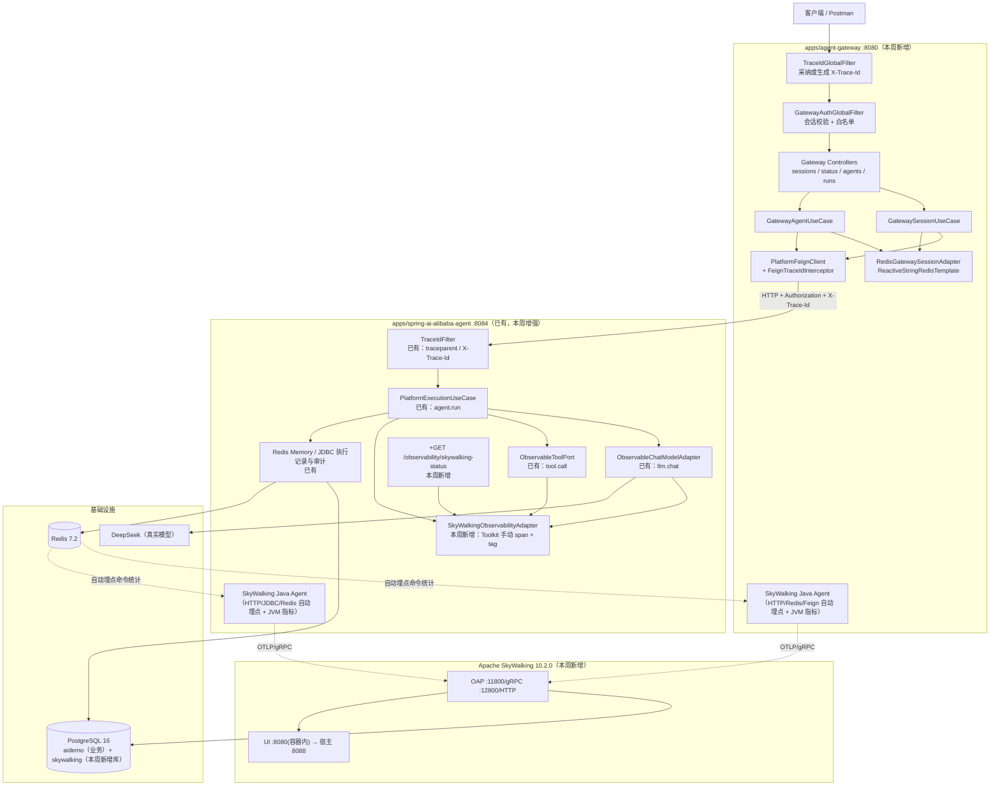
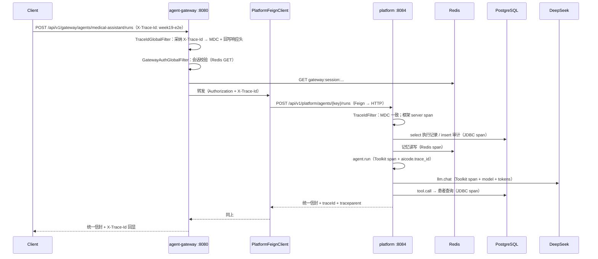
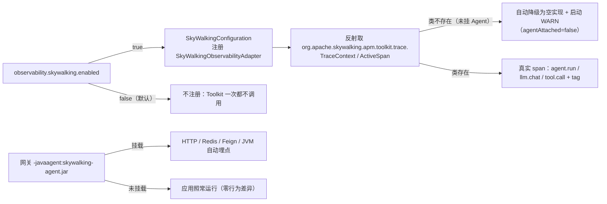

# Architecture: Week 19 — SkyWalking 接入（网关 + Spring Cloud 服务 + 服务拓扑）

> 只画本周**新增 / 改动**节点；标「已有」的节点本周不改契约。

## 1. 包结构（新增 / 改动）

```
apps/agent-gateway/                                  ← 新增模块（Spring Cloud Gateway，8080）
  pom.xml                                            ← 新增（spring-cloud-starter-gateway + openfeign + ai-core(不含 web) + satoken + redis + actuator）
  run-maven-jdk17.ps1                                ← 新增（复制既有模块脚本）
  .env.example                                       ← 新增（网关必需环境变量占位）
  src/main/java/com/aicode/gateway/
    GatewayApplication.java                          ← 新增（@SpringBootApplication + @EnableFeignClients）
    controller/GatewaySessionController.java         ← 新增（登录 / 登出）
    controller/GatewayStatusController.java          ← 新增（自检）
    controller/GatewayAgentController.java           ← 新增（经 Feign 读目录 / 转发执行）
    controller/GatewayExceptionAdvice.java           ← 新增（统一信封 + 错误码，网关侧自有用例）
    dto/                                             ← 新增（请求/响应体，含 ApiResponse 复用形状）
    application/GatewaySessionUseCase.java           ← 新增（登录换 token + 建会话 + 登出）
    application/GatewayAgentUseCase.java             ← 新增（目录查询：缓存优先，未命中走 Feign 并回填）
    application/GatewayStatusUseCase.java            ← 新增（自检视图）
    domain/model/                                    ← 新增（GatewaySession / GatewayRouteTarget / AgentSummary）
    domain/port/GatewaySessionPort.java              ← 新增（会话存储出站端口）
    domain/port/PlatformAuthPort.java                ← 新增（调平台登录/目录的出站端口）
    domain/exception/GatewayUpstreamException.java   ← 新增（上游失败 → 502）
    domain/exception/GatewayUnauthorizedException.java← 新增（无会话 → 401）
    infrastructure/security/GatewayAuthGlobalFilter.java ← 新增（GlobalFilter：会话校验 + 放行白名单 + traceId 透传）
    infrastructure/security/GatewaySessionProperties.java ← 新增（token-name / TTL）
    infrastructure/redis/RedisGatewaySessionAdapter.java  ← 新增（ReactiveStringRedisTemplate：SETEX/GET/DEL/INCR）
    infrastructure/feign/PlatformFeignClient.java    ← 新增（@FeignClient：login / agents / runs）
    infrastructure/feign/FeignPlatformAuthAdapter.java ← 新增（PlatformAuthPort 的 Feign 实现 + 缓存回填）
    infrastructure/feign/FeignTraceIdInterceptor.java ← 新增（透传 X-Trace-Id / Authorization；不覆盖上游已有值）
    infrastructure/config/GatewayConfiguration.java  ← 新增（路由/属性装配）
    infrastructure/logging/TraceIdGlobalFilter.java  ← 新增（网关侧：生成或采纳 X-Trace-Id，写 MDC 并回写响应头）
    infrastructure/observability/GatewayObservabilityAttributes.java ← 新增（网关侧 span 属性键名常量）
  src/main/resources/application.yml                 ← 新增（路由、会话、Feign、Actuator）
  src/test/...                                       ← 新增（≥ 40 用例，见实现日志第 4 节）

apps/spring-ai-alibaba-agent/                        ← 改动（平台侧接入 SkyWalking，契约不改）
  observability/domain/SkyWalkingStatusView.java     ← 新增（自检视图：服务名/OAP 地址/traceId/业务 traceId/是否挂 Agent）
  observability/domain/NoopObservabilityAdapter.java ← 不改（Toolkit 关闭时复用既有空实现）
  observability/infrastructure/SkyWalkingProperties.java      ← 新增（observability.skywalking.* 配置）
  observability/infrastructure/SkyWalkingObservabilityAdapter.java ← 新增（Toolkit 手动埋点：agent.run / llm.chat / tool.call + tag）
  observability/infrastructure/SkyWalkingAdapterFactory.java  ← 新增（反射拿 facade，Agent 未挂载也可运行）
  observability/infrastructure/SkyWalkingConfiguration.java   ← 新增（enabled 互斥装配，包装 DecoratingObservabilityAdapter）
  observability/application/PlatformObservabilityUseCase.java ← 改动（+skywalkingStatus()）
  observability/controller/PlatformObservabilityController.java ← 改动（+GET /skywalking-status）
  observability/dto/SkyWalkingStatusResponse.java    ← 新增（不含任何密钥）
  pom.xml                                            ← 改动（+apm-toolkit-trace，provided 作用域）
  application.yml                                    ← 改动（observability.skywalking.*）
  src/test/resources/application-test.yml            ← 改动（skywalking.enabled=false 显式）
  .env.example                                       ← 改动（SW_AGENT_* 占位）

deploy/skywalking/docker-compose.yml                 ← 新增（OAP + UI，存储用既有 PostgreSQL 16 的独立库）
deploy/skywalking/.env.example                       ← 新增（SW_* 占位 + 存储连接说明）
docs/deploy/week-19-skywalking.md                    ← 新增（部署 / 存储 / Agent 挂载 / 故障 / 验收）
docs/postman/week-19.postman_collection.json         ← 新增

libs/ai-core                                         ← 无变更（Port 契约零改动，规范 5.8.2）
apps/patient-agent / enterprise-knowledge-agent / spring-ai-demo ← 无变更（第 21 周评估是否挂 Agent）
```

## 2. 本周增量拓扑（跨进程）



要点：

- **三条链路互不替代**：SkyWalking（服务拓扑 + 基础设施 + JVM）、OTel（自研 span 语义 + Prometheus 出口）、
  Langfuse（LLM 观测树 + token/成本）。三者共用同一个业务 traceId（见第 4 节），但各有各的 traceId 体系。
- 网关**不连业务库**：MySQL 监控全部来自平台既有的 JDBC 语句（Agent 自动埋点），
  避免为「凑监控」造出第二条数据通道（规范 5.2）。
- 网关与平台各自挂 Agent、各自上报 OAP；OAP 用独立 `skywalking` 库，与业务库 `aidemo` 隔离。

## 3. 一次请求的 SkyWalking span 树（预期形状）



SkyWalking 侧呈现（预期）：

```text
服务拓扑： ai-code-gateway:8080  ──HTTP/Feign──▶  ai-code-platform:8084
端点指标： 网关 /api/v1/gateway/agents/{key}/runs（p99/错误率/慢端点）
           平台 /api/v1/platform/agents/{key}/runs
链路：     GatewayServerSpan(HTTP)
           └── Feign/PlatformFeignClient.method          ← Feign 客户端 span
               └── PlatformServerSpan(HTTP)
                   ├── agent.run                          ← Toolkit 手动 span（tag: aicode.trace_id/agent.key）
                   ├── llm.chat                           ← Toolkit 手动 span（tag: gen_ai.request.model / token 数）
                   ├── tool.call PatientLookupTool        ← Toolkit 手动 span（tag: tool.name）
                   ├── JDBC select/insert                 ← Agent 自动（MySQL 监控）
                   └── Redis GET/SET                      ← Agent 自动（Redis 监控）
JVM：      两个服务实例各自的堆 / GC / 线程 / 类加载面板
```

## 4. 三后端链路 ID 口径（本周核心约束）

```mermaid
flowchart LR
    H["请求头 X-Trace-Id（客户端可带）"] --> MDC["MDC traceId（Week 16 单源）"]
    MDC --> OTEL["OTel traceId<br/>W3C traceparent"]
    MDC --> SWTAG["SkyWalking span tag<br/>aicode.trace_id（本周新增）"]
    MDC --> RESP["响应头 X-Trace-Id + 响应体 traceId"]
    SW["SkyWalking traceId<br/>（Base64 segmentId）"] -.不可比.-> OTEL
    OTEL -.同一次请求用 aicode.trace_id 关联.-> SWTAG
    LF["Langfuse traceId（= OTel traceId，Week 18 已验）"] --- OTEL
```

| 后端 | traceId 形态 | 关联手段 |
|------|--------------|----------|
| 自研 / 日志 / 审计 / 响应 | 32 位 hex（`X-Trace-Id`，可被客户端指定） | 唯一事实源 |
| OTel / Langfuse | 32 位 hex（W3C traceparent），由 `X-Trace-Id` 派生 | 与自研**逐位相等**（Week 17/18 已验收） |
| SkyWalking | Base64 segmentId，Agent 生成 | 靠 span tag `aicode.trace_id` 做**同请求关联**；父子关系由 `sw8` 头在应用间传播 |

**为什么不做「统一成 SkyWalking traceId」**：那会把 Week 16 验收过的 `X-Trace-Id` 回显契约改成
服务端生成值（客户端无法指定），并让 Langfuse/日志的既有检索方式全部失效；收益只是「一个 ID」，
成本是破坏三项已验收契约。故保留三种 ID，用一个业务 tag 做关联（ADR 第 5 节）。

## 5. 装配与开关（互斥）



- **Toolkit 用 `provided` 作用域**：编译期可见（`ActiveSpan.tag` / `TraceContext.traceId`），运行时由
  Agent 的 `apm-toolkit-activation` 提供 facade；未挂 Agent 时类仍在 classpath（provided 不打包进 jar），
  因此**运行 fat jar 时靠反射 + 捕获 `NoClassDefFoundError` 双重保护**，避免「忘挂 Agent 就启动失败」。
- 网关侧不写一行 SkyWalking 代码：全部靠 Agent 自动埋点（网关自己的 `TraceIdGlobalFilter` 只处理业务 traceId）。

## 6. 与既有模块关系

| 模块 | 变更 |
|------|------|
| `apps/agent-gateway` | **全新模块**：网关入口、统一鉴权、Feign 出站、Redis 会话与缓存、自检 |
| `apps/spring-ai-alibaba-agent` | 平台侧：新增 SkyWalking 适配器与自检端点；`AgentObservabilityPort` 契约**零改动**（新适配器以装饰器形式叠加） |
| `libs/ai-core` | **无变更** |
| `patient-agent` / `enterprise-knowledge-agent` / `spring-ai-demo` | 无变更 |
| Week 13–18（RBAC / Guardrail / Eval / 信封 / OTel / Langfuse） | 业务规则与契约零改动 |

## 7. YAGNI 陈述

- 不引入注册中心（Nacos/Eureka）：本机只有两个进程、路由目标是配置项，注册中心带来的新故障模式
  远大于它带来的便利（规范 3.4「用不到的能力本周不准加」）。
- 不新建独立下游业务服务：它只会转发一层，却要再吃 ~300 MB 内存（VM 仅剩 ~1.1 GB）；
  Feign / Redis / 跨进程链路这些可观测事实在网关进程内等价可验收。
- 不引 `apm-toolkit-logback-1.x`：日志与链路的 traceId 已由 Week 16/17 的 MDC 单源统一，
  再引一份等于维护两套 ID（且 SkyWalking 的 traceId 与自研 ID 不同源）。
- 不做网关限流/熔断/重试编排：本周目标是「链路可见」，限流熔断属容量与稳定性，第 20 周按监控数据决定。
- 不给网关加数据库：MySQL 监控用平台既有 JDBC 事实，不造第二条通道。
