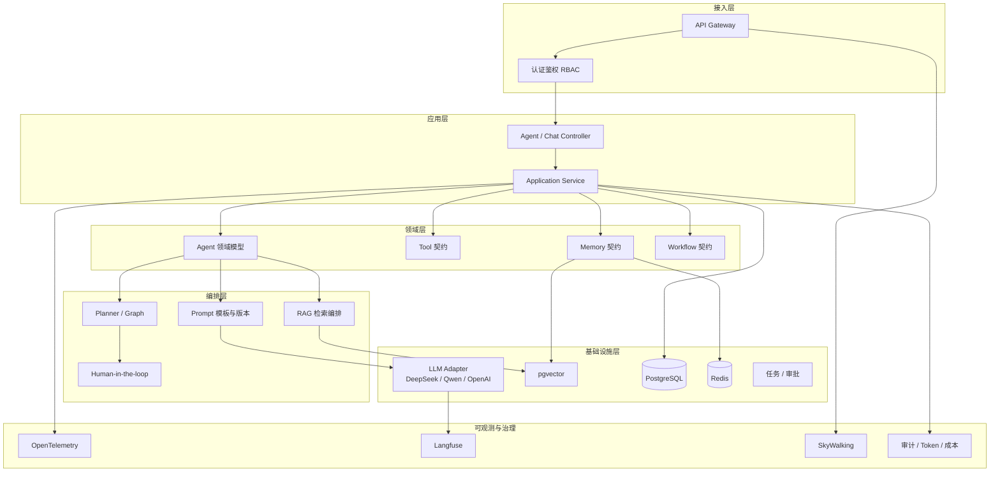
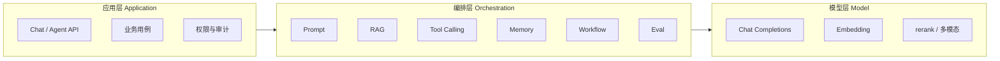
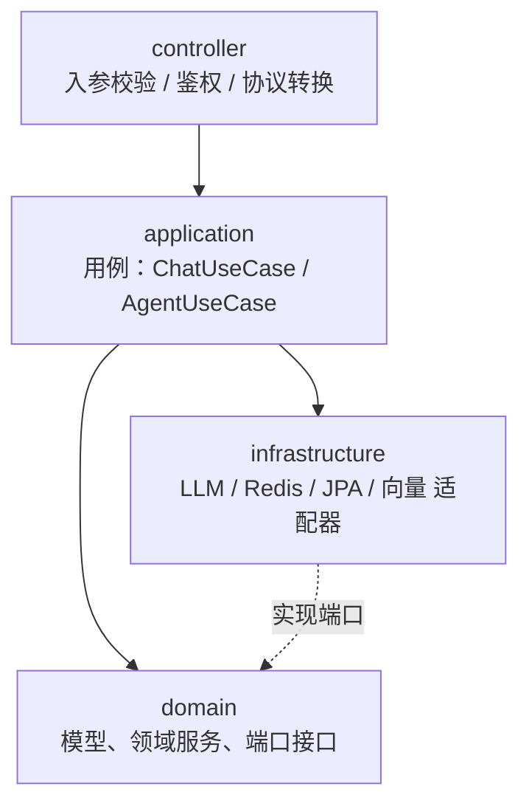
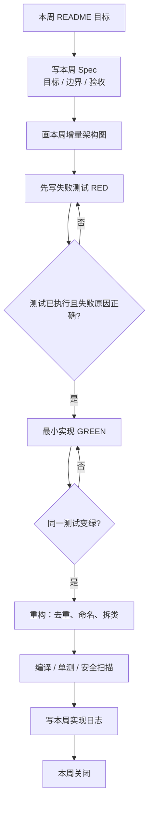
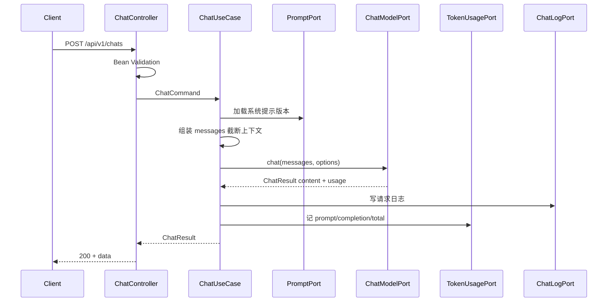
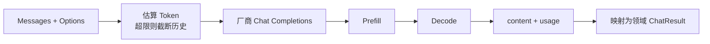
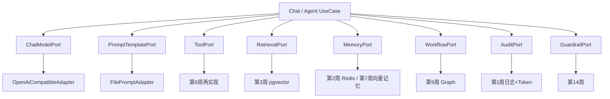

# 企业级 AI Agent 代码实现规范

> 角色：资深 AI 应用架构师  
> 适用范围：本仓库全部周次代码（第1周起强制执行）  
> 配套计划：[README.md](../README.md)  
> 配套阅读：[notes/week-01-llm-basics.md](../notes/week-01-llm-basics.md)

本文是**每周写代码的唯一范式**。未按本规范产出的代码视为未完成。

---

## 1. 目的

1. 把 6 个月学习计划从「能跑 Demo」升级为「可演进的企业级 AI 应用」。
2. 每周增量可编译、可测试、可回滚，禁止一次堆出不可维护的大泥球。
3. 让后续 RAG、Agent、权限、可观测性都能**挂到同一套分层上**，而不是推倒重来。
4. 固定交付物：规格 → 架构图 → 测试 → 代码 → 实现日志 → 质量门禁。任何人（含未来的自己）只看日志就能接手。

---

## 2. 依据

| 来源 | 采用什么 | 落到代码上的约束 |
|------|----------|------------------|
| Chip Huyen《AI工程》1.4 | 模型层 / 编排层 / 应用层 三层技术栈 | LLM SDK 不得泄漏到 Controller；编排逻辑独立于业务接口 |
| Chip Huyen《AI工程》1.3 | 场景评估 → 目标 → 里程碑 → 维护 | 每周先写 Spec，再写代码；日志与 Token 统计从第1周就有 |
| Chip Huyen《AI工程》5.x | Prompt 当代码、防御性提示 | Prompt 模板化、版本化；用户输入当数据不当指令 |
| Clean / Hexagonal Architecture | 依赖向内，基础设施可替换 | 业务面向接口；换 DeepSeek / Qwen / 本地模型只改适配器 |
| SOLID / DRY / KISS / YAGNI | 企业级可维护性 | 见第 5 节硬性禁令 |
| Spring 官方分层 | Controller / Service / Repository | 禁止跨层；禁止循环依赖 |
| TDD | 先红后绿再重构 | 无失败测试不得改生产代码 |
| OWASP / 企业安全基线 | 输入校验、密钥、审计 | API Key 只走环境变量；审计日志不含密钥 |

不采用：为了「看起来像大厂」而引入的多余中间件。本周用不到的能力，本周不准加。

---

## 3. 应用到的技术架构

### 3.1 全局目标架构（第6个月终态）



第1周只实现其中的 **接入 → 应用 → LLM Adapter → 审计（日志/Token）**。其余方框按周次长出来，不提前开挖。

### 3.2 三层 AI 技术栈映射（全书主线）



| 层 | 职责 | 允许依赖 | 禁止 |
|----|------|----------|------|
| 应用层 | HTTP、鉴权、用例编排、事务边界 | 领域接口、DTO | 直接 new OpenAI 客户端；拼 Prompt 字符串 |
| 编排层 | Prompt、检索、工具调度、图状态 | 模型端口、向量端口 | 写 SQL；感知 HttpServletRequest |
| 模型层 | 厂商 SDK、重试、超时、Token 解析 | 外部 API | 业务 if/else（如「患者风险」规则） |

### 3.3 代码分层（所有 Java 模块统一）



依赖规则：

- 高层只依赖抽象（`ChatModelPort`、`TokenUsagePort`、`ChatMessageRepository`）。
- 所有依赖构造器注入，禁止在类内 `new` 具体客户端。
- Controller 禁止调用 Repository。
- 业务层禁止写 SQL。
- 一个类超过 200 行必须拆。

### 3.4 分阶段技术栈（按周启用，未到周次禁止引入）

| 阶段 | 周次 | 允许技术 | 明确不做 |
|------|------|----------|----------|
| P1 基础 | 1 | Spring Boot 3、JDK 17+、Web、校验、日志 | Redis、向量、Agent |
| P1 基础 | 2 | LangChain4j 或 Spring AI、Redis、PostgreSQL | RAG、登录 |
| P1 RAG | 3–4 | pgvector、文档解析、Embedding | Multi-Agent |
| P2 Agent | 5–8 | Tool Calling、Memory、Spring AI Alibaba | K8s、Langfuse |
| P3 Workflow | 9–12 | Graph / State、HITL、Multi-Agent | 生产级网关可先简化 |
| P4 治理 | 13–16 | RBAC、Guardrails、Eval | 新业务 Agent |
| P5 可观测 | 17–20 | OTel、Langfuse、SkyWalking、Prom/Grafana | 新功能 |
| P6 实战 | 21–24 | 既有能力组合为医疗 SaaS | 换框架 |

### 3.5 JDK 运行约定（全局强制，后续所有项目照此）

本机系统 `JAVA_HOME` 固定为 **JDK 1.8**，供其他 1.8 项目使用。**禁止**为了本仓库改系统或会话级 `JAVA_HOME`。

本仓库全部 Java 模块使用 **JDK 17**，只通过 Maven 参数切换编译器与测试 JVM：

| 项 | 值 |
|----|----|
| 参数名 | `jdk.17.home` |
| 默认路径 | `E:/Program Files/Eclipse Adoptium/jdk-17.0.20.8-hotspot` |
| 命令写法 | `mvn test "-Djdk.17.home=E:\Program Files\Eclipse Adoptium\jdk-17.0.20.8-hotspot"` |

每个 `apps/*/pom.xml` 必须包含：

```xml
<properties>
    <java.version>17</java.version>
    <jdk.17.home>E:/Program Files/Eclipse Adoptium/jdk-17.0.20.8-hotspot</jdk.17.home>
</properties>

<plugin>
    <artifactId>maven-compiler-plugin</artifactId>
    <configuration>
        <fork>true</fork>
        <executable>${jdk.17.home}/bin/javac</executable>
        <release>17</release>
    </configuration>
</plugin>
<plugin>
    <artifactId>maven-surefire-plugin</artifactId>
    <configuration>
        <jvm>${jdk.17.home}/bin/java</jvm>
    </configuration>
</plugin>
<plugin>
    <groupId>org.springframework.boot</groupId>
    <artifactId>spring-boot-maven-plugin</artifactId>
    <configuration>
        <executable>${jdk.17.home}/bin/java</executable>
    </configuration>
</plugin>
```

每周 Spec 的 Commands、实现日志里的命令，都必须带 `-Djdk.17.home=...`。助手执行 Maven 时同样只传参数，不改 `JAVA_HOME`。

### 3.6 Maven 仓库约定（全局强制）

本仓库与 JDK 1.8 业务项目隔离：不用系统默认 `~/.m2`，不用其它项目的本地仓库。

| 项 | 值 |
|----|----|
| Maven Home | `D:\soft\maven-3.8.1` |
| User settings | `D:\soft\maven-3.8.1\conf\settings-ailocal.xml` |
| Local repository | `E:\workRepositoryAi`（已写在 settings-ailocal.xml 的 `<localRepository>`） |
| CLI | `mvn -s D:\soft\maven-3.8.1\conf\settings-ailocal.xml ...` |

每个可构建模块（及仓库根目录）必须有 `.mvn/maven.config`，与 IDEA「Use settings from .mvn/maven.config」对齐：

```
-s
D:/soft/maven-3.8.1/conf/settings-ailocal.xml
```

禁止：改全局 `settings.xml` 去迁就本仓库；把依赖下到 JDK8 项目的仓库。助手跑 Maven 必须带 `-s settings-ailocal.xml`（或依赖 `.mvn/maven.config`）。

---

## 4. 代码设计流程图

### 4.1 每周标准作业流程（强制）



无 Spec 不画图；无红灯测试不写生产代码；无日志不算交付。

### 4.2 第1周核心链路（后续周次在此链上长节点）



### 4.3 模型适配器内部（所有厂商共用此心智模型）



换厂商 = 换 Adapter，不换 UseCase。

### 4.4 演进时的扩展点（先定义端口，后填实现）



第1周必须落地的端口：`ChatModelPort`、`PromptTemplatePort`、`AuditPort`（日志+Token）。其余只允许以接口形式预留，**禁止空实现堆代码**。

---

## 5. 代码结构与编码硬性约定

### 5.1 仓库目录（按周生长，不预先建空模块）

```text
ai-code-repo/
├── README.md
├── docs/
│   ├── code-implementation-spec.md    ← 本文件
│   └── specs/
│       └── week-XX.md                 ← 本周 Spec
├── notes/
│   ├── week-XX-*.md                   ← 精读提纲
│   └── impl-logs/
│       └── week-XX.md                 ← 本周实现日志
└── apps/
    └── spring-ai-demo/                ← 第1–2周
        ├── pom.xml
        └── src/
            ├── main/java/.../
            │   ├── controller/   # 仅 Controller + Advice
            │   ├── dto/          # 请求/响应体
            │   ├── application/
            │   ├── domain/
            │   └── infrastructure/
            └── test/java/.../
```

后续 `enterprise-knowledge-agent`、`patient-agent` 以独立模块出现在 `apps/` 下，共享规范，不共享错误的上帝类。

### 5.2 包内职责

| 包 | 可以有 | 不可以有 |
|----|--------|----------|
| `controller` | 仅 Controller、`@Valid` 校验、`@RestControllerAdvice` | 调模型、算 Token、拼 Prompt、if 业务规则、放 DTO |
| `dto` | 请求/响应体、错误信封、参数校验注解 | 业务逻辑、依赖领域外类型 |
| `application` | 用例、事务、编排调用端口 | SQL、厂商 SDK 类型 |
| `domain` | 实体、值对象、领域异常、Port 接口 | Spring 注解（除纯 POJO）、Http 类型 |
| `infrastructure` | SDK、JPA、Redis、配置 | 业务决策（如「这是高风险患者」） |

### 5.3 命名

- 用例：`ChatUseCase`、`IngestDocumentUseCase`
- 端口：`XxxPort`（出站）/ 仓储 `XxxRepository`
- 适配器：`OpenAiCompatibleChatModelAdapter`
- DTO：`ChatRequest` / `ChatResponse`，不把厂商 JSON 直接暴露给前端
- 测试：`ChatUseCaseTest`、`ChatControllerTest`

### 5.4 文档约定（全局强制）

所有生产代码必须有文档，禁止无描述的 public 类型。注释写**职责与约束**，不写「把 i 加 1」这类废话。

| 对象 | 必须写什么 |
|------|------------|
| 类 / 接口 / 枚举 / record | 一句话职责；Port 写清入参/出参/失败约定 |
| public 方法（Port、UseCase、Controller、Adapter） | 做什么、何时抛什么异常 |
| HTTP 接口 | path、成功/失败状态码 |
| 配置项 | 含义、默认值、是否密钥 |
| 包 | 不强制 `package-info`；包职责见 5.2 |

格式：JavaDoc（`/** ... */`），中文。字段级 getter（record 访问器）不用再写一遍。

禁止：大段注释掉的死代码；把 Prompt 全文贴进 JavaDoc；把 API Key 示例写进注释。

### 5.5 硬性禁令

- 禁止魔法字符串 / 魔法数字 → 枚举或常量。
- 禁止 `Controller` 里写 Prompt。
- 禁止把 API Key 写入配置文件明文仓库；只用环境变量 / 本地未提交配置。
- 禁止日志打印密钥、完整银行卡、身份证；Prompt 日志可记，密钥不可记。
- 禁止返回 `null` 集合；用空列表。
- 禁止函数超过 3 个原始参数；封装命令对象。
- 禁止为「下周可能用到」提前引入 Redis / Kafka / 注册中心。
- 禁止在未确认 RED 前修改生产代码。
- 禁止跨周把无关重构混进本周提交。
- 禁止修改系统或会话 `JAVA_HOME`。本仓库 JDK 17 只用 `-Djdk.17.home`。

- 禁止 public 类型缺少 JavaDoc。

### 5.6 API 约定

```text
POST /api/v1/chats
GET  /api/v1/chats/{sessionId}/messages
```

成功：

```json
{
  "data": {
    "sessionId": "...",
    "messageId": "...",
    "content": "...",
    "usage": { "promptTokens": 12, "completionTokens": 34, "totalTokens": 46 }
  }
}
```

失败：

```json
{
  "error": {
    "code": "validation_error",
    "message": "message must not be blank"
  }
}
```

HTTP 状态码按语义使用，禁止全部 200。

### 5.7 安全底线（从第1周生效）

- 入参：长度、非空、字符集；`message` 设上限（如 8K 字符）。
- 用户输入作为 `user` role 内容，不得拼进系统提示。
- 超时、重试、`max_tokens` 必配。
- 对外错误信息不含堆栈、不含厂商原始报文。

---

## 6. 每周交付范式（以后每周代码必须按此输出）

每周代码输出是一个**交付包**，缺一不可：

```text
1. docs/specs/week-XX.md          本周规格
2. 本周增量架构图（可内嵌在 Spec）
3. 失败测试 + 执行证据（RED）
4. 最小实现 + 复测证据（GREEN）
5. notes/impl-logs/week-XX.md     实现日志
6. 质量门禁结果
```

### 6.1 本周规格模板（`docs/specs/week-XX.md`）

```markdown
# Spec: Week XX — <短标题>

## Objective
本周要让系统多具备什么能力（一句话）。

## Tech Stack
本周允许使用的技术（从规范 3.4 表勾选）。

## Commands
- 不改 JAVA_HOME。JDK17：`-Djdk.17.home=E:\\Program Files\\Eclipse Adoptium\\jdk-17.0.20.8-hotspot`
- Maven：`-s D:\\soft\\maven-3.8.1\\conf\\settings-ailocal.xml`（仓库 `E:\\workRepositoryAi`）
- 启动：
- 测试：
- 构建：

## Boundaries
- Always：本周必须做完
- Ask first：超出范围先停
- Never：本周明确不做

## Success Criteria
- [ ] 可执行的验收条目（接口、表、指标、测试名）

## Open Questions
未决问题；没有则写「无」。
```

### 6.2 本周增量架构要求

- 必须有一张 mermaid 图，只画**本周新增或改动的节点**，用注释标明「已有 / 本周新增」。
- 必须列出本周新增的 Port / Adapter / UseCase 清单。
- 必须说明为什么不采用更复杂方案（YAGNI 陈述，三行内）。

### 6.3 代码输出顺序

1. 先补测试，跑到失败，记录命令与失败信息。
2. 再写最小生产代码，只为让该测试变绿。
3. 测试全绿后再重构，重构后必须再跑同一测试集。
4. 最后写实现日志，日志中的命令与结果必须是真实跑过的。

### 6.4 对话中的输出格式（AI 助手每周必须遵守）

每周开始实现时，在对话里按这个顺序说话，禁止先丢一大坨代码：

1. **规格摘要**（目标 / 边界 / 验收，各不超过 5 条）
2. **增量架构图**（mermaid）
3. **RED**：测试文件路径 + 失败证据
4. **GREEN**：改动文件清单 + 复测证据
5. **日志已写入** `notes/impl-logs/week-XX.md`

---

## 7. 每周代码实现日志

日志路径：`notes/impl-logs/week-XX.md`  
一条日志对应一周，追加不覆盖；同一周多次迭代用「批次」分隔。

### 7.1 日志模板（复制即用）

```markdown
# Week XX 实现日志 — <短标题>

- 日期：
- 批次：1
- 对应 Spec：docs/specs/week-XX.md
- 对应阅读：notes/week-XX-*.md

## 1. 本周目标
## 2. 边界
- Always：
- Never：
## 3. 增量架构
（贴 mermaid 或指向 Spec 中的图）
## 4. 新增类型清单
| 类型 | 名称 | 职责 |
|------|------|------|
| UseCase | | |
| Port | | |
| Adapter | | |
| Test | | |
## 5. RED
- 命令：
- 结果：失败（预期）
- 原因：
## 6. GREEN
- 改动文件：
- 命令：
- 结果：通过
## 7. 重构
- 做了什么 / 没做什么：
## 8. 质量门禁
- [ ] 编译
- [ ] 单测
- [ ] 无密钥入库
- [ ] 分层未突破
## 9. 验证证据
粘贴关键命令输出摘要（不要整份构建日志）。
## 10. 风险与下周输入
## 11. 决策记录 ADR
| 决策 | 选项 | 选择 | 理由 |
|------|------|------|------|
```

### 7.2 日志填写规则

- 只记**做过的事**和**跑过的命令**，不记计划口吻。
- ADR 只记录有争议的选择（例如选 Spring AI 还是 LangChain4j）。无争议写「无」。
- Token 统计、模型名、耗时一旦有真实数据，写入第 9 节。
- 失败过的尝试也要记，避免下周重复踩坑。

### 7.3 周次索引

| 周 | 主题 | Spec | 日志 | 状态 |
|----|------|------|------|------|
| 01 | LLM 基础 / spring-ai-demo | docs/specs/week-01.md | notes/impl-logs/week-01.md | 已关闭 |
| 02 | Java AI 基础 / 模板 / Redis / 表结构 | | | 未开始 |
| 03 | RAG 知识库 | | | 未开始 |
| 04 | 企业知识库 Agent V1 | | | 未开始 |
| 05 | Agent 基础 | | | 未开始 |
| 06 | Tool Calling | | | 未开始 |
| 07 | Agent Memory | | | 未开始 |
| 08 | Spring AI Alibaba | | | 未开始 |
| 09 | Workflow | | | 未开始 |
| 10 | Human in the Loop | | | 未开始 |
| 11 | Multi Agent | | | 未开始 |
| 12 | Agent 平台 V1 | | | 未开始 |
| 13 | 权限体系 | | | 未开始 |
| 14 | AI 安全 | | | 未开始 |
| 15 | Agent Evaluation | | | 未开始 |
| 16 | 企业规范 | | | 未开始 |
| 17 | OpenTelemetry | | | 未开始 |
| 18 | Langfuse | | | 未开始 |
| 19 | SkyWalking | | | 未开始 |
| 20 | 完整监控体系 | | | 未开始 |
| 21–24 | 医疗 SaaS 四 Agent | | | 未开始 |

每周关闭时把本表状态改为「进行中 / 已关闭」，并补上文件路径。

---

## 8. 质量门禁

每周 GREEN 之后必须执行，结果写入日志第 8 节。

| 门禁 | 标准 | 不通过则 |
|------|------|----------|
| 编译 | 模块可 `mvn -q test-compile "-Djdk.17.home=..."` | 不得进入重构 |
| 单测 | 本周新增测试全绿 | 不得宣称完成 |
| JDK | 未改 `JAVA_HOME`；pom 含 `jdk.17.home` | 立刻改回参数方式 |
| 文档 | public 类型均有 JavaDoc | 补文档后再交付 |
| 分层 | Controller 无 SDK / Service 无 SQL | 回滚越层代码 |
| 安全 | 无密钥、无用户输入拼进系统提示 | 立即改 |
| YAGNI | 未出现下周才需要的依赖 | 删除依赖后再提交 |
| 日志 | `notes/impl-logs/week-XX.md` 已填 RED/GREEN 证据 | 本周未交付 |

覆盖率目标：新增业务代码行覆盖 ≥ 80%（端口适配器的纯 SDK 调用允许用契约测试代替）。

---

## 9. 第1周预览（只定义，不在本文实现）

- 目标：Spring Boot 聊天接口 + 模型调用 + 请求日志 + Token 统计。
- 端口：`ChatModelPort`、`PromptTemplatePort`、`AuditPort`。
- Never：Redis、RAG、登录、Docker 编排以外的平台能力。
- 验收见未来的 `docs/specs/week-01.md`。

启动第1周代码时，先产出 Spec 与 RED，再写实现。
