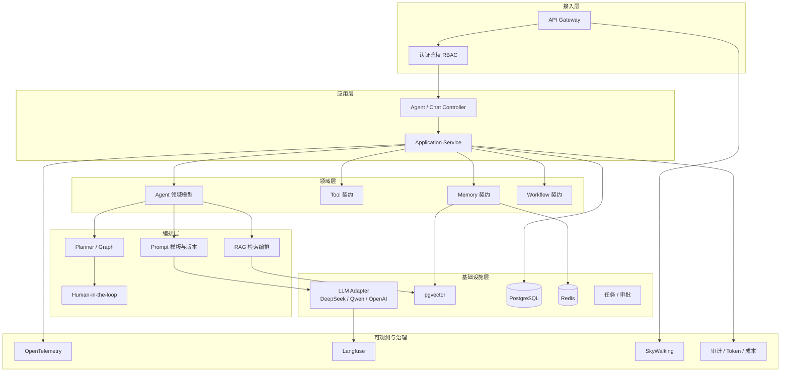
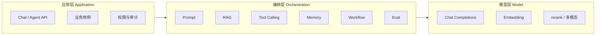
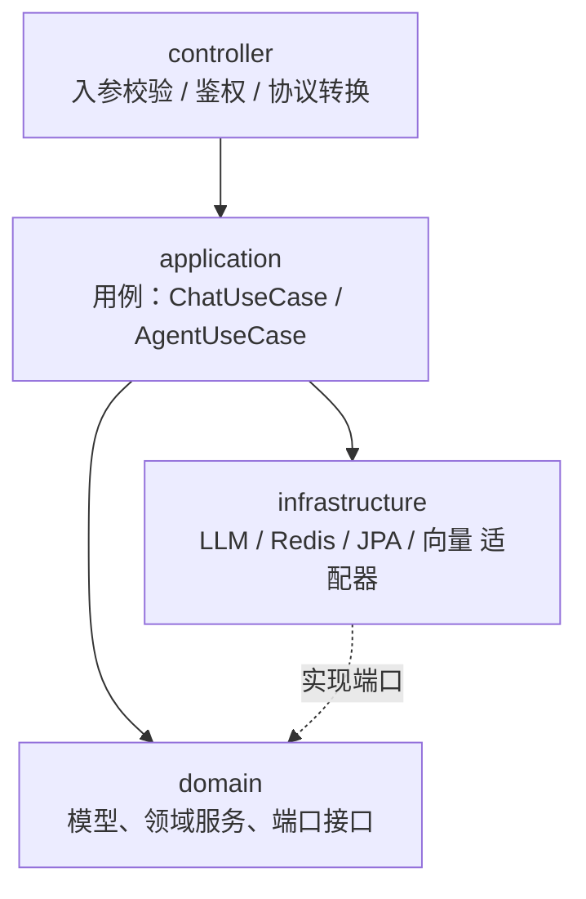
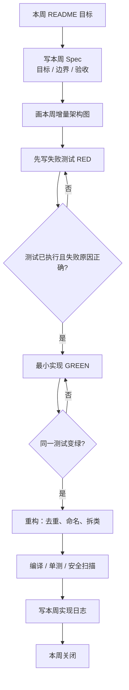
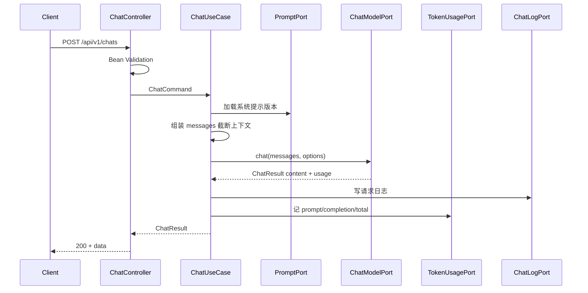
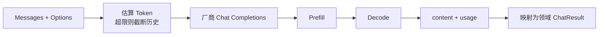
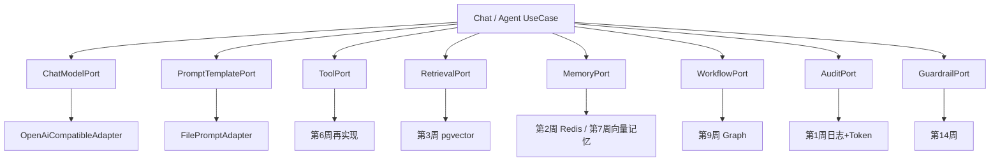

# 企业级 AI Agent 代码实现规范

> 角色：资深 AI 应用架构师 / 代码架构师 
> 适用范围：本仓库全部周次代码（第1周起强制执行）  
> 配套计划：[README.md](../README.md)  
> 配套阅读：[notes/week-01-llm-basics.md](../notes/week-01-llm-basics.md)

本文是**每周写代码的唯一范式**。未按本规范产出的代码视为未完成。

---

## 1. 目的

1. 把 6 个月学习计划从「能跑 Demo」升级为「可演进的企业级 AI 应用」。
2. 每周增量可编译、可测试、可回滚，禁止一次堆出不可维护的大泥球。
3. 让后续 RAG、Agent、权限、可观测性都能**挂到同一套分层上**，而不是推倒重来。
4. 固定交付物：规格 → 架构图 → 测试 → 代码 → 实现日志 → 质量门禁。任何人（含未来的自己）只看日志就能接手。

---

## 2. 依据

| 来源 | 采用什么 | 落到代码上的约束 |
|------|----------|------------------|
| Chip Huyen《AI工程》1.4 | 模型层 / 编排层 / 应用层 三层技术栈 | LLM SDK 不得泄漏到 Controller；编排逻辑独立于业务接口 |
| Chip Huyen《AI工程》1.3 | 场景评估 → 目标 → 里程碑 → 维护 | 每周先写 Spec，再写代码；日志与 Token 统计从第1周就有 |
| Chip Huyen《AI工程》5.x | Prompt 当代码、防御性提示 | Prompt 模板化、版本化；用户输入当数据不当指令 |
| Clean / Hexagonal Architecture | 依赖向内，基础设施可替换 | 业务面向接口；换 DeepSeek / Qwen / 本地模型只改适配器 |
| SOLID / DRY / KISS / YAGNI | 企业级可维护性 | 见第 5 节硬性禁令 |
| Spring 官方分层 | Controller / Service / Repository | 禁止跨层；禁止循环依赖 |
| TDD | 先红后绿再重构 | 无失败测试不得改生产代码 |
| OWASP / 企业安全基线 | 输入校验、密钥、审计 | API Key 只走环境变量；审计日志不含密钥 |

不采用：为了「看起来像大厂」而引入的多余中间件。本周用不到的能力，本周不准加。

---

## 3. 应用到的技术架构

### 3.1 全局目标架构（第6个月终态）


```mermaid
flowchart TB
  subgraph Access["接入层"]
    GW[API Gateway]
    AUTH[认证鉴权 RBAC]
  end

  subgraph App["应用层"]
    CTRL[Agent / Chat Controller]
    APP[Application Service]
  end

  subgraph Domain["领域层"]
    AGENT[Agent 领域模型]
    TOOL[Tool 契约]
    MEM[Memory 契约]
    WF[Workflow 契约]
  end

  subgraph Orchestration["编排层"]
    PROMPT[Prompt 模板与版本]
    RAG[RAG 检索编排]
    PLAN[Planner / Graph]
    HITL[Human-in-the-loop]
  end

  subgraph Infra["基础设施层"]
    LLM[LLM Adapter<br/>DeepSeek / Qwen / OpenAI]
    VEC[pgvector]
    DB[(PostgreSQL)]
    REDIS[(Redis)]
    MQ[任务 / 审批]
  end

  subgraph Observe["可观测与治理"]
    OTEL[OpenTelemetry]
    LF[Langfuse]
    SW[SkyWalking]
    AUDIT[审计 / Token / 成本]
  end

  GW --> AUTH --> CTRL --> APP
  APP --> AGENT
  APP --> TOOL
  APP --> MEM
  APP --> WF
  AGENT --> PROMPT
  AGENT --> RAG
  AGENT --> PLAN
  PLAN --> HITL
  PROMPT --> LLM
  RAG --> VEC
  APP --> DB
  MEM --> REDIS
  MEM --> VEC
  APP --> OTEL
  LLM --> LF
  GW --> SW
  APP --> AUDIT
```

第1周只实现其中的 **接入 → 应用 → LLM Adapter → 审计（日志/Token）**。其余方框按周次长出来，不提前开挖。

### 3.2 三层 AI 技术栈映射（全书主线）


```mermaid
flowchart LR
  subgraph L3["应用层 Application"]
    A1[Chat / Agent API]
    A2[业务用例]
    A3[权限与审计]
  end

  subgraph L2["编排层 Orchestration"]
    B1[Prompt]
    B2[RAG]
    B3[Tool Calling]
    B4[Memory]
    B5[Workflow]
    B6[Eval]
  end

  subgraph L1["模型层 Model"]
    C1[Chat Completions]
    C2[Embedding]
    C3[rerank / 多模态]
  end

  L3 --> L2 --> L1
```

| 层 | 职责 | 允许依赖 | 禁止 |
|----|------|----------|------|
| 应用层 | HTTP、鉴权、用例编排、事务边界 | 领域接口、DTO | 直接 new OpenAI 客户端；拼 Prompt 字符串 |
| 编排层 | Prompt、检索、工具调度、图状态 | 模型端口、向量端口 | 写 SQL；感知 HttpServletRequest |
| 模型层 | 厂商 SDK、重试、超时、Token 解析 | 外部 API | 业务 if/else（如「患者风险」规则） |

### 3.3 代码分层（所有 Java 模块统一）


```mermaid
flowchart TB
  CTRL["controller<br/>入参校验 / 鉴权 / 协议转换"]
  APP["application<br/>用例：ChatUseCase / AgentUseCase"]
  DOM["domain<br/>模型、领域服务、端口接口"]
  ADAPT["infrastructure<br/>LLM / Redis / JPA / 向量 适配器"]

  CTRL --> APP
  APP --> DOM
  ADAPT -.->|实现端口| DOM
  APP --> ADAPT
```

依赖规则：

- 高层只依赖抽象（`ChatModelPort`、`TokenUsagePort`、`ChatMessageRepository`）。
- 所有依赖构造器注入，禁止在类内 `new` 具体客户端。
- Controller 禁止调用 Repository。
- 业务层禁止写 SQL。
- 一个类超过 200 行必须拆。

### 3.4 分阶段技术栈（按周启用，未到周次禁止引入）

| 阶段 | 周次 | 允许技术 | 明确不做 |
|------|------|----------|----------|
| P1 基础 | 1 | Spring Boot 3、JDK 17+、Web、校验、日志 | Redis、向量、Agent |
| P1 基础 | 2 | LangChain4j 或 Spring AI、Redis、PostgreSQL | RAG、登录 |
| P1 RAG | 3–4 | pgvector、文档解析、Embedding | Multi-Agent |
| P2 Agent | 5–8 | Tool Calling、Memory、Spring AI Alibaba | K8s、Langfuse |
| P3 Workflow | 9–12 | Graph / State、HITL、Multi-Agent | 生产级网关可先简化 |
| P4 治理 | 13–16 | RBAC、Guardrails、Eval | 新业务 Agent |
| P5 可观测 | 17–20 | OTel、Langfuse、SkyWalking、Prom/Grafana | 新功能 |
| P6 实战 | 21–24 | 既有能力组合为医疗 SaaS | 换框架 |

### 3.5 JDK 运行约定（全局强制，后续所有项目照此）

**系统 / 用户级 `JAVA_HOME` 固定为 `D:\soft\jdk-1.8`**，供其他 1.8 项目使用。**禁止**为了本仓库改系统或会话级 `JAVA_HOME`。

本仓库全部 Java 模块使用 **JDK 17**，通过以下方式运行，不污染全局：

| 项 | 值 |
|----|----|
| JDK 17 路径 | `E:/Program Files/Eclipse Adoptium/jdk-17.0.20.8-hotspot` |
| Maven 参数 | `mvn test "-Djdk.17.home=E:\Program Files\Eclipse Adoptium\jdk-17.0.20.8-hotspot"` |
| 快捷脚本（推荐） | 根 `run-maven-jdk17.ps1`（聚合构建）；各模块 `run-maven-jdk17.ps1`（单模块） |

快捷脚本用法：

```powershell
# 测试
.\run-maven-jdk17.ps1 -q test

# 启动
.\run-maven-jdk17.ps1 spring-boot:run

# 打包（spring-boot-maven-plugin 需要 Maven 本身跑在 JDK 17，所以必须用脚本）
.\run-maven-jdk17.ps1 -q -DskipTests package
```

每个 `apps/*/pom.xml` 必须包含：

```xml
<properties>
    <java.version>17</java.version>
    <jdk.17.home>E:/Program Files/Eclipse Adoptium/jdk-17.0.20.8-hotspot</jdk.17.home>
</properties>

<plugin>
    <artifactId>maven-compiler-plugin</artifactId>
    <configuration>
        <fork>true</fork>
        <executable>${jdk.17.home}/bin/javac</executable>
        <release>17</release>
    </configuration>
</plugin>
<plugin>
    <artifactId>maven-surefire-plugin</artifactId>
    <configuration>
        <jvm>${jdk.17.home}/bin/java</jvm>
    </configuration>
</plugin>
<plugin>
    <groupId>org.springframework.boot</groupId>
    <artifactId>spring-boot-maven-plugin</artifactId>
    <configuration>
        <executable>${jdk.17.home}/bin/java</executable>
    </configuration>
</plugin>
```

每周 Spec 的 Commands、实现日志里的命令，都必须带 `-Djdk.17.home=...`。助手执行 Maven 时同样只传参数，不改 `JAVA_HOME`。

### 3.6 Maven 仓库约定（全局强制）

本仓库与 JDK 1.8 业务项目隔离：不用系统默认 `~/.m2`，不用其它项目的本地仓库。

| 项 | 值 |
|----|----|
| Maven Home | `D:\soft\maven-3.9.4` |
| User settings | `D:\soft\maven-3.9.4\conf\settings-ailocal.xml` |
| Local repository | `E:\workRepositoryAi`（已写在 settings-ailocal.xml 的 `<localRepository>`） |
| CLI | `mvn -s D:\soft\maven-3.9.4\conf\settings-ailocal.xml ...` |

每个可构建模块（及仓库根目录）必须有 `.mvn/maven.config`，与 IDEA「Use settings from .mvn/maven.config」对齐：

```
-s
D:/soft/maven-3.9.4/conf/settings-ailocal.xml
```

禁止：改全局 `settings.xml` 去迁就本仓库；把依赖下到 JDK8 项目的仓库。助手跑 Maven 必须带 `-s settings-ailocal.xml`（或依赖 `.mvn/maven.config`）。

### 3.7 数据库与迁移脚本约定（全局强制）

第 16 周真库验证（PostgreSQL 16.15）暴露过「H2 单测全绿、上真库直接失败」的问题，故把数据库脚本与本地配置提升为全局强制约定。后续所有周次新增迁移脚本与 `application*.yml` 一律照此执行。

#### 3.7.1 一处脚本，两种数据库

单测用 H2（`MODE=PostgreSQL`）跑与生产**同一套**迁移脚本，因此脚本必须在 PostgreSQL 与 H2 上都可执行。禁止方言单边特性：

| 禁用 | 原因 | 替代 |
|------|------|------|
| `CLOB` / `LONGTEXT` | H2 容忍但 PostgreSQL 无此类型，直接报 `type "clob" does not exist` | 无长度 `VARCHAR`（PostgreSQL 不限长、H2 取最大长度） |
| `TEXT` | H2 不支持 | 同上 |
| `JSONB` / `JSON` | H2 与 PostgreSQL 行为不一致 | 无长度 `VARCHAR` 存 JSON 文本 |
| `CREATE EXTENSION` | H2 无扩展机制 | 需要扩展的脚本单独放 `db/postgresql/` 目录，且只在该库生效 |
| 部分索引（`WHERE` 子句） | H2 支持有限 | 普通索引 |
| 方言 upsert（`ON CONFLICT` / `MERGE`） | 两库语法不同 | 适配器层「先查后写」：`UPDATE` 影响 0 行再 `INSERT` |
| `GENERATED ... AS IDENTITY`（若需兼容旧库） | H2 与 PostgreSQL 语义有差异 | 需要时用 `COALESCE(MAX(id),0)+1` 生成，或明确只支持 PostgreSQL |

可放心使用：`BIGSERIAL` / `VARCHAR(n)` / `INT` / `BIGINT` / `BOOLEAN` / `TIMESTAMP WITH TIME ZONE` / `CREATE TABLE IF NOT EXISTS` / `CREATE INDEX IF NOT EXISTS`。

时间列统一 `TIMESTAMP WITH TIME ZONE`，Java 侧统一用 `Instant` 读写（禁止 `LocalDateTime`，避免跨时区歧义）。

#### 3.7.2 Flyway 历史表与引导

同一个数据库可能被多个应用共用（各模块各有从 V1 开始的迁移）。**每个模块必须使用自己的历史表**：

```yaml
spring:
  flyway:
    enabled: true
    locations: classpath:db/migration
    table: flyway_schema_history_<模块名>   # 禁止默认 flyway_schema_history
    baseline-on-migrate: true
    baseline-version: 0                    # 必须是 0，不能留默认值 1
```

| 配置 | 错误后果 |
|------|----------|
| 用默认历史表 | 两个模块的 V1 相互跳过或版本冲突 |
| `baseline-on-migrate: false`（共用库） | 启动直接失败：`Found non-empty schema(s) "public" but no schema history table` |
| `baseline-version` 留默认 1 | Flyway 把本模块 V1 记为「已应用」而**跳过**，表一张都不建 |

单测的 `application-test.yml` 必须与生产同口径（`baseline-version: 0`），否则测试通过而真库失败。

#### 3.7.3 脚本命名与不可变性

- 命名：`V<序号>__<小写下划线描述>.sql`（如 `V2__platform_execution_record.sql`）。
- **已成功应用的脚本不可再修改**——Flyway 校验 checksum，改动会导致启动报 validation 失败。只有失败回滚过的脚本可以改；改完需清除该库中的失败记录后重跑。
- 每次迁移必须是可重复执行的（`IF NOT EXISTS`），并考虑「服务重启」场景。

#### 3.7.4 落库验收要求（不可只用 H2）

新增或修改迁移脚本时，交付前必须完成：

1. 根聚合 `test` 全绿（H2 `MODE=PostgreSQL`）；
2. **在真实 PostgreSQL 上启动一次**，确认日志出现 `Successfully validated N migrations` → `Migrating ... to version vX` → `Successfully applied N migrations, now at version vX`；
3. 查历史表确认**没有被跳过的版本**：应为 `v0 BASELINE` + `v1` + `v2` + …，若只看到 `v1 BASELINE` 说明 V1 被跳过；
4. **重启一次**，确认只做校验不重跑迁移，且 seed 幂等（行数不变）；
5. 确认未污染同库其它应用的对象（它们的历史表行数不变）。

#### 3.7.5 往已有环境的库上叠加新模块（pull 新代码后必查）

各环境库中已有前序周次的对象（例如第 1–3 周的聊天表、第 4 周的知识库表），新模块很可能**同一个库**。此时必须逐项确认：

| 检查项 | 期望 | 不通过说明 |
|--------|------|------------|
| 历史表名 | 新模块用 `flyway_schema_history_<模块名>`，与既有应用的 `flyway_schema_history` 并存 | 仍是默认表名 → 版本号冲突，必须先改配置再启动 |
| 历史表内容 | `v0 BASELINE` + 新模块的 `v1/v2/…` **逐条 SQL** | 只有一条 `v1 BASELINE` → V1 被跳过，表没建 |
| 表名冲突 | 新模块表名与既有对象无重名（`information_schema.tables` 比对） | 重名 → 改名，禁止 `DROP` 既有表 |
| 既有应用历史 | 原 `flyway_schema_history` 行数不变 | 行数变化 → 新模块污染了别人的迁移记录 |
| 密码列 | seed 只写哈希 | 出现明文 → 立即回滚 |

同一模块在**多个环境**的库上首次执行时，上述检查要各做一次；不同环境库内容不同，验证结果不能互相替代。

#### 3.7.6 本地连接配置（.env 与环境变量）

连接串、密钥等环境相关配置**只放环境变量或模块 `.env`**，一律不入库（`.gitignore` 已忽略 `.env`），每套环境自建。

**禁止在 `application*.yml` 里写具体库名/账号作默认值。** 必须写成空占位：

```yaml
spring:
  datasource:
    url: ${SPRING_DATASOURCE_URL:}        # 不要写 jdbc:postgresql://localhost:5432/某个库名
    username: ${SPRING_DATASOURCE_USERNAME:}
    password: ${SPRING_DATASOURCE_PASSWORD:}
```

原因：各环境库名/账号都不同，写死在 yml 里的库名会误导其它环境（曾把某个历史库名写进 yml 与文档，造成"这个库是不是要求我建"的困惑）。空占位在缺配置时直接报缺失，比连错库更好定位。

运行方式与配置来源：

| 方式 | 配置来源 | 说明 |
|------|----------|------|
| **IDEA（推荐）** | EnvFile 插件指向**本模块** `.env` | 运行配置里 `envFilePaths` = `$PROJECT_DIR$/apps/<模块>/.env`，插件把文件内容作为**环境变量**注入进程，优先级最高。IDEA 运行配置的工作目录通常是项目根，`file:.env` 找不到模块级 `.env`，所以以 EnvFile 注入为准（二者不冲突）。**若未装 EnvFile 插件**，必须在运行配置里手工填数据源环境变量 |
| 命令行 / 脚本 | shell 环境变量，或模块 `.env` | 模块 `application*.yml` 声明 `config.import: optional:file:.env[.properties]`；`optional:` 保证文件缺失不启动失败，`[.properties]` 提示按 `KEY=VALUE` 解析 |

**IDE 运行不读 Maven 的 profile 参数。** `spring-boot-maven-plugin` 的 `spring-boot.run.profiles` 只对 `mvn spring-boot:run` 生效；IDEA 直接 Run 或 `java -jar` 都要另想办法，二选一：

1. 在 `application.yml` 声明 `spring.profiles.default: <默认 profile>`（推荐，覆盖面最广，IDE 与 jar 都生效）；
2. 在 IDEA 运行配置的 "Active profiles" 或 `.env` 里设 `SPRING_PROFILES_ACTIVE=<profile>`。

否则落在需要数据源的 profile 上却没有数据源配置，启动会报
`Failed to configure a DataSource: 'url' attribute is not specified ... you may need to activate it`——报错含糊、容易误判为"库连不上"。

**相对路径按进程工作目录解析**：`file:.env` 只在工作目录 == 模块目录时命中（`mvn spring-boot:run`、在模块目录跑 jar 属于此种）。工作目录是项目根时（IDEA 默认）该 import 空转，不报错。

配置优先级（高 → 低）：命令行参数 / 环境变量 → `application-<profile>.yml` → `.env` → `application.yml` 默认值。

- 因此单测的 `application-test.yml`（H2）**不会被 `.env` 的真库地址覆盖**；
- 本地临时覆盖用环境变量即可，无需改文件。
- 文档中引用具体环境一律用占位符（`<db-host>`、`<db-name>`），避免换环境后文档误导。

**每个模块必须维护 `.env.example`（入库，供新环境照抄）**，且遵守：

| 要求 | 说明 |
|------|------|
| 只给 key 与**格式占位符** | 如 `SPRING_DATASOURCE_URL=jdbc:postgresql://<db-host>:<db-port>/<db-name>`；**禁止填某个环境的具体库名/账号**（曾把历史库名写进模板，误导其它环境以为必须建该库） |
| 列全该模块**启动必需**的 key | 尤其数据库、Redis、必填密钥；漏列会导致新环境照抄后启动失败 |
| 标明哪些可选、默认值是什么 | 用「可选」标注，并给默认值（如 `AUTH_PASSWORD_SALT=change-me-please`） |
| 值可安全入库 | 模板里不出现任何真实 Key、密码、内网地址 |

`.env`（填了真实值）不入库，`.env.example`（占位符）入库——这是新环境能"照着配自己的库"的唯一途径。

---

## 4. 代码设计流程图

### 4.1 每周标准作业流程（强制）


```mermaid
flowchart TD
  S[本周 README 目标] --> SPEC[写本周 Spec<br/>目标 / 边界 / 验收]
  SPEC --> ARCH[画本周增量架构图]
  ARCH --> RED[先写失败测试 RED]
  RED --> GATE1{测试已执行且失败原因正确?}
  GATE1 -->|否| RED
  GATE1 -->|是| GREEN[最小实现 GREEN]
  GREEN --> GATE2{同一测试变绿?}
  GATE2 -->|否| GREEN
  GATE2 -->|是| REF[重构：去重、命名、拆类]
  REF --> VERIFY[编译 / 单测 / 安全扫描]
  VERIFY --> LOG[写本周实现日志]
  LOG --> DONE[本周关闭]
```

无 Spec 不画图；无红灯测试不写生产代码；无日志不算交付。

### 4.2 第1周核心链路（后续周次在此链上长节点）


```mermaid
sequenceDiagram
  participant U as Client
  participant C as ChatController
  participant UC as ChatUseCase
  participant P as PromptPort
  participant M as ChatModelPort
  participant T as TokenUsagePort
  participant L as ChatLogPort

  U->>C: POST /api/v1/chats
  C->>C: Bean Validation
  C->>UC: ChatCommand
  UC->>P: 加载系统提示版本
  UC->>UC: 组装 messages 截断上下文
  UC->>M: chat(messages, options)
  M-->>UC: ChatResult content + usage
  UC->>L: 写请求日志
  UC->>T: 记 prompt/completion/total
  UC-->>C: ChatResult
  C-->>U: 200 + data
```

### 4.3 模型适配器内部（所有厂商共用此心智模型）


```mermaid
flowchart LR
  IN[Messages + Options] --> EST[估算 Token<br/>超限则截断历史]
  EST --> HTTP[厂商 Chat Completions]
  HTTP --> PRE[Prefill]
  PRE --> DEC[Decode]
  DEC --> OUT[content + usage]
  OUT --> MAP[映射为领域 ChatResult]
```

换厂商 = 换 Adapter，不换 UseCase。

### 4.4 演进时的扩展点（先定义端口，后填实现）


```mermaid
flowchart TB
  UC[Chat / Agent UseCase]
  UC --> MP[ChatModelPort]
  UC --> PP[PromptTemplatePort]
  UC --> TP[ToolPort]
  UC --> RP[RetrievalPort]
  UC --> MEM[MemoryPort]
  UC --> WP[WorkflowPort]
  UC --> AP[AuditPort]
  UC --> GP[GuardrailPort]

  MP --> A1[OpenAiCompatibleAdapter]
  PP --> A2[FilePromptAdapter]
  TP --> A3[第6周再实现]
  RP --> A4[第3周 pgvector]
  MEM --> A5[第2周 Redis / 第7周向量记忆]
  WP --> A6[第9周 Graph]
  AP --> A7[第1周日志+Token]
  GP --> A8[第14周]
```

第1周必须落地的端口：`ChatModelPort`、`PromptTemplatePort`、`AuditPort`（日志+Token）。其余只允许以接口形式预留，**禁止空实现堆代码**。

---

## 5. 代码结构与编码硬性约定

### 5.1 仓库目录（按周生长，不预先建空模块）

```text
ai-code-repo/
├── README.md
├── pom.xml                             ← 根聚合（packaging=pom，聚合 libs + apps）
├── run-maven-jdk17.ps1                 ← 根聚合构建脚本
├── .mvn/maven.config                   ← -s settings-ailocal.xml
├── docs/
│   ├── code-implementation-spec.md    ← 本文件
│   ├── specs/week-XX.md               ← 本周 Spec
│   ├── architecture/week-XX-*.md      ← 本周架构图
│   ├── api/week-XX-api.md             ← 本周接口文档
│   └── postman/week-XX.postman_collection.json
├── notes/
│   ├── week-XX-*.md                   ← 精读提纲
│   └── impl-logs/week-XX.md           ← 本周实现日志
├── libs/
│   └── ai-core/                        ← 横切能力共享库（com.aicode.core，第6周起）
│       ├── pom.xml
│       └── src/main/java/com/aicode/core/
│           ├── domain/                 # model / port / exception / 领域服务 / 工具契约
│           └── infrastructure/         # llm / prompt / embedding / vector / ocr / security / storage / config
└── apps/
    ├── spring-ai-demo/                ← 第1–3周（历史演示，保留自含，不收敛到 ai-core）
    ├── enterprise-knowledge-agent/    ← 第4周（依赖 ai-core）
    ├── patient-agent/                 ← 第5–7周（依赖 ai-core）
    └── spring-ai-alibaba-agent/       ← 第8周（Spring AI Alibaba Graph，依赖 ai-core）
        ├── pom.xml
        └── src/
            ├── main/java/.../
            │   ├── controller/   # 仅 Controller + Advice
            │   ├── dto/          # 请求/响应体
            │   ├── application/
            │   ├── domain/
            │   └── infrastructure/
            └── test/java/.../
```

各 app 模块在 `apps/` 下独立存在，共享规范，不共享错误的上帝类。**新应用在旧模块基础上改造，不再复制代码**（第 6 周起，横切能力一律进 `libs/ai-core`）。

### 5.2 包内职责

| 包 | 可以有 | 不可以有 |
|----|--------|----------|
| `controller` | 仅 Controller、`@Valid` 校验、`@RestControllerAdvice` | 调模型、算 Token、拼 Prompt、if 业务规则、放 DTO |
| `dto` | 请求/响应体、错误信封、参数校验注解 | 业务逻辑、依赖领域外类型 |
| `application` | 用例、事务、编排调用端口 | SQL、厂商 SDK 类型 |
| `domain` | 实体、值对象、领域异常、Port 接口 | Spring 注解（除纯 POJO）、Http 类型 |
| `infrastructure` | SDK、JPA、Redis、配置 | 业务决策（如「这是高风险患者」） |

### 5.3 命名

- 用例：`ChatUseCase`、`IngestDocumentUseCase`
- 端口：`XxxPort`（出站）/ 仓储 `XxxRepository`
- 适配器：`OpenAiCompatibleChatModelAdapter`
- DTO：`ChatRequest` / `ChatResponse`，不把厂商 JSON 直接暴露给前端
- 测试：`ChatUseCaseTest`、`ChatControllerTest`

### 5.4 文档约定（全局强制）

所有生产代码必须有文档，禁止无描述的 public 类型。注释写**职责与约束**，不写「把 i 加 1」这类废话。

| 对象 | 必须写什么 |
|------|------------|
| 类 / 接口 / 枚举 / record | 一句话职责；Port 写清入参/出参/失败约定 |
| public 方法（Port、UseCase、Controller、Adapter） | 做什么、何时抛什么异常 |
| HTTP 接口 | path、成功/失败状态码 |
| 配置项 | 含义、默认值、是否密钥 |
| 包 | 不强制 `package-info`；包职责见 5.2 |

格式：JavaDoc（`/** ... */`），中文。字段级 getter（record 访问器）不用再写一遍。

禁止：大段注释掉的死代码；把 Prompt 全文贴进 JavaDoc；把 API Key 示例写进注释。

### 5.5 硬性禁令

- 禁止魔法字符串 / 魔法数字 → 枚举或常量。
- 禁止 `Controller` 里写 Prompt。
- 禁止把 API Key 写入配置文件明文仓库；只用环境变量 / 本地未提交配置。
- 禁止日志打印密钥、完整银行卡、身份证；Prompt 日志可记，密钥不可记。
- 禁止返回 `null` 集合；用空列表。
- 禁止函数超过 3 个原始参数；封装命令对象。
- 禁止为「下周可能用到」提前引入 Redis / Kafka / 注册中心。
- 禁止在未确认 RED 前修改生产代码。
- 禁止跨周把无关重构混进本周提交。
- 禁止修改系统或会话 `JAVA_HOME`。本仓库 JDK 17 只用 `-Djdk.17.home`。

- 禁止 public 类型缺少 JavaDoc。

### 5.6 API 约定

```text
POST /api/v1/chats
GET  /api/v1/chats/{sessionId}/messages
```

**响应信封：扁平结构，成功与失败同一形状，只有 `data` 与错误码不同。**

成功：

```json
{
  "code": "SUCCESS",
  "message": "OK",
  "data": {
    "sessionId": "...",
    "messageId": "...",
    "content": "...",
    "usage": { "promptTokens": 12, "completionTokens": 34, "totalTokens": 46 }
  },
  "traceId": "..."
}
```

失败：

```json
{
  "code": "VALIDATION_ERROR",
  "message": "message must not be blank",
  "data": null,
  "traceId": "..."
}
```

约定细则：

| 项 | 规定 |
|----|------|
| `code` | 成功固定字符串 `SUCCESS`；失败必须是 `ApiErrorCode` 枚举名（`UPPER_SNAKE_CASE`），**禁止临时字符串** |
| `message` | 成功后为 `OK`；失败为中文提示，不含堆栈、SQL、厂商原始报文、密钥 |
| `data` | 失败时恒为 `null`（不是 `{}`、不是省略） |
| `traceId` | 第 16 周起必带；与响应头 `X-Trace-Id` 一致。第 2–15 周既有接口无此字段，新增接口必须带 |
| 状态码 | 按语义使用，禁止全部 200；映射由 `ApiErrorCode` 决定 |

> 历史说明：第 2 周起所有模块（`spring-ai-demo`、`enterprise-knowledge-agent`、`patient-agent`、`spring-ai-alibaba-agent`）实际都用扁平信封；
> 本文早期草案曾写 `{"error":{"code","message"}}`，从未实现，第 16 周已按实现校正，避免后续周次误按草案改造。

### 5.7 安全底线（从第1周生效）

- 入参：长度、非空、字符集；`message` 设上限（如 8K 字符）。
- 用户输入作为 `user` role 内容，不得拼进系统提示。
- 超时、重试、`max_tokens` 必配。
- 对外错误信息不含堆栈、不含厂商原始报文。

### 5.8 共享库 ai-core 约定（第 6 周起强制）

横切能力（模型 / Prompt / Embedding / 向量 / RAG / OCR / 鉴权 / 文件 / 审计 / 工具契约）统一收敛到 `libs/ai-core`（包 `com.aicode.core`），app 模块依赖它，不再内部复制。

#### 5.8.1 依赖拆分原则

ai-core 的依赖按「是否所有 app 都真实需要」分成两类，禁止一刀切全塞 `compile`：

| 类别 | 处理 | 例子 |
|------|------|------|
| 真正横切、每个 app 都用 | 常规 `compile` 依赖（随 ai-core 传递） | `spring-boot-starter-web`（RestClient/Jackson）、`langchain4j-core`（Prompt 渲染） |
| 仅个别适配器用、按 app 可选 | `<optional>true</optional>` + `@ConditionalOnClass` 守卫 | `spring-boot-starter-jdbc`（仅 `PgVectorStoreAdapter`）、`sa-token`（仅鉴权适配器） |

规则：

- 可选依赖在 ai-core 内声明为 `optional`，**不向 app 传递**；需要它的 app（如 enterprise 用 jdbc / sa-token）在自身 `pom.xml` 显式声明。
- 依赖可选类的适配器必须加 `@ConditionalOnClass(name = "全限定类名")`（**用字符串类名**，避免类缺失时 `NoClassDefFoundError`），与已有 `@ConditionalOnProperty` 并列。
- 引入新横切能力时先回答「是每个 app 都要，还是可选」，再决定依赖形态；不确定就先用 `optional` + `@ConditionalOnClass`，宁可少传递。

#### 5.8.2 边界

- ai-core 只放**契约（Port + 模型）+ 无状态适配器 + 配置**；绑定某个 app 持久化 schema 的适配器（如 `LocalFileStorageAdapter` 绑定 `file_record` 表）**留在 app**，只把 Port 放进 core。
- ai-core **禁止**有 `main` / `@SpringBootApplication`；装配集中在 `AiCoreConfiguration`（`@EnableConfigurationProperties` + `@ComponentScan("com.aicode.core.infrastructure")` + 公共 Bean），app 用 `scanBasePackages = {"com.aicode.<app>", "com.aicode.core"}` 引入。
- 历史演示 `spring-ai-demo` 不收敛到 ai-core，保持独立；后续新 app 一律依赖 ai-core。

---

## 6. 每周交付范式（以后每周代码必须按此输出）

每周代码输出是一个**交付包**，缺一不可：

```text
1. docs/specs/week-XX.md          本周规格
2. 本周增量架构图（可内嵌在 Spec）
3. 失败测试 + 执行证据（RED）
4. 最小实现 + 复测证据（GREEN）
5. notes/impl-logs/week-XX.md     实现日志
6. 质量门禁结果
```

### 6.1 本周规格模板（`docs/specs/week-XX.md`）

```markdown
# Spec: Week XX — <短标题>

## Objective
本周要让系统多具备什么能力（一句话）。

## Tech Stack
本周允许使用的技术（从规范 3.4 表勾选）。

## Commands
- 不改 JAVA_HOME。JDK17：`-Djdk.17.home=E:\\Program Files\\Eclipse Adoptium\\jdk-17.0.20.8-hotspot`
- Maven：`-s D:\\soft\\maven-3.8.1\\conf\\settings-ailocal.xml`（仓库 `E:\\workRepositoryAi`）
- 启动：
- 测试：
- 构建：

## Boundaries
- Always：本周必须做完
- Ask first：超出范围先停
- Never：本周明确不做

## Success Criteria
- [ ] 可执行的验收条目（接口、表、指标、测试名）

## Open Questions
未决问题；没有则写「无」。
```

### 6.2 本周增量架构要求

- 必须有一张 mermaid 图，只画**本周新增或改动的节点**，用注释标明「已有 / 本周新增」。
- 必须列出本周新增的 Port / Adapter / UseCase 清单。
- 必须说明为什么不采用更复杂方案（YAGNI 陈述，三行内）。

### 6.3 代码输出顺序

1. 先补测试，跑到失败，记录命令与失败信息。
2. 再写最小生产代码，只为让该测试变绿。
3. 测试全绿后再重构，重构后必须再跑同一测试集。
4. 最后写实现日志，日志中的命令与结果必须是真实跑过的。

### 6.4 对话中的输出格式（AI 助手每周必须遵守）

每周开始实现时，在对话里按这个顺序说话，禁止先丢一大坨代码：

1. **规格摘要**（目标 / 边界 / 验收，各不超过 5 条）
2. **增量架构图**（mermaid）
3. **RED**：测试文件路径 + 失败证据
4. **GREEN**：改动文件清单 + 复测证据
5. **日志已写入** `notes/impl-logs/week-XX.md`

---

## 7. 每周代码实现日志

日志路径：`notes/impl-logs/week-XX.md`  
一条日志对应一周，追加不覆盖；同一周多次迭代用「批次」分隔。

### 7.1 日志模板（复制即用）

```markdown
# Week XX 实现日志 — <短标题>

- 日期：
- 批次：1
- 对应 Spec：docs/specs/week-XX.md
- 对应阅读：notes/week-XX-*.md

## 1. 本周目标
## 2. 边界
- Always：
- Never：
## 3. 增量架构
（贴 mermaid 或指向 Spec 中的图）
## 4. 新增类型清单
| 类型 | 名称 | 职责 |
|------|------|------|
| UseCase | | |
| Port | | |
| Adapter | | |
| Test | | |
## 5. RED
- 命令：
- 结果：失败（预期）
- 原因：
## 6. GREEN
- 改动文件：
- 命令：
- 结果：通过
## 7. 重构
- 做了什么 / 没做什么：
## 8. 质量门禁
- [ ] 编译
- [ ] 单测
- [ ] 无密钥入库
- [ ] 分层未突破
## 9. 验证证据
粘贴关键命令输出摘要（不要整份构建日志）。
## 10. 风险与下周输入
## 11. 决策记录 ADR
| 决策 | 选项 | 选择 | 理由 |
|------|------|------|------|
```

### 7.2 日志填写规则

- 只记**做过的事**和**跑过的命令**，不记计划口吻。
- ADR 只记录有争议的选择（例如选 Spring AI 还是 LangChain4j）。无争议写「无」。
- Token 统计、模型名、耗时一旦有真实数据，写入第 9 节。
- 失败过的尝试也要记，避免下周重复踩坑。

### 7.3 周次索引

| 周 | 主题 | Spec | 日志 | 状态 |
|----|------|------|------|------|
| 01 | LLM 基础 / spring-ai-demo | docs/specs/week-01.md | notes/impl-logs/week-01.md | 已关闭 |
| 02 | Java AI 基础 / 模板 / Redis / 表结构 | docs/specs/week-02.md | notes/impl-logs/week-02.md | 已关闭 |
| 03 | RAG 知识库 | docs/specs/week-03.md | notes/impl-logs/week-03.md | 已关闭 |
| 04 | 企业知识库 Agent V1 | docs/specs/week-04.md | notes/impl-logs/week-04.md | 已关闭 |
| 05 | Agent 基础 | docs/specs/week-05.md | notes/impl-logs/week-05.md | 已关闭 |
| 06 | Tool Calling | docs/specs/week-06.md | notes/impl-logs/week-06.md | 已关闭 |
| 07 | Agent Memory | docs/specs/week-07.md | notes/impl-logs/week-07.md | 已关闭 |
| 08 | Spring AI Alibaba | docs/specs/week-08.md | notes/impl-logs/week-08.md | 已关闭 |
| 09 | Workflow | docs/specs/week-09.md | notes/impl-logs/week-09.md | 已关闭 |
| 10 | Human in the Loop | docs/specs/week-10.md | notes/impl-logs/week-10.md | 已关闭 |
| 11 | Multi Agent | docs/specs/week-11.md | notes/impl-logs/week-11.md | 已关闭 |
| 12 | Agent 平台 V1 | docs/specs/week-12.md | notes/impl-logs/week-12.md | 已关闭 |
| 13 | 权限体系 | docs/specs/week-13.md | notes/impl-logs/week-13.md | 已关闭 |
| 14 | AI 安全 | docs/specs/week-14.md | notes/impl-logs/week-14.md | 已关闭 |
| 15 | Agent Evaluation | docs/specs/week-15.md | notes/impl-logs/week-15.md | 已关闭 |
| 16 | 企业规范（API/日志/审计/异常 + RBAC 落库） | docs/specs/week-16.md | notes/impl-logs/week-16.md | 已关闭 |
| 17 | OpenTelemetry（Trace/Span/Metric/Context + 指标出口） | docs/specs/week-17.md | notes/impl-logs/week-17.md | 已关闭 |
| 18 | Langfuse | | | 未开始 |
| 19 | SkyWalking | | | 未开始 |
| 20 | 完整监控体系 | | | 未开始 |
| 21–24 | 医疗 SaaS 四 Agent | | | 未开始 |

每周关闭时把本表状态改为「进行中 / 已关闭」，并补上文件路径。

### 7.4 Week 13 遗留 → 后续周显式补项

| 遗留项 | 补位周次 | 说明 |
|--------|----------|------|
| 8084 RBAC + ExecutionRecord PostgreSQL/Flyway | **第 16 周（已完成）** | 见 `docs/specs/week-16.md`；Port 契约不变，`platform.persistence.mode=jdbc` 时换 `Jdbc*Adapter`，另增审计表 `audit_log` |
| Prompt 过滤 / 输入校验 / 输出脱敏 / Tool 内容白名单 | **第 14 周** | `GuardrailPort`；与 RBAC 身份授权正交 |
| Gateway 层统一鉴权 + 路由 | **第 19 周** | SkyWalking 已提 Gateway；生产隐藏直连 URL |
| enterprise（8083）↔ platform（8084）统一身份 SSO | **第 21 周** | 医疗 SaaS 实战启动时整合 |
| 8082 patient-agent 收敛至 8084 Platform | **第 21 周** | 标注 deprecated；统一 Run 入口 |
| 长期记忆按用户/租户隔离（pgvector） | **第 21 周** | Week 13 仅 patientId 数据域；记忆落库随 SaaS |

---

## 8. 质量门禁

每周 GREEN 之后必须执行，结果写入日志第 8 节。

| 门禁 | 标准 | 不通过则 |
|------|------|----------|
| 编译 | 模块可 `mvn -q test-compile "-Djdk.17.home=..."` | 不得进入重构 |
| 单测 | 本周新增测试全绿 | 不得宣称完成 |
| JDK | 未改 `JAVA_HOME`；pom 含 `jdk.17.home` | 立刻改回参数方式 |
| 文档 | public 类型均有 JavaDoc | 补文档后再交付 |
| 分层 | Controller 无 SDK / Service 无 SQL | 回滚越层代码 |
| 安全 | 无密钥、无用户输入拼进系统提示 | 立即改 |
| YAGNI | 未出现下周才需要的依赖 | 删除依赖后再提交 |
| 数据库脚本 | 涉及迁移脚本时按 3.7 执行：双库可跑、真库启动一次、历史表无跳过版本、重启幂等、未污染同库其它应用 | 不得宣称完成 |
| 日志 | `notes/impl-logs/week-XX.md` 已填 RED/GREEN 证据 | 本周未交付 |

覆盖率目标：新增业务代码行覆盖 ≥ 80%（端口适配器的纯 SDK 调用允许用契约测试代替）。

> 说明：**H2 单测全绿不等于迁移可用**。第 16 周真库验证一次性暴露了 `CLOB` 类型、`baseline-version` 跳过 V1、共用库非空 schema 三个只在 PostgreSQL 上才出现的问题，故「数据库脚本」必须是独立门禁项，不能由单测代替。

---

## 9. 第1周预览（只定义，不在本文实现）

- 目标：Spring Boot 聊天接口 + 模型调用 + 请求日志 + Token 统计。
- 端口：`ChatModelPort`、`PromptTemplatePort`、`AuditPort`。
- Never：Redis、RAG、登录、Docker 编排以外的平台能力。
- 验收见未来的 `docs/specs/week-01.md`。

启动第1周代码时，先产出 Spec 与 RED，再写实现。
