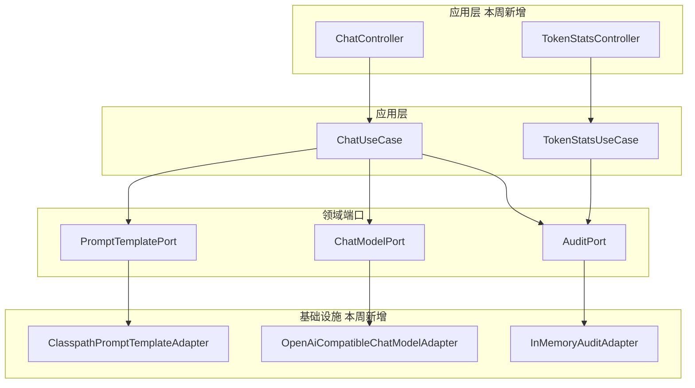
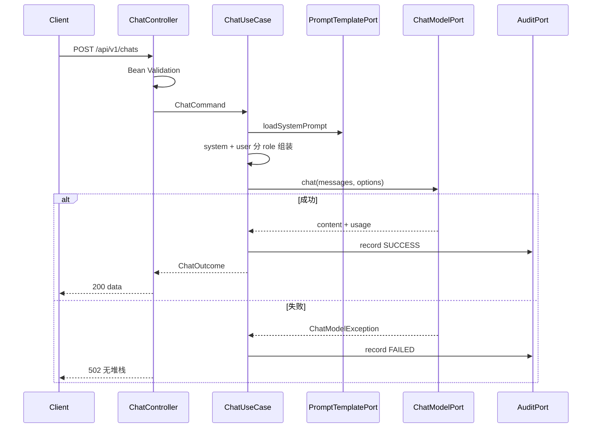

# Spec: Week 01 — spring-ai-demo 聊天接口

## Objective

打通应用层到模型层：提供聊天 HTTP 接口，调用 OpenAI 兼容 API（DeepSeek / Qwen / OpenAI），每次调用落请求日志并统计 Token。

## Tech Stack

- JDK 17、Spring Boot 3.4、Maven
- `spring-boot-starter-web`、`validation`
- OpenAI 兼容 HTTP Adapter（不引入 Spring AI / LangChain4j）
- 内存审计（不引入 Redis / PostgreSQL）

## Commands

- 不改系统 `JAVA_HOME`。JDK 用参数：`-Djdk.17.home="E:\Program Files\Eclipse Adoptium\jdk-17.0.20.8-hotspot"`
- Maven settings：`.mvn/maven.config` 已指向 `D:\soft\maven-3.8.1\conf\settings-ailocal.xml`（本地仓库 `E:\workRepositoryAi`）
- 测试：在 `apps/spring-ai-demo` 执行 `mvn -q test "-Djdk.17.home=E:\Program Files\Eclipse Adoptium\jdk-17.0.20.8-hotspot"`
- 启动：配置 `LLM_API_KEY` 后 `mvn spring-boot:run "-Djdk.17.home=E:\Program Files\Eclipse Adoptium\jdk-17.0.20.8-hotspot"`
- 构建：`mvn -q -DskipTests package "-Djdk.17.home=E:\Program Files\Eclipse Adoptium\jdk-17.0.20.8-hotspot"`

## 增量架构

本周新增：Controller → UseCase → Port → Adapter。不引入 Redis / DB。

YAGNI：不引入 Spring AI / LangChain4j，换厂商只改 `LLM_BASE_URL`。

## Boundaries

- Always：聊天接口、系统提示与用户输入分离、请求日志、Token 统计、入参校验、密钥走环境变量
- Ask first：更换非 OpenAI 兼容协议、引入 DB
- Never：Redis、RAG、登录、Agent、历史多轮持久化

## Success Criteria

- [ ] `POST /api/v1/chats` 校验空白/超长 message，返回 400
- [ ] 成功调用返回 `data.content` 与 `data.usage`
- [ ] 系统提示来自模板版本，用户输入只作为 `user` role
- [ ] 模型失败仍写审计，对外 502 且无堆栈
- [ ] `GET /api/v1/token-stats` 返回累计 Token
- [ ] 单测不打真实网络；无密钥入库

## Open Questions

无。默认厂商 DeepSeek（OpenAI 兼容）。换 Qwen/OpenAI 只改 `LLM_BASE_URL` / `LLM_MODEL`。
