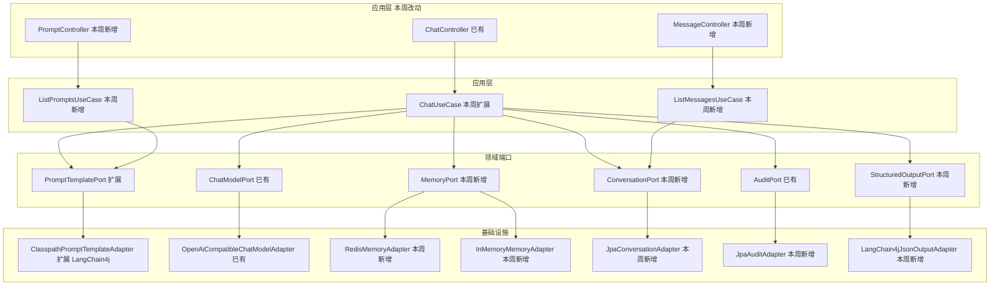
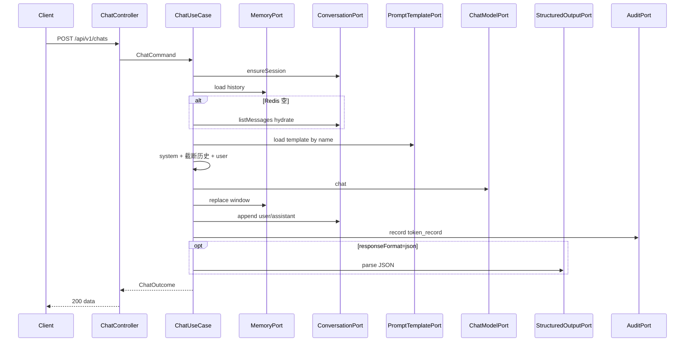

# Spec: Week 02 — Prompt 模板、结构化输出、Redis 上下文、会话落库

## Objective

在第1周聊天链路上补齐编排层：可切换的 Prompt 模板、JSON 结构化输出、Redis 短期上下文（滑动窗口）、PostgreSQL 会话/消息/Token 三张表持久化。

## Tech Stack

- JDK 17、Spring Boot 3.4、Maven（沿用 `-Djdk.17.home` / `settings-ailocal.xml`）
- LangChain4j **core**（Prompt 变量渲染 + JSON 解析）；不替换第1周 `ChatModelPort` HTTP 适配器
- Spring Data Redis、Spring Data JPA、Flyway、PostgreSQL
- 单测不连真实 Redis / PostgreSQL（内存端口 + H2 仓储测试）

## Commands

- 不改 `JAVA_HOME`。JDK17：`-Djdk.17.home=E:\Program Files\Eclipse Adoptium\jdk-17.0.20.8-hotspot`
- Maven：仓库 `.mvn/maven.config` 已指向 `D:\soft\maven-3.8.1\conf\settings-ailocal.xml`
- 推荐用脚本 `apps/spring-ai-demo/run-maven-jdk17.ps1`，它会临时切到 JDK 17 跑 Maven，不影响全局：
  - 测试：`.\run-maven-jdk17.ps1 -q test`
  - 启动：配置 `LLM_API_KEY` 后 `.\run-maven-jdk17.ps1 spring-boot:run`
  - 构建：`.\run-maven-jdk17.ps1 -q -DskipTests package`
- 手动命令：在 `apps/spring-ai-demo` 执行 `mvn -q test "-Djdk.17.home=E:\Program Files\Eclipse Adoptium\jdk-17.0.20.8-hotspot"`
- 本地依赖：`docker compose -f apps/spring-ai-demo/docker-compose.yml up -d`（Postgres 5432 / Redis 6379）

## 增量架构

本周新增：MemoryPort、ConversationPort、StructuredOutputPort、模板列表。已有 ChatModelPort / AuditPort 不换协议。

YAGNI：不引入 LangChain4j OpenAI 客户端（模型层已有 HTTP Adapter）；不引入 Testcontainers 作为 `mvn test` 必依赖；不引入 RAG / 登录。

## Boundaries

- Always：多轮上下文、滑动窗口、命名 Prompt 模板、JSON 结构化输出、三张表 Flyway、GET 历史消息、GET 模板列表
- Ask first：用 LangChain4j 替换 HTTP 模型适配器；`mvn test` 依赖 Docker
- Never：RAG / Embedding / pgvector、登录鉴权、Agent / Tool Calling、改 `JAVA_HOME`、密钥入库、用户输入拼进系统提示

## Success Criteria

- [ ] 同一 `sessionId` 第二轮请求的模型入参包含上一轮 user/assistant
- [ ] 历史超过 `chat.max-memory-messages` 时丢掉最旧非 system 消息
- [ ] Redis miss 时从 `chat_message` 回填
- [ ] `GET /api/v1/prompts` 返回模板名与版本
- [ ] 请求 `template` 可切换系统提示；非法名 400
- [ ] `responseFormat=json` 成功时 `data.payload` 为 JSON 对象；非法 JSON 返回 422
- [ ] Flyway 创建 `chat_session` / `chat_message` / `token_record`
- [ ] 成功调用后三张表有对应行（仓储测试）
- [ ] `GET /api/v1/chats/{sessionId}/messages` 返回持久化历史
- [ ] 单测不打真实网络、不依赖本机 Redis/PG；无密钥入库

## Open Questions

无。LangChain4j 只用于编排层（模板渲染、JSON 解析）。默认模板 `system`（沿用 `prompts/system-v1.txt`），结构化模板 `json`。
