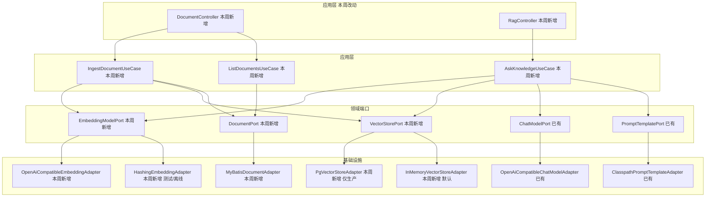
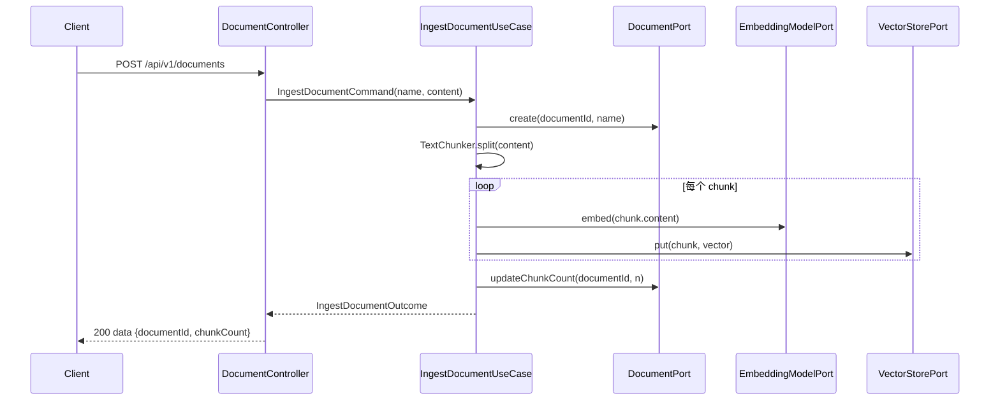
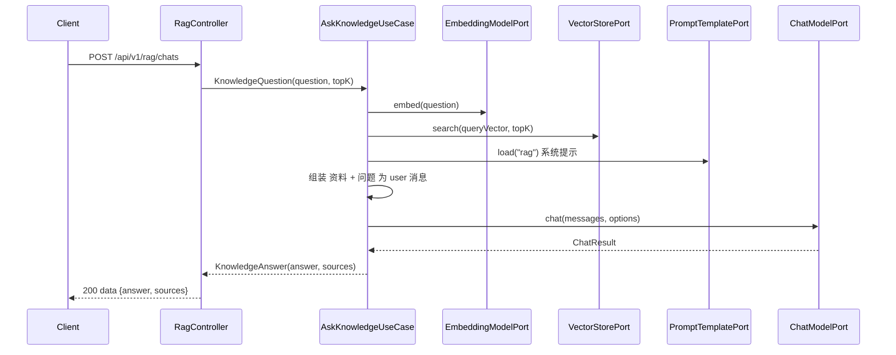

# Spec: Week 03 — RAG 知识库（文档 → 切片 → 向量 → 检索 → 问答）

## Objective

在已有聊天链路上打通检索增强生成（RAG）最小闭环：文档上传解析切片 → Embedding 向量化 → 向量库相似度检索 → 检索片段注入 DeepSeek 生成回答。本周建立可插拔的 **Embedding 层** 与 **向量库层** 端口，为第 4 周「企业知识库 Agent V1」打地基。

## Tech Stack

- JDK 17、Spring Boot 3.4、Maven（沿用 `-Djdk.17.home` / `settings-ailocal.xml`）
- **新增**：Embedding（OpenAI 兼容 HTTP，可插拔）、pgvector（PostgreSQL 扩展，仅生产启用）
- **沿用**：`ChatModelPort`（DeepSeek 回答）、`PromptTemplatePort`（新增 `rag` 模板）、Fluent-MyBatis、Flyway、JdbcTemplate
- 文档解析：纯文本（`.txt` / `.md`）按字符窗口切片，不引入 Tika / POI（YAGNI）
- 单测不连真实网络、不依赖本机 Redis / PG / pgvector（内存向量库 + H2 仓储）

## Commands

- 不改 `JAVA_HOME`。JDK17：`-Djdk.17.home=E:\Program Files\Eclipse Adoptium\jdk-17.0.20.8-hotspot`
- Maven：仓库 `.mvn/maven.config` 已指向 `D:\soft\maven-3.9.4\conf\settings-ailocal.xml`
- 推荐脚本 `apps/spring-ai-demo/run-maven-jdk17.ps1`：
  - 测试：`.\run-maven-jdk17.ps1 -q test`
  - 构建：`.\run-maven-jdk17.ps1 -q -DskipTests package`
- 生产启用 pgvector：`docker compose -f apps/spring-ai-demo/docker-compose.yml up -d` 后，Postgres 侧安装 `pgvector` 扩展（镜像已内置，迁移自动 `CREATE EXTENSION`）
- 生产启用真实 Embedding：设置 `EMBEDDING_PROVIDER=openai` + `EMBEDDING_API_KEY`

## 增量架构

本周新增三个端口：`EmbeddingModelPort`（模型层）、`VectorStorePort`（向量库）、`DocumentPort`（文档元数据）。`ChatModelPort` / `PromptTemplatePort` 不换协议。

YAGNI：不引入意图识别/路由（属 Agent 周）；不引入 Tika/POI 解析 Office（纯文本够）；不引入真实 Embedding 供应商作为 `mvn test` 必依赖（默认 hashing，真实走 openai 可插拔）。

## Boundaries

- Always：文档上传→切片→向量化→检索→问答全链路；Embedding 与向量库端口可插拔；新增 `rag` Prompt 模板；`document` 表 Flyway；RAG 问答接口带 sources；中文 JavaDoc；单测不打真实网络
- Ask first：引入 Tika/POI 解析 PDF/Word；引入 LangChain4j OpenAI 客户端替换 HTTP 适配器；意图识别/路由
- Never：改 `JAVA_HOME`；密钥入库；用户输入拼进系统提示；`mvn test` 依赖 Docker/pgvector；Agent / Tool Calling；登录鉴权

## Success Criteria

- [ ] `POST /api/v1/documents` 上传文本后返回 `documentId` 与 `chunkCount`；空白内容 400
- [ ] `TextChunker` 把超长文本切成 ≤ chunk-size 的块，短文本单块，空白返回空
- [ ] `HashingEmbeddingAdapter` 产出固定维度（1024）且确定性向量；相同文本向量一致
- [ ] `InMemoryVectorStoreAdapter` 按余弦相似度降序返回 top-k；空库返回空
- [ ] `IngestDocumentUseCase` 每个切片被向量化并入库（stub Embedding + 内存向量库断言）
- [ ] `POST /api/v1/rag/chats` 把检索到的切片注入上下文并调用 DeepSeek，返回 `answer` 与 `sources`
- [ ] 空向量库时 RAG 问答仍能回答（sources 为空），不抛 5xx
- [ ] `GET /api/v1/documents` 返回文档列表
- [ ] Flyway 在 H2 上创建 `document` 表；`document_chunk`（含 `vector` 列）仅在 PostgreSQL 迁移目录
- [ ] 单测不打真实网络、不依赖本机 PG/Redis/pgvector；无密钥入库

## Open Questions

- 无。默认 Embedding 走 `hashing`（离线确定性，便于跑通全链路与测试）；真实语义向量化设 `EMBEDDING_PROVIDER=openai` + `EMBEDDING_API_KEY`（base-url/model 已默认指向阿里云百炼 `qwen3.7-text-embedding-flash`，1024 维）。意图路由留待第 5 周 Agent。
