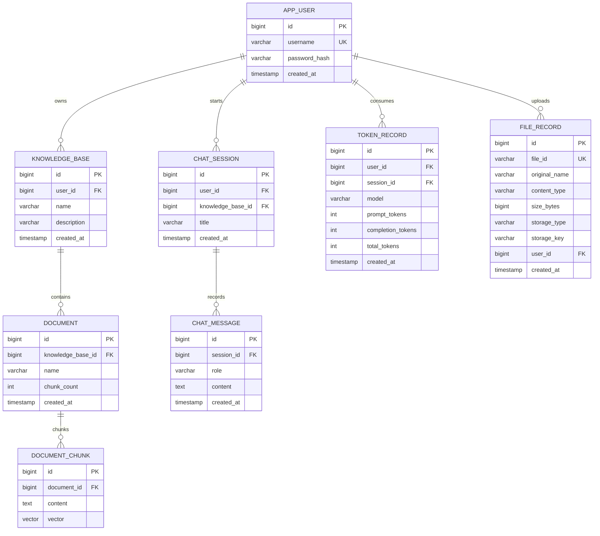
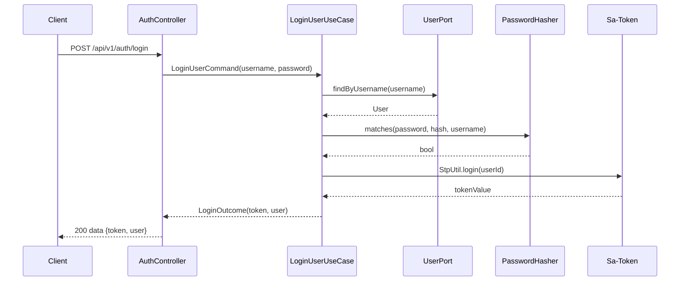
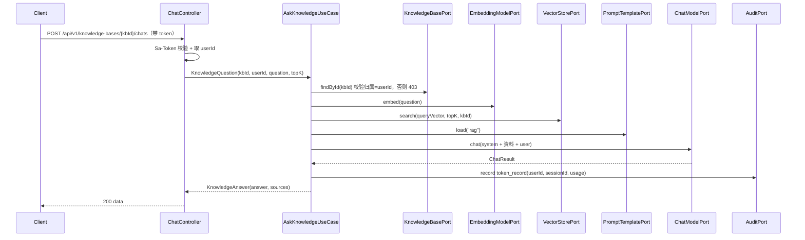
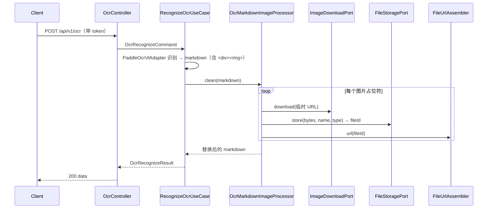

# Spec: Week 04 — 企业知识库 Agent V1（登录 / 知识库 / 文档 / 文件 / 问答 / 历史 / Token / Docker）

## Objective

把第 3 周的单用户 RAG 闭环升级为**多用户、多租户的企业知识库应用**：用户登录鉴权（Sa-Token）→ 用户拥有多个知识库 → 知识库内含多篇文档 → 文档入库向量化（pgvector 落库）→ 限定知识库范围的 RAG 问答 → 会话历史与 Token 统计落库 → 通用文件上传服务（本地/OSS/OBS 可插拔）→ OCR 图片占位符替换为可访问路径 → Docker 一键部署。产出一个可对外演示的完整企业 AI 应用。

## Tech Stack

- JDK 17、Spring Boot 3.4、Maven（沿用 `-Djdk.17.home` / `settings-ailocal.xml` / `.mvn/maven.config`）
- **新增**：Sa-Token（`sa-token-spring-boot3-starter` 1.46.0，登录/令牌/RBAC + `SaSecureUtil` 加盐 md5 密码哈希）
- **新增**：独立 Maven 模块 `apps/enterprise-knowledge-agent`（包 `com.aicode.enterprise`）
- **新增**：通用文件上传服务（`FileStoragePort` 可插拔：本地落地，OSS/OBS 仅接口预留）
- **复用/适配第 3 周 RAG 管线**：`EmbeddingModelPort` / `VectorStorePort` / `DocumentPort` / `TextChunker` / `RagContextAssembler`、`HashingEmbeddingAdapter` / `OpenAiCompatibleEmbeddingAdapter` / `InMemoryVectorStoreAdapter` / `PgVectorStoreAdapter`、`ChatModelPort`（DeepSeek）/ `PromptTemplatePort`
- **沿用**：Fluent-MyBatis、Flyway、JdbcTemplate、pgvector（已装好，`RAG_VECTOR_STORE=pgvector` 直接落库）
- Docker：应用 Dockerfile（多阶段构建）；`docker-compose.yml` 编排 app + postgres（`pgvector/pgvector:pg16`，新环境一键装扩展）+ redis（已部署环境可只跑 app 容器）
- 单测不连真实网络、不依赖本机 Redis / PG / pgvector（内存向量库 + H2 仓储 + Sa-Token 内存会话）

## Commands

- 不改 `JAVA_HOME`。JDK17：`-Djdk.17.home=E:\Program Files\Eclipse Adoptium\jdk-17.0.20.8-hotspot`
- Maven：仓库 `.mvn/maven.config` 指向 `D:\soft\maven-3.9.4\conf\settings-ailocal.xml`
- 复制第 3 周脚本为 `apps/enterprise-knowledge-agent/run-maven-jdk17.ps1`：
  - 测试：`.\run-maven-jdk17.ps1 -q test`
  - 构建：`.\run-maven-jdk17.ps1 -q -DskipTests package`
  - 启动：`.\run-maven-jdk17.ps1 spring-boot:run`
- 生产部署：`docker compose -f apps/enterprise-knowledge-agent/docker-compose.yml up -d --build`
- 生产启用真实 Embedding：`EMBEDDING_PROVIDER=openai` + `EMBEDDING_API_KEY`（默认 `qwen3.7-text-embedding-flash`，1024 维）

## 数据模型（多租户三级：用户 → 知识库 → 文档）

Flyway 迁移：`V1__app_user.sql`、`V2__knowledge_base.sql`、`V3__document.sql`、`V4__chat_tables.sql`（chat_session/chat_message/token_record）、`V5__file_record.sql`，`db/postgresql/V6__document_chunk_pgvector.sql`（`CREATE EXTENSION IF NOT EXISTS vector` + vector 列，仅生产，H2 测试不跑）。

## 增量架构

```mermaid
flowchart TB
    subgraph 接入["接入层 本周新增"]
        AC[AuthController]
        KBC[KnowledgeBaseController]
        DC[DocumentController]
        RC[ChatController 知识库问答]
        TC[TokenStatsController]
        FC[FileController 文件上传/访问]
        OC[OcrController 扩展 图片占位符清理]
    end

    subgraph 鉴权["Sa-Token"]
        ST[StpUtil 登录态 + SaInterceptor @SaCheckLogin]
        PH[PasswordHasher SaTokenMd5]
    end

    subgraph 用例["应用层 本周新增"]
        RU[RegisterUserUseCase]
        LU[LoginUserUseCase]
        KBU[CreateKnowledgeBaseUseCase]
        LKB[ListKnowledgeBasesUseCase]
        IDU[IngestDocumentUseCase 限定 kb+user]
        LDU[ListDocumentsUseCase]
        AU[AskKnowledgeUseCase 限定 kb]
        HU[ListChatHistoryUseCase]
        TU[TokenStatsUseCase]
        FSU[UploadFileUseCase]
        RO[RecognizeOcrUseCase 扩展清理]
    end

    subgraph 领域["领域层"]
        UP[UserPort]
        KBP[KnowledgeBasePort]
        DP[DocumentPort]
        EP[EmbeddingModelPort]
        VP[VectorStorePort]
        CP[ConversationPort]
        AP[AuditPort]
        MP[ChatModelPort]
        PP[PromptTemplatePort]
        FSP[FileStoragePort]
        IDP[ImageDownloadPort]
        FUA[FileUrlAssembler]
        OIP[OcrMarkdownImageProcessor]
    end

    subgraph 适配["基础设施"]
        MBU[MyBatisUserAdapter]
        MBK[MyBatisKnowledgeBaseAdapter]
        MBD[MyBatisDocumentAdapter]
        HE[HashingEmbeddingAdapter]
        OE[OpenAiCompatibleEmbeddingAdapter]
        IM[InMemoryVectorStoreAdapter]
        PG[PgVectorStoreAdapter]
        MBC[MyBatisConversationAdapter]
        MBA[MyBatisAuditAdapter]
        LLM[OpenAiCompatibleChatModelAdapter]
        File[ClasspathPromptTemplateAdapter]
        LFS[LocalFileStorageAdapter]
        OFS[OssFileStorageAdapter 接口预留]
        BFS[ObsFileStorageAdapter 接口预留]
        HID[HttpImageDownloadAdapter]
    end

    AC --> RU
    AC --> LU
    KBC --> KBU
    KBC --> LKB
    DC --> IDU
    DC --> LDU
    RC --> AU
    RC --> HU
    TC --> TU
    FC --> FSU
    OC --> RO

    AC --> ST
    KBC --> ST
    DC --> ST
    RC --> ST
    TC --> ST
    FC --> ST
    LU --> PH
    RU --> PH

    RU --> UP
    LU --> UP
    KBU --> KBP
    LKB --> KBP
    IDU --> DP
    IDU --> EP
    IDU --> VP
    LDU --> DP
    AU --> EP
    AU --> VP
    AU --> MP
    AU --> PP
    HU --> CP
    TU --> AP
    FSU --> FSP
    RO --> OIP
    OIP --> IDP
    OIP --> FSP
    OIP --> FUA

    UP --> MBU
    KBP --> MBK
    DP --> MBD
    EP --> HE
    EP --> OE
    VP --> IM
    VP --> PG
    CP --> MBC
    AP --> MBA
    MP --> LLM
    PP --> File
    FSP --> LFS
    FSP --> OFS
    FSP --> BFS
    IDP --> HID
```

YAGNI：不引 Spring Security 全家桶（Sa-Token 够用）；不引 JWT（默认 Sa-Token 随机令牌，后续按需切 `token-style=jwt`）；不引 Tika/POI；OSS/OBS 仅接口预留不落地（需密钥+SDK）；不抽共享库模块（仅第 4 周一个复用者，等第 3 个模块出现再抽，见 ADR）；Redis 记忆窗口暂不引（历史已落库，多轮上下文直接读 `chat_message`）。

## Ports / Adapters / UseCases 清单

| 类型 | 名称 | 职责 |
|------|------|------|
| Port | UserPort | 用户持久化（建/查 username） |
| Port | KnowledgeBasePort | 知识库 CRUD（含归属校验查询） |
| Port | DocumentPort | 文档元数据持久化（限定 kb） |
| Port | FileStoragePort | 文件存储（store/load），本地/OSS/OBS 可插拔 |
| Port | ImageDownloadPort | 下载远程图片字节（OCR 占位符清理用） |
| Port | EmbeddingModelPort / VectorStorePort | 沿用第 3 周，签名扩展 kb 范围 |
| Port | ConversationPort | 会话/消息持久化（历史） |
| Port | AuditPort | Token 统计落库 |
| Port | ChatModelPort / PromptTemplatePort | 沿用第 2/3 周 |
| Domain | PasswordHasher | 密码哈希抽象（默认 Sa-Token 加盐 md5） |
| Domain | FileUrlAssembler | fileId → 访问路径（域名+fileId）拼接 |
| Domain | OcrMarkdownImageProcessor | 解析 `
` 占位符 → 下载 → 上传 → 替换 |
| Domain | TextChunker / RagContextAssembler | 沿用第 3 周 |
| UseCase | RegisterUserUseCase / LoginUserUseCase | 注册 / 登录 |
| UseCase | CreateKnowledgeBaseUseCase / ListKnowledgeBasesUseCase | 知识库管理 |
| UseCase | IngestDocumentUseCase / ListDocumentsUseCase | 文档管理（切片/向量化/入库） |
| UseCase | AskKnowledgeUseCase | 限定 kb 的 RAG 问答 |
| UseCase | ListChatHistoryUseCase | 会话列表 + 消息历史 |
| UseCase | TokenStatsUseCase | 用户维度 Token 汇总 |
| UseCase | UploadFileUseCase | 文件上传 |
| Adapter | MyBatisUserAdapter / MyBatisKnowledgeBaseAdapter / MyBatisDocumentAdapter / MyBatisConversationAdapter / MyBatisAuditAdapter | Fluent-MyBatis 仓储 |
| Adapter | LocalFileStorageAdapter | 本地目录存储（默认） |
| Adapter | OssFileStorageAdapter / ObsFileStorageAdapter | OSS/OBS，接口预留 |
| Adapter | HttpImageDownloadAdapter | RestClient 下载图片 |
| Adapter | Hashing/OpenAi Embedding、InMemory/PgVector、OpenAiChatModel、ClasspathPrompt | 沿用第 2/3 周 |
| Config | SaTokenConfig、AuthProperties、FileProperties、AppConfiguration 同构 | 装配 + Sa-Token 拦截器 |
| Entity | AppUserEntity / KnowledgeBaseEntity / DocumentEntity / ChatSessionEntity / ChatMessageEntity / TokenRecordEntity / FileRecordEntity | 表映射 |

## API 设计（统一 `/api/v1`，成功 `data` 信封，错误 `error` 信封）

| Method | Path | 鉴权 | 说明 |
|--------|------|------|------|
| POST | /api/v1/auth/register | 公开 | 注册，返回 201；重名 409 |
| POST | /api/v1/auth/login | 公开 | 登录，返回 token + user；失败 401 |
| POST | /api/v1/auth/logout | 登录 | 注销当前 token |
| GET | /api/v1/auth/me | 登录 | 当前用户 |
| POST | /api/v1/knowledge-bases | 登录 | 建知识库 |
| GET | /api/v1/knowledge-bases | 登录 | 列出当前用户知识库 |
| GET | /api/v1/knowledge-bases/{id} | 登录 | 详情（非本人 403） |
| PUT | /api/v1/knowledge-bases/{id} | 登录 | 更新（非本人 403） |
| DELETE | /api/v1/knowledge-bases/{id} | 登录 | 删除（级联文档/切片） |
| POST | /api/v1/knowledge-bases/{kbId}/documents | 登录 | 上传文档入库，返回 documentId + chunkCount |
| GET | /api/v1/knowledge-bases/{kbId}/documents | 登录 | 文档列表 |
| DELETE | /api/v1/knowledge-bases/{kbId}/documents/{docId} | 登录 | 删除文档 |
| POST | /api/v1/knowledge-bases/{kbId}/chats | 登录 | RAG 问答，返回 answer + sources |
| GET | /api/v1/chats/{sessionId}/messages | 登录 | 会话消息历史 |
| GET | /api/v1/token-stats | 登录 | 当前用户 Token 汇总 |
| POST | /api/v1/files | 登录 | 上传文件，返回 fileId + url |
| GET | /api/v1/files/{fileId} | 公开 | 取回文件（供页面 img/下载） |
| POST | /api/v1/ocr | 登录 | OCR 识别，返回 markdown（图片占位符已替换为访问路径） |

## Boundaries

- **Always**：Sa-Token 登录/鉴权（密码加盐 md5 哈希，`PasswordHasher` 抽象）；用户-知识库-文档三级多租户隔离（越权 403）；文档切片/向量化/入库（pgvector 生产落库）；限定 kb 的 RAG 问答（带 sources）；会话历史落库；Token 统计落库；通用文件上传服务（本地落地 + OSS/OBS 接口预留）；OCR 图片占位符自动替换为访问路径；Dockerfile + docker-compose；中文 JavaDoc；单测不打真实网络、无密钥入库
- **Ask first**：引入 JWT（`sa-token-jwt`）；Sa-Token 会话迁 Redis（`sa-token-redis-jackson`）；OSS/OBS 适配器落地（需密钥+SDK）；批量重 embedding / 增量重算（换模型维度变化）
- **Never**：改 `JAVA_HOME`；密码/密钥明文入库；用户输入拼进系统提示；Controller 里写 Prompt/业务规则；`mvn test` 依赖 Docker/pgvector；引入 Spring Security 全家桶 / Tika / POI / 共享库模块

## Success Criteria

- [ ] `POST /api/v1/auth/register` 注册成功 201；重名 409；密码哈希落库（非明文，加盐 md5）
- [ ] `POST /api/v1/auth/login` 正确凭据返回 token；错误密码 401
- [ ] 未带 token 访问 `/api/v1/knowledge-bases` 返回 401；带合法 token 返回 200
- [ ] 用户 A 访问用户 B 的知识库/文档/会话返回 403（多租户隔离）
- [ ] `POST /api/v1/knowledge-bases` 建库成功；`GET` 只返回当前用户的知识库
- [ ] `POST /api/v1/knowledge-bases/{kbId}/documents` 上传文本返回 documentId + chunkCount；每个切片被向量化入库（stub Embedding + 内存向量库断言）
- [ ] `POST /api/v1/knowledge-bases/{kbId}/chats` 检索注入上下文并调用 DeepSeek，返回 answer + sources；空向量库仍能回答（sources 空）不抛 5xx
- [ ] 问答成功后 `token_record` 有对应行；`GET /api/v1/token-stats` 返回用户 Token 汇总
- [ ] `GET /api/v1/chats/{sessionId}/messages` 返回持久化历史
- [ ] `POST /api/v1/files` 上传返回 fileId + url；`GET /api/v1/files/{fileId}` 取回
- [ ] OCR 返回的 markdown 里 `
` 占位符被替换为 fileId 访问路径（`OcrMarkdownImageProcessorTest`）
- [ ] Flyway 在 H2 上建 `app_user`/`knowledge_base`/`document`/`chat_session`/`chat_message`/`token_record`/`file_record`；`document_chunk`（含 vector 列）仅 PostgreSQL
- [ ] `RAG_VECTOR_STORE=pgvector` 时 `CREATE EXTENSION IF NOT EXISTS vector` 成功，向量落 `document_chunk`
- [ ] 单测不打真实网络、不依赖本机 PG/Redis/pgvector；无密钥入库

## Open Questions

- 无（暂不引入 JWT / Sa-Token Redis 会话 / OSS-OBS 落地，见 Boundaries「Ask first」；均可在后续按需切换，不阻塞本周闭环）

## ADR

| 决策 | 选项 | 选择 | 理由 |
|------|------|------|------|
| 鉴权框架 | Spring Security / Sa-Token / 手写 | Sa-Token | 轻量、登录/RBAC 开箱即用、`spring-boot3-starter` 原生支持 3.4；避免 Security 全家桶复杂度 |
| 密码哈希 | BCrypt（spring-security-crypto / favre）/ Sa-Token SaSecureUtil | Sa-Token `SaSecureUtil.md5BySalt`（盐=username+全局盐） | 用户指定零额外依赖；`PasswordHasher` 抽象留替换点。风险：md5 为快速哈希、可暴力破解，演示项目可接受，生产建议换 BCrypt/Argon2 |
| 令牌形态 | JWT / Sa-Token 默认随机令牌 | 默认随机令牌 | 简单够用，会话可校验/踢下线；JWT 按需后续切 |
| 模块归属 | 扩 spring-ai-demo / 新模块 | 新模块 enterprise-knowledge-agent | 规范 5.1；多用户企业与单机 demo 边界不同 |
| RAG 管线复用 | 抽共享库 / 模块内自含适配 | 模块内自含（从第 3 周适配） | 仅一个复用者，抽库过早（YAGNI）；等第 3 个模块再抽（规则三） |
| pgvector | 官方 postgres + 手动装扩展 / pgvector/pgvector | 已装好直接 `RAG_VECTOR_STORE=pgvector`；docker-compose 新环境用 `pgvector/pgvector:pg16` | 现有容器已可用，直接落库；镜像仅作新环境默认 |
| 文件存储 | 本地 / OSS / OBS | 本地落地 + OSS/OBS 接口预留 | 演示零密钥可跑通；多后端用端口隔离，按需实现 |
