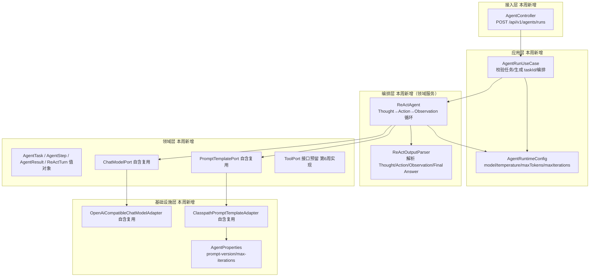
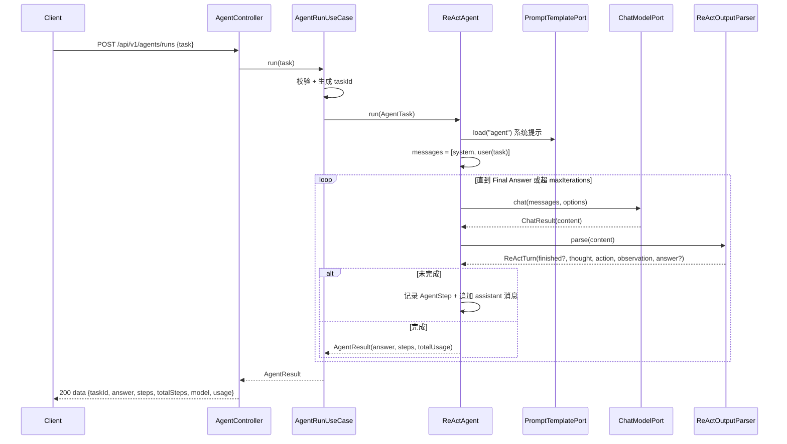

# Spec: Week 05 — Agent 基础（ReAct 循环：Reason → Action → Observation）

## Objective

把第 4 周「单轮问答 + RAG」升级为**会自主规划、逐步执行、自我迭代的 Agent**：用户提出一个任务，Agent 不是一次作答，而是进入 ReAct 循环——思考（Thought）→ 行动（Action）→ 观察（Observation）——多轮迭代直到产出最终答案，并返回**完整执行轨迹（trace）**。落地为独立模块 `apps/patient-agent`（医疗患者分析场景，包 `com.aicode.patient`）。

## Tech Stack

- JDK 17、Spring Boot 3.4、Maven（沿用 `-Djdk.17.home` / `settings-ailocal.xml` / `.mvn/maven.config`）
- **新增**：独立 Maven 模块 `apps/patient-agent`
- **自含复用（不抽共享库）**：`ChatModelPort` / `PromptTemplatePort` / `OpenAiCompatibleChatModelAdapter` / `ClasspathPromptTemplateAdapter` 在本模块内复制一份（见 ADR「暂不抽库」）
- **不引入**：DB / 登录 / Redis / Tool 实现（第 6 周）/ Spring AI Alibaba（第 8 周）
- 单测不连真实网络（Mockito + 纯函数测试）；无数据源，无 Flyway

## Commands

- 不改 `JAVA_HOME`。JDK17：`-Djdk.17.home=E:\Program Files\Eclipse Adoptium\jdk-17.0.20.8-hotspot`
- Maven：仓库 `.mvn/maven.config` 指向 `D:\soft\maven-3.9.4\conf\settings-ailocal.xml`
- 复制脚本为 `apps/patient-agent/run-maven-jdk17.ps1`：
  - 测试：`.\run-maven-jdk17.ps1 test`
  - 构建：`.\run-maven-jdk17.ps1 -q -DskipTests package`
  - 启动：`.\run-maven-jdk17.ps1 spring-boot:run`
- 生产调用真实模型：`LLM_API_KEY`（默认 DeepSeek）

## 增量架构

本周新增核心：**编排层 ReAct 循环**（`ReActAgent` 领域服务）+ **输出解析器**（`ReActOutputParser` 纯函数）+ 预留 `ToolPort`。模型层沿用（模块内自含）。





YAGNI：不引 Tool 实现（第 6 周 Function Calling 才落业务工具，本周 `ToolPort` 仅接口预留）；不引 Memory 端口/Redis（第 7 周）；不引 Spring AI Alibaba / LangChain4j 编排框架（第 8 周）；不引 DB / 登录（patient-agent 为无状态 Agent 演示，trace 直接随响应返回，执行记录留第 12 周 Agent 平台）。

## Ports / Adapters / UseCases / Domain 清单

| 类型 | 名称 | 职责 |
|------|------|------|
| Domain | ReActAgent | ReAct 循环：组装上下文 → 调模型 → 解析 → 记录步骤 → 收敛/超限 |
| Domain | ReActOutputParser | 纯函数：从模型输出解析 Thought/Action/Observation/Final Answer |
| Domain | AgentTask / AgentStep / AgentResult / ReActTurn | 任务、单步轨迹、最终结果、单轮解析结果（值对象） |
| Domain | ToolCall / ToolDefinition / ToolResult | 第 6 周 Tool Calling 的值对象，本周仅定义 |
| Port | ToolPort | 工具契约（`definitions()` / `execute(ToolCall)`），第 6 周实现，本周无适配器 |
| Port | ChatModelPort / PromptTemplatePort | 自含复用（模型层 + Prompt） |
| UseCase | AgentRunUseCase | 校验任务非空、生成 taskId、调用 ReActAgent、返回结果 |
| Adapter | OpenAiCompatibleChatModelAdapter | OpenAI 兼容 Chat Completions（自含复用） |
| Adapter | ClasspathPromptTemplateAdapter | 加载 `prompts/agent-v1.txt`（自含复用） |
| Config | AgentProperties / LlmProperties / AppConfiguration | 配置映射 + Bean 装配 |
| DTO | AgentRunRequest / AgentRunResponse / AgentStepDto / AgentUsageDto / ApiResponse | 请求/响应体 |

## API 设计

| Method | Path | 鉴权 | 说明 |
|--------|------|------|------|
| POST | /api/v1/agents/runs | 公开 | 提交任务，同步执行 ReAct 循环，返回最终答案 + 完整步骤轨迹 + Token 用量 |

请求：

```json
{ "task": "评估患者张三的出院风险，并给出随访建议" }
```

响应（成功 200）：

```json
{
  "data": {
    "taskId": "uuid",
    "answer": "……最终答案……",
    "steps": [
      { "stepNo": 1, "thought": "……", "action": "……", "observation": "……" },
      { "stepNo": 2, "thought": "……", "action": "……", "observation": "……" }
    ],
    "totalSteps": 2,
    "model": "deepseek-chat",
    "usage": { "promptTokens": 120, "completionTokens": 340, "totalTokens": 460 }
  }
}
```

失败沿用统一 `error` 信封：任务空白 400、模型失败 502、超迭代 500。

## Boundaries

- **Always**：ReAct 循环（多轮迭代直到 Final Answer）；返回完整步骤轨迹 + 汇总 Token 用量；`ReActOutputParser` 纯函数可离线单测；`maxIterations` 兜底防死循环；中文 JavaDoc；单测不打真实网络、无密钥入库；`ToolPort` 仅接口预留无实现
- **Ask first**：实现 Tool 调用（第 6 周）；引入持久化执行记录 / Memory（第 12/7 周）；抽共享库（本次已确认「暂不抽库」）
- **Never**：改 `JAVA_HOME`；密钥入库；用户输入拼进系统提示；Controller 里写 Prompt/业务规则；`mvn test` 依赖网络/DB/Redis；给 patient-agent 加 DB / 登录（本周无状态）

## Success Criteria

- [ ] `ReActOutputParser` 能解析含 `Thought/Action/Observation/Final Answer` 的模型输出，正确提取各字段与 finished 标记；缺省字段返回空串
- [ ] `ReActAgent` 在模型先返回「思考步」再返回「Final Answer」时，收敛并返回最终答案 + 2 个步骤 + 汇总 Token
- [ ] `ReActAgent` 在模型持续不输出 Final Answer 时，达到 `maxIterations` 后抛 `AgentLoopExceededException`
- [ ] `ReActAgent` 在模型输出空白时抛 `AgentExecutionException`
- [ ] `AgentRunUseCase` 空白任务抛 `InvalidChatRequestException`（400）；合法任务返回非空 taskId
- [ ] `POST /api/v1/agents/runs` 返回 200 + data（taskId/answer/steps/totalSteps/model/usage）；任务空白返回 400
- [ ] 单测不打真实网络、无密钥入库；模块可 `mvn -q test` 全绿

## Open Questions

- 无。第 6 周 Tool Calling 时把 `ReActAgent` 的 Action 从「模型内部推理」升级为「调用 `ToolPort`」，观察值来自工具返回；本周 Action 仅是模型自述的分析动作，观察值来自模型自述结果。

## ADR

| 决策 | 选项 | 选择 | 理由 |
|------|------|------|------|
| 共享库抽取 | 抽 ai-core / 模块内自含 | 暂不抽库（模块内自含复制） | 用户拍板：等最后一个应用出现再统一抽；本次避免跨模块重构，隔离干净，代价是三处重复暂可接受 |
| Action 语义 | 纯推理循环 + ToolPort 预留 / 内置演示假 Tool | 纯推理循环 + ToolPort 预留 | 第 6 周才做 Function Calling；本周 Action=模型内部推理，接口预留不抢后续内容，且可离线单测 |
| 编排框架 | Spring AI / LangChain4j Agent / 手写 ReAct 循环 | 手写 ReAct 循环（领域服务） | 第 8 周才引框架；手写循环透明可测、符合分层，避免提前锁定厂商 |
| 执行轨迹存储 | 落库 / 随响应返回 | 随响应返回（无状态） | 本周无 DB；执行记录持久化属第 12 周 Agent 平台 |
| patient-agent 鉴权 | 登录 / 公开 | 公开（无鉴权） | 单机 Agent 演示；企业鉴权已由第 4 周 enterprise 模块承载，patient 到第 12 周平台再挂权限 |
