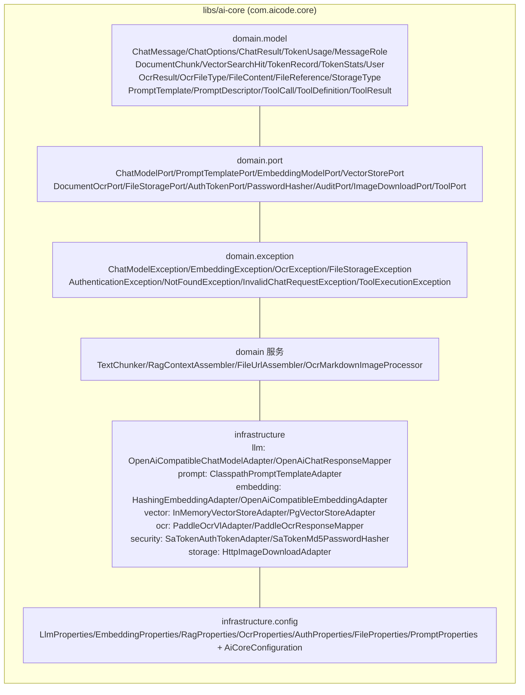
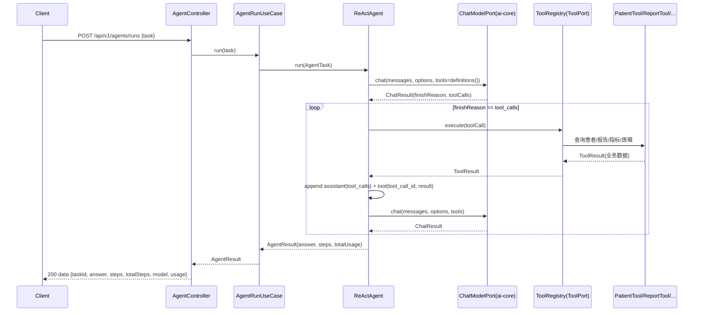

# Spec: Week 06 — ai-core 共享库抽取 + Tool Calling（原生 Function Calling）

## Objective

本周做两件事：

1. **抽取 `ai-core` 共享库**：把第 1–4 周沉淀的横切能力一次性收敛成独立 Maven 库（包 `com.aicode.core`），`enterprise-knowledge-agent` 与 `patient-agent` 改为依赖它，删除各自内部复制的重复类。此后约定「新应用在旧模块基础上改造，不再复制代码」。
2. **在 `patient-agent` 落地 Tool Calling（机制 A：原生 Function Calling）**：把第 5 周的文本 ReAct 循环升级为「模型返回结构化工具调用 → 执行工具 → 观察结果回填 → 继续循环」，实现 `PatientTool / ReportTool / HealthDataTool / OrderTool` 四个业务工具，打通「用户 → Agent → Tool → 业务服务 → 数据」。

## Tech Stack

- JDK 17、Spring Boot 3.4.5、Maven（沿用 `-Djdk.17.home` / `settings-ailocal.xml` / `.mvn/maven.config`）
- **新增**：`libs/ai-core` 独立库模块（packaging `jar`，包 `com.aicode.core`）
- **新增**：根聚合 `pom.xml`（`packaging=pom`，聚合 `libs/ai-core` + `apps/enterprise-knowledge-agent` + `apps/patient-agent`），配套根 `.mvn/maven.config` 与根 `run-maven-jdk17.ps1`
- `spring-ai-demo`（第 1–3 周演示）**不动**，保持独立，继续保留自身复制的代码
- patient-agent 业务数据本周用**内存种子数据 + 端口抽象**（不引 DB），DB 持久化留待第 9/12 周

## Commands

- 不改 `JAVA_HOME`。JDK17：`-Djdk.17.home=E:\Program Files\Eclipse Adoptium\jdk-17.0.20.8-hotspot`
- Maven 仓库：`.mvn/maven.config` 指向 `D:\soft\maven-3.9.4\conf\settings-ailocal.xml`
- 根聚合构建（自根目录）：
  - 测试：`.\run-maven-jdk17.ps1 test`
  - 打包：`.\run-maven-jdk17.ps1 -q -DskipTests package`
- 单模块仍可独立构建（前提 ai-core 已 `install` 到本地仓库）：`libs/ai-core` 自带 `run-maven-jdk17.ps1` / `.mvn/maven.config`

## 增量架构

### ai-core 分层（抽取结果）

### patient-agent 第 6 周 Tool Calling 时序

## Ports / Adapters / UseCases / Domain 清单（本周增量）

| 层 | 类型 | 说明 |
|----|------|------|
| ai-core | 9 大类共享类 | 见「ai-core 分层」图；来源：enterprise 为 canonical（第 4 周），model/llm/prompt 取 patient 第 5 周新版（含 `reasoning_content` 回退、WARN 诊断） |
| ai-core | `AiCoreConfiguration` | `@EnableConfigurationProperties` + `@ComponentScan(com.aicode.core.infrastructure)` + `OpenAiChatResponseMapper`/`PaddleOcrResponseMapper`/`FileUrlAssembler`/`llmRestClient`/`embeddingRestClient`/`ocrRestClient` Bean |
| ai-core | `PromptProperties` | 统一 Prompt 版本配置（prefix `prompt`，字段 `version`），替代 enterprise `chat.system-prompt-version` 与 patient `agent.prompt-version` |
| ai-core | `FinishReason` | 枚举 STOP/TOOL_CALLS/LENGTH/UNKNOWN |
| patient | `ReActAgent`（升级） | 原生 Function Calling 循环：`finishReason==tool_calls` 时执行工具并回填观察，否则收敛 |
| patient | `ToolRegistry`（ToolPort 实现） | 持有多工具，按 name 分发 `definitions()`/`execute()` |
| patient | `PatientTool/ReportTool/HealthDataTool/OrderTool` | 4 个业务工具，带 JSON Schema 参数 |
| patient | `PatientDataPort` + `InMemoryPatientDataAdapter` | 业务数据端口 + 内存种子实现（患者/报告/指标/医嘱） |

## 关键模型变更（原生 Function Calling 需要）

- `MessageRole`：新增 `TOOL("tool")`
- `ChatMessage`：扩为 `(role, content, toolCallId, toolCalls)`；保留 2 参构造；新增 `tool(toolCallId, content)` / `assistant(toolCalls)` 工厂；`content` 对 assistant-tool-calls 允许为 null
- `ChatResult`：扩为 `(content, toolCalls, finishReason, usage, model)`
- `ChatModelPort`：新增 `chat(messages, options, tools)`；旧 `chat(messages, options)` 变 default 委托空 tools
- `ToolDefinition`：扩为 `(name, description, parameters)`，`parameters` 为 JSON Schema `Map`
- `ToolCall`：扩为 `(id, name, arguments)`，`id` 由模型返回用于回填关联

## API 设计（patient-agent，兼容第 5 周）

| Method | Path | 鉴权 | 说明 |
|--------|------|------|------|
| POST | /api/v1/agents/runs | 公开 | 提交任务，同步执行 Function Calling 循环，返回最终答案 + 步骤轨迹 + Token 用量 |

响应在 `steps` 中新增 `toolCalls`（每次工具调用的 name + arguments + 结果摘要），保持 `answer/steps/totalSteps/model/usage` 结构不变，向后兼容。

## Boundaries

- **Always**：原生 Function Calling（tools/tool_calls 协议）；工具调用与结果作为一等结构化事件入 trace；`ToolRegistry` 单一分发点（为第 13/14 周权限与安全留咽喉点）；工具参数经 JSON Schema 校验；中文 JavaDoc；单测不打真实网络、无密钥入库；ai-core 无 Spring Boot 启动类、无 main
- **Ask first**：给 patient-agent 加 DB / 登录 / Redis；把 `spring-ai-demo` 一并重构；把 LocalFileStorageAdapter/MyBatis 适配器抽进 ai-core（见 ADR）
- **Never**：改 `JAVA_HOME`；密钥入库；用户输入拼进系统提示；Controller 里写 Prompt/业务规则；ai-core 依赖任何 app 模块

## Success Criteria

- [ ] `mvn test` 三个模块（ai-core / enterprise / patient）全绿，根聚合 `.\run-maven-jdk17.ps1 test` 通过
- [ ] `enterprise-knowledge-agent` 删除重复类后仍可编译、启动（依赖 ai-core），原 API 行为不变
- [ ] `OpenAiChatResponseMapper` 能解析 `tool_calls` 与 `finish_reason`（含无 tool_calls 的普通响应）
- [ ] `ReActAgent` 在模型返回 `tool_calls` 时执行工具并回填观察，收敛后返回最终答案 + 工具调用轨迹 + 汇总 Token
- [ ] `ReActAgent` 超 `maxIterations` 抛 `AgentLoopExceededException`；空白输出抛 `AgentExecutionException`
- [ ] `ToolRegistry` 对未知工具名抛 `ToolExecutionException`
- [ ] 4 个工具各自返回正确的业务数据；单测不连真实网络、无密钥入库

## Open Questions

- 业务数据持久化：本周内存种子数据，DB 是否在第 9 周 Workflow 前引入，待定。
- `spring-ai-demo` 是否也在后续周收敛到 ai-core，待定（本周明确不动）。

## ADR

| 决策 | 选项 | 选择 | 理由 |
|------|------|------|------|
| 共享库位置 | `libs/ai-core` / `apps/ai-core` | `libs/ai-core` | 库与应用语义分离；包 `com.aicode.core` |
| 抽取 canonical 来源 | enterprise / patient / 混合 | 混合（model/llm/prompt 取 patient 第 5 周新版，其余取 enterprise） | patient 的模型层含 `reasoning_content` 回退与 WARN 诊断，是第 5 周增量修复，必须保留 |
| 本地文件存储适配器 | 抽进 ai-core / 留在 enterprise | 留在 enterprise（`LocalFileStorageAdapter`） | 它绑定 enterprise 的 `file_record` 表与 fluent-mybatis mapper；按六边形架构，契约进 core、持久化实现留 app |
| SaTokenConfig 拦截器 | 抽进 ai-core / 留在 enterprise | 留在 enterprise | 鉴权路径规则（`/api/v1/auth/login` 等）是 app 特定，core 只提供 Sa-Token 适配器与 AuthProperties |
| Prompt 版本配置 | 复用 chat/agent 各自前缀 / 统一 `prompt.version` | 统一 `PromptProperties`（prefix `prompt`） | 两模块字段语义相同，统一消除分歧；adapter 从 core 读统一属性 |
| 构建编排 | 各模块独立 install / 根聚合 pom | 根聚合 pom + 各模块保留独立脚本 | 根 `mvn` 一次构建全部并自动解析跨模块依赖；单模块脚本继续可用 |
| Tool 抽象位置 | 放 patient-agent / 放 ai-core | 放 ai-core（`ToolPort`/`ToolCall`/`ToolDefinition`/`ToolResult`） | 工具是 Agent 通用基础设施，第 11/12 周 Multi-Agent 与平台要复用 |
| 业务数据 | DB / 内存种子 + 端口 | 内存种子 + 端口 | 本周核心目标是 Function Calling 机制；patient-agent 保持「聚焦 Agent 演示」，DB 持久化留第 9/12 周 |
| Action 语义 | 文本 ReAct 推理 / 原生 Function Calling | 原生 Function Calling（机制 A） | 结构化、可监控可治理、根治第 5 周格式漂移、为第 8 周 Spring AI Alibaba 打底 |
