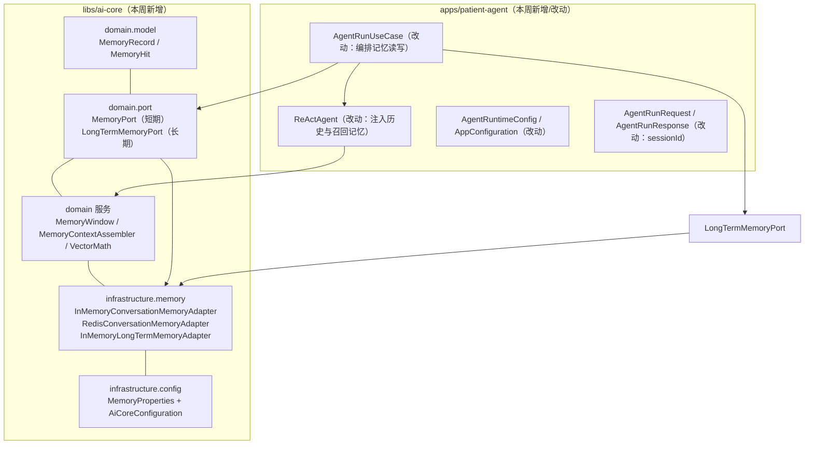
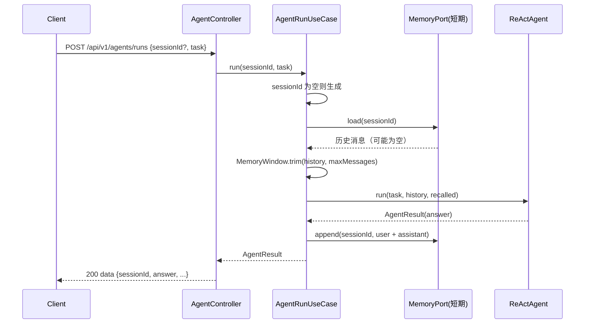
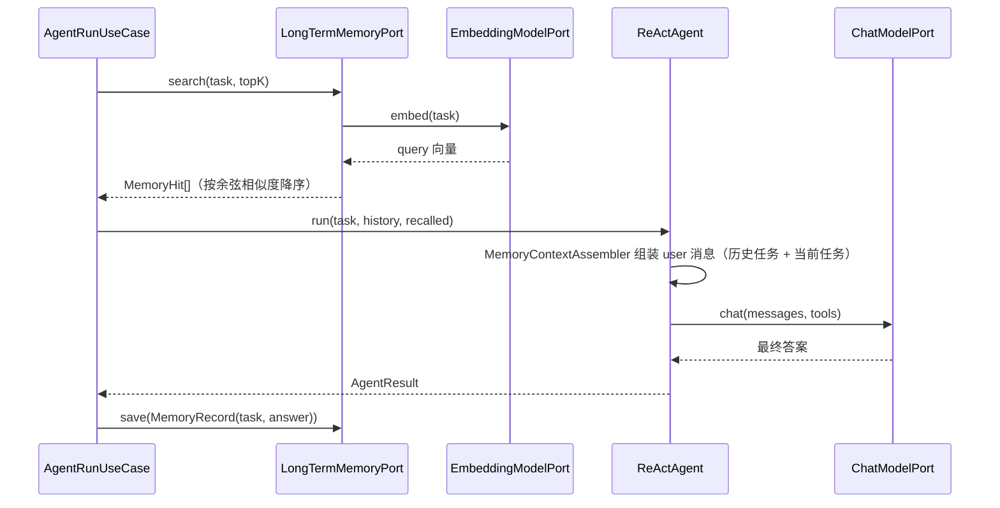

# Spec: Week 07 — Agent Memory（短期会话记忆 + 长期向量记忆）

## Objective

让第 6 周「无状态、每次任务只看当前输入」的 `patient-agent` 具备记忆能力：**短期记忆**保存同一会话的聊天上下文（user/assistant 多轮窗口），**长期记忆**把历史任务的「任务 + 结论」向量化保存，新任务到来时按语义检索相关历史任务并注入上下文。短期记忆支持 `memory.short-term-provider=memory|redis` 两种适配器，长期记忆基于 ai-core 的 `EmbeddingModelPort` 做余弦相似度检索。

## Tech Stack

- JDK 17、Spring Boot 3.4.5、Maven（沿用 `-Djdk.17.home` / `settings-ailocal.xml` / `.mvn/maven.config`）
- **新增（ai-core）**：`MemoryPort` / `LongTermMemoryPort` 契约 + `MemoryRecord` / `MemoryHit` 模型 + `MemoryWindow` / `MemoryContextAssembler` / `VectorMath` 领域服务 + `MemoryProperties` 配置
- **新增（ai-core）**：`InMemoryConversationMemoryAdapter`、`RedisConversationMemoryAdapter`（可选依赖 + `@ConditionalOnClass` 守卫）、`InMemoryLongTermMemoryAdapter`（复用 `EmbeddingModelPort`）
- **新增（ai-core 依赖）**：`spring-boot-starter-data-redis`（`optional`，不向 app 传递）
- **新增（patient-agent 依赖）**：`spring-boot-starter-data-redis`（`memory.short-term-provider=redis` 时使用；默认内存，单测不连 Redis）
- 复用第 6 周 `ReActAgent` 原生 Function Calling 循环、`ToolRegistry` 与 4 个业务工具

## Commands

- 不改 `JAVA_HOME`。JDK17：`-Djdk.17.home=E:\Program Files\Eclipse Adoptium\jdk-17.0.20.8-hotspot`
- Maven 仓库：`.mvn/maven.config` 指向 `D:\soft\maven-3.9.4\conf\settings-ailocal.xml`
- 根聚合（自根目录）：
  - 测试：`.\run-maven-jdk17.ps1 test`
  - 打包：`.\run-maven-jdk17.ps1 -q -DskipTests package`
- 启动：`apps/patient-agent` 下 `.\run-maven-jdk17.ps1 spring-boot:run`

## 增量架构

### 记忆能力分层

图例：`ai-core` 全部为本周新增；`patient-agent` 中 `AgentRunUseCase` / `ReActAgent` / DTO / 配置为改动，第 6 周工具链保持不变。

### 短期记忆时序（会话上下文）

### 长期记忆时序（历史任务语义检索）

## Ports / Adapters / UseCases 清单（本周增量）

| 层 | 类型 | 说明 |
|----|------|------|
| ai-core domain | `MemoryPort` | 短期会话记忆契约：`load` / `append` / `clear`，永不返回 null |
| ai-core domain | `LongTermMemoryPort` | 长期记忆契约：`save(MemoryRecord)` / `search(query, topK)` |
| ai-core domain | `MemoryRecord` | 历史任务记录：`memoryId / sessionId / task / answer / createdAt` |
| ai-core domain | `MemoryHit` | 语义检索命中：`record + score` |
| ai-core domain | `MemoryWindow` | 纯函数截断：只保留最近 N 条历史 |
| ai-core domain | `MemoryContextAssembler` | 把召回的历史任务与当前任务拼成 user 消息（历史当数据，不拼系统提示） |
| ai-core domain | `VectorMath` | 余弦相似度纯函数，供向量记忆与向量库复用 |
| ai-core infra | `InMemoryConversationMemoryAdapter` | 进程内短期记忆，`memory.short-term-provider=memory`（默认） |
| ai-core infra | `RedisConversationMemoryAdapter` | Redis 短期记忆，带 TTL；`redis` + `@ConditionalOnClass` 守卫 |
| ai-core infra | `InMemoryLongTermMemoryAdapter` | 内存向量长期记忆，复用 `EmbeddingModelPort` 做语义检索 |
| ai-core config | `MemoryProperties` | `memory.*`：provider / max-messages / long-term-top-k / redis-ttl-hours |
| patient app | `AgentRunUseCase`（改） | 编排：加载+截断+召回 → 运行 → 写回短期 + 保存长期 |
| patient domain | `ReActAgent`（改） | `run(AgentTask, history, recalled)`：把历史与召回记忆装入消息 |
| patient domain | `AgentTask` / `AgentResult`（改） | 增加 `sessionId`；结果带 `recalledMemories` 计数 |
| patient config | `AgentRuntimeConfig` / `AppConfiguration`（改） | 映射 `max-messages` / `long-term-top-k` |
| patient dto | `AgentRunRequest` / `AgentRunResponse`（改） | 请求可选 `sessionId`；响应返回 `sessionId` + `recalledMemories` |

## API 设计（patient-agent，兼容第 6 周）

| Method | Path | 鉴权 | 说明 |
|--------|------|------|------|
| POST | /api/v1/agents/runs | 公开 | 提交任务，携带可选 `sessionId`；返回最终答案 + 步骤轨迹 + Token 用量 + `sessionId` + `recalledMemories` |

请求新增可选字段 `sessionId`（≤100 字符）；为空时服务端生成并回传，调用方后续携带同一 `sessionId` 即获得多轮上下文。`answer / steps / totalSteps / model / usage` 结构保持不变，向后兼容。

## Boundaries

- **Always**：短期记忆 user/assistant 多轮窗口（按 `max-messages` 截断）；长期记忆保存「任务 + 结论」并按语义检索召回；历史任务/用户输入一律作为 user 内容，禁止拼进 system 提示；记忆通过端口抽象，内存/Redis/向量适配器可替换；中文 JavaDoc；单测不打真实网络、不连真实 Redis；无密钥入库
- **Ask first**：把长期记忆落 pgvector / 数据库（patient-agent 仍无 DB）；引入 Sa-Token Redis 会话；给 `enterprise-knowledge-agent` 也接记忆
- **Never**：改 `JAVA_HOME`；密钥入库；用户输入拼系统提示；Controller 里写 Prompt/业务规则；ai-core 依赖任何 app 模块；把业务工具（PatientTool 等）下沉到 ai-core

## Success Criteria

- [ ] `.\run-maven-jdk17.ps1 test` 三个模块（ai-core / enterprise / patient）全绿
- [ ] `MemoryWindow.trim` 只保留最近 N 条；空/null/非正数 N 返回空列表
- [ ] `InMemoryConversationMemoryAdapter` 的 `append/load/clear` 正确且不同 `sessionId` 隔离、`load` 永不返回 null
- [ ] `RedisConversationMemoryAdapter` 写入带 TTL、读取解析 JSON、脏数据回退空列表（Mock 模板，不连真实 Redis）
- [ ] `InMemoryLongTermMemoryAdapter` 能按语义相似度把相关历史任务排前，`topK` 生效，空查询返回空列表
- [ ] `ReActAgent` 在消息中包含历史对话与召回的历史任务（用户输入在 user 消息，不进 system）
- [ ] `AgentRunUseCase`：同一 `sessionId` 第二轮能看到第一轮上下文并写回；未传 `sessionId` 时生成；空任务 400
- [ ] `POST /api/v1/agents/runs` 响应含 `sessionId` 与 `recalledMemories`；请求可携带 `sessionId` 复用会话
- [ ] 单测不打真实网络、不依赖本机 Redis；无密钥入库

## Open Questions

- 长期记忆是否按用户/租户隔离：patient-agent 为单用户演示，本周全局检索；多租户隔离留待第 13 周权限体系。
- 长期记忆持久化：本周内存 + 端口，落 pgvector 或 DB 留待第 12 周 Agent 平台。

## ADR

| 决策 | 选项 | 选择 | 理由 |
|------|------|------|------|
| 记忆契约位置 | patient-agent / ai-core | ai-core（`MemoryPort` / `LongTermMemoryPort` / 模型 / 适配器） | 与第 6 周 Tool 契约同理，记忆是 Agent 通用基础设施，第 11/12 周 Multi-Agent 与平台要复用 |
| 短期记忆默认实现 | Redis / 内存 | 内存（默认），Redis 可切换 | 单测不依赖本机 Redis；演示与开箱即用优先，Redis 走 `@ConditionalOnProperty` 显式开启 |
| Redis 依赖形态 | ai-core 常规依赖 / optional | ai-core `optional` + `@ConditionalOnClass`；patient-agent 显式声明 | 遵守规范 5.8.1：仅个别适配器用的依赖不向 app 传递 |
| 召回记忆拼装位置 | system 提示 / user 消息 | user 消息（`MemoryContextAssembler`） | 历史任务含用户输入，严禁拼进 system 提示；与 `RagContextAssembler` 同构 |
| 长期记忆检索范围 | 按会话 / 全局 | 全局 | 长期记忆应跨会话生效；单用户演示无越权风险，多租户隔离留第 13 周 |
| 记忆编排位置 | ReActAgent 内 / UseCase | UseCase 编排、ReActAgent 只装配上下文 | 记忆读写是应用层用例职责；领域服务保持「给定上下文跑循环」，便于单测 |
| sessionId 归属 | DTO 内联 / 新会话表 | 请求可选 + 服务端生成回传 | 无 DB 的轻量会话能力；落库会话留第 12 周 |
