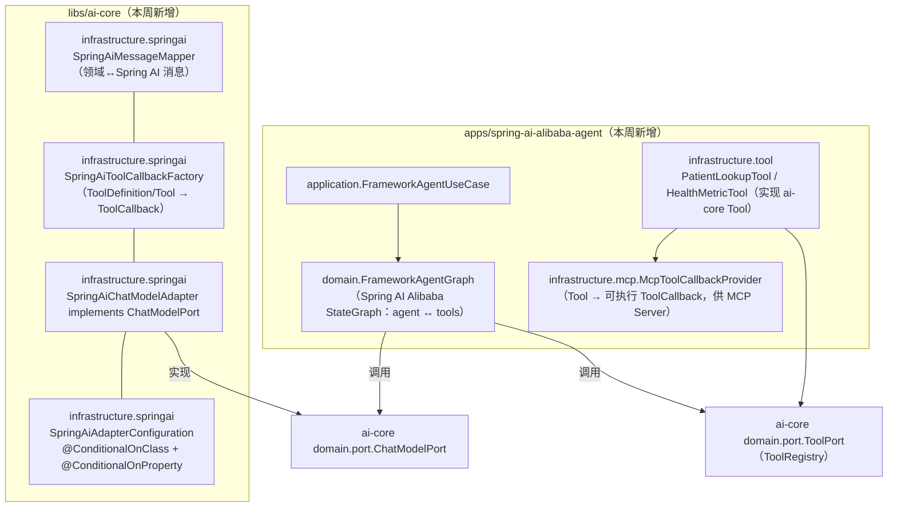
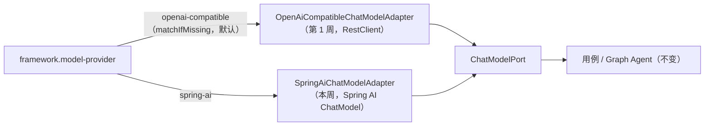
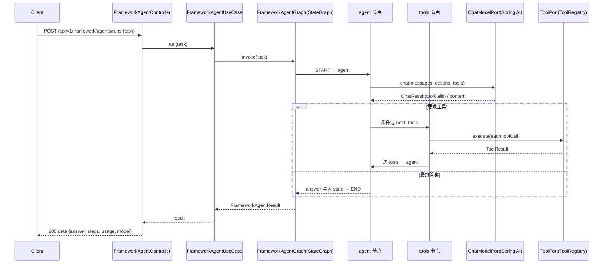

# Spec: Week 08 — Spring AI Alibaba 接入（框架适配器 + Graph Agent）

## Objective

把第 5–7 周手写的 Agent 能力接到 **Spring AI / Spring AI Alibaba** 框架上，且**不破坏既有分层**：在 `ai-core` 新增把领域端口（`ChatModelPort` / `Tool`）桥接到 Spring AI 1.0.0 的**无状态适配器**；新增演示模块 `apps/spring-ai-alibaba-agent`，用 **Spring AI Alibaba Graph（StateGraph）** 把「模型带工具循环（ReAct）」编排成 `agent ↔ tools` 图，工具仍走 ai-core 的 `ToolRegistry`，验证「换框架只换适配器，用例与领域不变」。

## Tech Stack

- JDK 17、Spring Boot 3.4.5、Maven（沿用 `-Djdk.17.home` / `settings-ailocal.xml` / `.mvn/maven.config`）
- **新增（ai-core，optional）**：`org.springframework.ai:spring-ai-model:1.0.0`（适配器桥接 `ChatModel` / `Prompt` / messages / `DefaultToolCallingChatOptions` / `ToolCallback`），声明为 `optional`，不向 app 传递
- **新增（app：spring-ai-alibaba-agent）**：`org.springframework.ai:spring-ai-starter-model-openai:1.0.0`（Spring AI 1.0.0，模型通道指向 DeepSeek 的 OpenAI 兼容端点）、`org.springframework.ai:spring-ai-starter-mcp-server-webmvc:1.0.0`（MCP 工具暴露）、`com.alibaba.cloud.ai:spring-ai-alibaba-graph-core:1.0.0.2`（Graph 编排）
- **模型通道**：复用现有 DeepSeek OpenAI 兼容配置（`LLM_BASE_URL` / `LLM_API_KEY` / `LLM_MODEL`），无需新增密钥
- 复用 ai-core `ToolRegistry` / `Tool` / `ToolDefinition` / `ToolCall` 契约（第 6 周）与 `PromptTemplatePort`（第 2 周）

## Commands

- 不改 `JAVA_HOME`。JDK17：`-Djdk.17.home=E:\Program Files\Eclipse Adoptium\jdk-17.0.20.8-hotspot`
- Maven 仓库：`.mvn/maven.config` 指向 `D:\soft\maven-3.9.4\conf\settings-ailocal.xml`
- 根聚合（自根目录）：
  - 测试：`.\run-maven-jdk17.ps1 test`
  - 打包：`.\run-maven-jdk17.ps1 -q -DskipTests package`
- 单模块：`.\run-maven-jdk17.ps1 -pl libs/ai-core test`；`.\run-maven-jdk17.ps1 -pl apps/spring-ai-alibaba-agent -am test`
- 启动：`apps/spring-ai-alibaba-agent` 下 `.\run-maven-jdk17.ps1 spring-boot:run`
- 环境变量：`apps/spring-ai-alibaba-agent/.env.example` 复制为 `.env`（本地不入库，IDE EnvFile 加载）。关键项：`SPRING_AI_OPENAI_BASE_URL`（Spring AI OpenAI 兼容端点，**只写主机名，不带 `/v1`**）、`LLM_API_KEY`（密钥，仅环境变量）、`LLM_MODEL`；可选 `FRAMEWORK_MODEL_PROVIDER`（`spring-ai`/`openai-compatible`）、`LLM_PROXY_HOST`（仅 `openai-compatible` 适配器走 ai-core RestClient 时生效）

## 增量架构

### 框架适配分层（ai-core 桥接 Spring AI）

图例：ai-core 方框为本周新增（模式二适配器，`spring-ai-model` 为 `optional`）；app 方框为本周新增模块。既有 `patient-agent` / `enterprise-knowledge-agent` 不改行为。

### 适配器切换（换框架只换适配器）

### Graph Agent 时序（模型带工具循环）

## Ports / Adapters / UseCases 清单（本周增量）

| 层 | 类型 | 说明 |
|----|------|------|
| ai-core infra | `SpringAiMessageMapper` | 领域 `ChatMessage` ↔ Spring AI `Message`；`ChatResponse` → `ChatResult`（content/toolCalls/finishReason/usage/model），无状态 |
| ai-core infra | `SpringAiToolCallbackFactory` | 领域 `ToolDefinition` → Spring AI `ToolCallback`（仅暴露定义，不执行）；领域 `Tool` → 可执行 `ToolCallback`（供 MCP） |
| ai-core infra | `SpringAiChatModelAdapter` | 实现 `ChatModelPort`，包 Spring AI `ChatModel`；关闭 Spring AI 内部工具执行，由用例/Graph 自行执行工具；异常统一 `ChatModelException` |
| ai-core config | `SpringAiAdapterConfiguration` | `@ConditionalOnClass(spring-ai-model)` + `@ConditionalOnProperty(framework.model-provider=spring-ai)` 装配以上 Bean，`spring-ai-model` 为 `optional` |
| app domain | `FrameworkAgentGraph` | 领域服务：构建/持有 Alibaba `CompiledGraph`；节点经 `ChatModelPort`/`ToolPort`，不感知 HTTP |
| app application | `FrameworkAgentUseCase` | 校验任务 → 调 Graph → 汇总 `FrameworkAgentResult` |
| app infra | `PatientLookupTool` / `HealthMetricTool` | 实现 ai-core `Tool`，演示数据；同时经 `McpToolCallbackProvider` 暴露给 MCP |
| app infra | `McpToolCallbackProvider` | 把领域 `Tool` 包成可执行 Spring AI `ToolCallback`，供 MCP Server 自动装配 |
| app config | `AppConfiguration` / `FrameworkAgentProperties` | 装配 `ToolPort`、`FrameworkAgentGraph`、MCP `ToolCallbackProvider`；`framework.agent.max-iterations` |
| app dto | `FrameworkAgentRunRequest` / `FrameworkAgentRunResponse` / `FrameworkAgentStepDto` / `FrameworkUsageDto` | 请求/响应体 |

## API 设计（spring-ai-alibaba-agent，新模块，端口 8084）

| Method | Path | 鉴权 | 说明 |
|--------|------|------|------|
| POST | /api/v1/framework/agents/runs | 公开 | 提交任务，同步执行 Graph Agent，返回最终答案 + 工具轨迹 + 汇总 Token + 模型名 |

请求 `{ "task": "..." }`（非空，≤8000 字符）；响应 `data { answer, steps[], totalSteps, usage{promptTokens,completionTokens,totalTokens}, model }`；空任务 400 + `VALIDATION_ERROR`。

## Boundaries

- **Always**：Spring AI 类型只出现在 `ai-core infrastructure.*` 与 app `infrastructure`/config；领域与用例只认端口；`framework.model-provider` 默认 `openai-compatible`，既有 app 行为不变；Graph 节点经端口调用工具与模型；复用第 6 周 `ToolRegistry`；中文 JavaDoc；单测不打真实网络（stub Spring AI `ChatModel` + fake `ChatModelPort`）；无密钥入库
- **Ask first**：接 Nacos / Spring Cloud 注册中心（本周不做）；连真实远端 MCP Server；引入 `spring-ai-alibaba-agent-framework` 等未在 Central 发布的构件；把业务工具下沉 ai-core
- **Never**：改 `JAVA_HOME`；密钥入库；用户输入拼进 system 提示；Controller 写 Prompt/业务规则；ai-core 依赖任何 app 模块；改动 `patient-agent` / `enterprise-knowledge-agent` 既有行为；提交跨周无关重构

## Success Criteria

- [ ] `.\run-maven-jdk17.ps1 test` 四个模块（ai-core / enterprise / patient / spring-ai-alibaba-agent）全绿
- [ ] `SpringAiMessageMapper`：system/user/assistant(含 toolCalls)/tool 四类消息双向映射正确；`ChatResponse` → `ChatResult` 提取 content、toolCalls、`TOOL_CALLS`/`STOP`、usage、model
- [ ] `SpringAiToolCallbackFactory`：`ToolDefinition` 转出的 `ToolCallback` 暴露 name/description/inputSchema（JSON Schema 字符串），非执行型调用被模型侧关闭（`internalToolExecutionEnabled=false`）；领域 `Tool` 转出的可执行 `ToolCallback` 能解析 JSON 参数并调用工具
- [ ] `SpringAiChatModelAdapter`：把领域 messages/tools/options 组装为 Spring AI `Prompt` 并回填 `ChatResult`；底层异常包为 `ChatModelException`；不触发 Spring AI 内部工具执行
- [ ] `framework.model-provider` 缺省时 `OpenAiCompatibleChatModelAdapter` 生效；`=spring-ai` 时装配 `SpringAiChatModelAdapter`（条件装配测试）
- [ ] `FrameworkAgentGraph`：模型要求工具时进入 `tools` 节点执行并回填，最终答案写入 `answer`；达到 `max-iterations` 终止（不依赖真实模型，用 fake `ChatModelPort` 驱动）
- [ ] `FrameworkAgentUseCase`：空任务抛 `InvalidChatRequestException`；正常任务返回 `FrameworkAgentResult`
- [ ] `POST /api/v1/framework/agents/runs`：返回 `answer/steps/totalSteps/usage/model`；空任务 400 + `VALIDATION_ERROR`
- [ ] MCP Server 模块装配成功并暴露 demo 工具（Spring 上下文加载通过）
- [ ] 单测不打真实网络、无密钥入库

## Open Questions

- **Spring Cloud / Nacos**：README 第 8 周写了「接入 Spring Cloud」，本周经确认不做，留待平台化周次（注册中心会让单测依赖外部设施，违背 YAGNI）。
- **MCP 传输**：本周用 `spring-ai-starter-mcp-server-webmvc` 以 SSE/WebMVC 暴露工具；是否需要接远端 MCP Client 拉取第三方工具，留待后续。
- **长期记忆与框架 Memory 映射**：第 7 周 `MemoryPort` 未在本周 Graph 中接入；框架 `ChatMemory` 与自研 `MemoryPort` 的映射留待后续。
- **Graph 与 `agent-framework`**：Central 仅发布到 `graph-core:1.0.0.2`，更高层 `agent-framework` 未发布；本周以 Graph 编排为准。

## ADR

| 决策 | 选项 | 选择 | 理由 |
|------|------|------|------|
| 框架接入形态 | 改造 patient-agent / 新增模块 + ai-core 适配器 | 新增 `spring-ai-alibaba-agent` + ai-core 适配器 | 既有 app 行为不变，符合「换框架换适配器」；单测可离线 |
| Spring AI 依赖位置 | app 直接引入 / ai-core optional | ai-core `optional` + `@ConditionalOnClass` | 规范 5.8.1：仅个别适配器用的依赖不向 app 传递 |
| 模型通道 | DashScope / DeepSeek OpenAI 兼容 | DeepSeek OpenAI 兼容 | 复用既有 `LLM_*`，无需新密钥，开箱即用 |
| 工具循环执行方 | 依赖 Spring AI 内部执行 / 自行执行 | 关闭内部执行，Graph/用例经 `ToolPort` 执行 | 工具执行是唯一咽喉点，便于权限/审计；与第 6 周一致 |
| Graph 角色 | 单节点直调 / `agent↔tools` 循环 | `agent↔tools` 条件边循环 | 真实体现 Agent 图编排，为第 9 周 Workflow 打底 |
| MCP 定位 | 不落地 / 最小 Server 暴露 demo 工具 | 最小 Server 暴露 demo 工具 | README 学习项含 MCP；用一个 starter 即可验证，成本可控 |
| 版本选择 | 最新快照 / Central 发布版 | `spring-ai 1.0.0` + `graph-core 1.0.0.2` | 仅用已发布、可离线复现的版本 |
