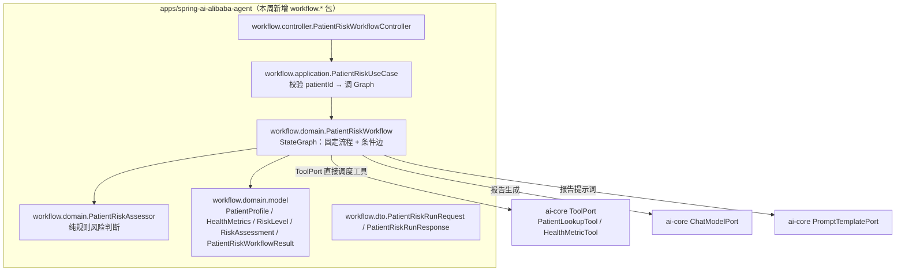
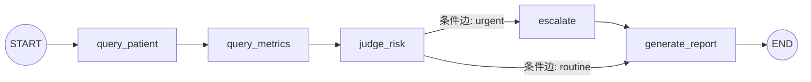
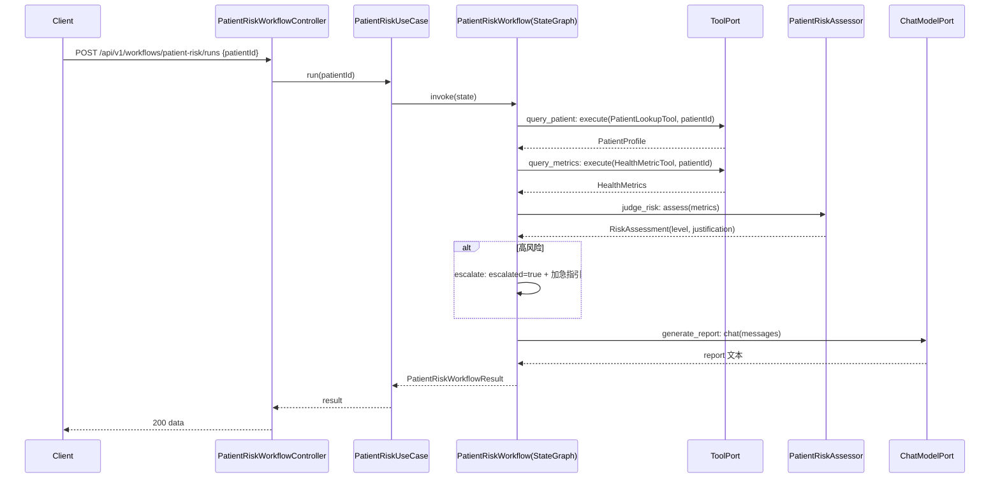

# Spec: Week 09 — Workflow（患者风险分析多节点流程）

## Objective

在 `spring-ai-alibaba-agent` 模块上，用 Spring AI Alibaba Graph 的**多节点固定流程（State / Node / Edge / Graph + 条件分支）**实现「患者风险分析」：查询患者 → 查询指标 → 风险判断 → 生成报告。

与第 8 周「模型带工具循环（ReAct）」的本质区别：本周节点**按固定顺序执行**，工具由节点**直接调度**（不经过模型选工具），风险判断是**确定性规则**，按风险等级走**条件边分支**（高风险加急），最终经 `ChatModelPort` 生成报告。第 8 周证明「模型会自己决定调什么工具」，本周证明「流程本身可以被显式编排成图」。

## Tech Stack

- JDK 17、Spring Boot 3.4.5、Maven（沿用 `-Djdk.17.home` / `settings-ailocal.xml` / `.mvn/maven.config`）
- `com.alibaba.cloud.ai:spring-ai-alibaba-graph-core:1.0.0.2`（已有）：`StateGraph` / `CompiledGraph` / `OverAllState` / `addNode` / `addEdge` / `addConditionalEdges` / `ReplaceStrategy`
- 复用 ai-core：`ToolPort`（查询患者/指标工具）、`ChatModelPort`（报告生成）、`PromptTemplatePort`（报告提示词）、`ToolRegistry`、`ChatMessage` / `ChatResult` / `TokenUsage` / `ToolCall` / `ToolResult` 等模型
- 复用第 8 周 demo 工具 `PatientLookupTool` / `HealthMetricTool`（不改其行为）

## Commands

- 不改 `JAVA_HOME`。JDK17：`-Djdk.17.home=E:\Program Files\Eclipse Adoptium\jdk-17.0.20.8-hotspot`
- Maven 仓库：`.mvn/maven.config` 指向 `D:\soft\maven-3.9.4\conf\settings-ailocal.xml`
- 根聚合（自根目录）：`.\run-maven-jdk17.ps1 test`
- 单模块：`.\run-maven-jdk17.ps1 -pl apps/spring-ai-alibaba-agent -am test`
- 启动：`apps/spring-ai-alibaba-agent` 下 `.\run-maven-jdk17.ps1 spring-boot:run`

## 增量架构

### 患者风险分析 Workflow（本周新增，扩展 spring-ai-alibaba-agent）

图例：`workflow.*` 包全部为本周新增；`PatientLookupTool` / `HealthMetricTool` 为第 8 周已有，本周复用不改。`FrameworkAgentGraph`（第 8 周）与 `PatientRiskWorkflow`（本周）并存，各自独立。

### 图结构（State / Node / Edge / Graph）

- **Node（节点）**：`query_patient`（查患者）、`query_metrics`（查指标）、`judge_risk`（规则风险判断）、`escalate`（高风险加急标记）、`generate_report`（LLM 生成报告）
- **Edge（边）**：`START→query_patient→query_metrics→judge_risk` 为固定边；`judge_risk` 之后为**条件边**（按 `route` 值分派 `urgent`/`routine`）
- **State（状态）**：`patientId / patient / metrics / riskLevel / justification / route / escalated / report / usage / model`，全部 `ReplaceStrategy`
- **Graph（图）**：`StateGraph` 编译为 `CompiledGraph`，一次 `invoke` 走完整流程

### 时序

## Ports / Adapters / UseCases 清单（本周增量）

| 层 | 类型 | 说明 |
|----|------|------|
| workflow.domain | `PatientRiskWorkflow` | 领域服务：构建/持有 `StateGraph`（5 节点 + 条件边），节点经 `ToolPort`/`ChatModelPort`/`PromptTemplatePort`，不感知 HTTP |
| workflow.domain | `PatientRiskAssessor` | 纯规则风险判断：`assess(HealthMetrics) → RiskAssessment`，阈值常量内聚，可独立单测 |
| workflow.domain | `PatientProfile` | 患者基础信息值对象（patientId/name/age/gender/diagnosis） |
| workflow.domain | `HealthMetrics` | 健康指标值对象（systolic/diastolic/fastingGlucose/hba1c） |
| workflow.domain | `RiskLevel` | 风险等级枚举（LOW/MEDIUM/HIGH）+ 中文标签 |
| workflow.domain | `RiskAssessment` | 风险评估结果（riskLevel + justification） |
| workflow.domain | `PatientRiskWorkflowResult` | 流程结果（workflowId/patientId/patient/metrics/riskLevel/justification/escalated/report/usage/model） |
| workflow.application | `PatientRiskUseCase` | 校验 patientId → 调 `PatientRiskWorkflow` |
| workflow.controller | `PatientRiskWorkflowController` | `POST /api/v1/workflows/patient-risk/runs`，协议转换 |
| workflow.dto | `PatientRiskRunRequest` / `PatientRiskRunResponse` / `PatientProfileDto` / `HealthMetricsDto` / `FrameworkUsageDto`（复用） | 请求/响应体 |
| config | `AppConfiguration`（改） | 装配 `PatientRiskAssessor` / `PatientRiskWorkflow` |

## API 设计（spring-ai-alibaba-agent，端口 8084，新增端点）

| Method | Path | 鉴权 | 说明 |
|--------|------|------|------|
| POST | /api/v1/workflows/patient-risk/runs | 公开 | 提交 `patientId`，同步执行风险分析 Workflow，返回患者/指标/风险等级/报告 |

请求 `{ "patientId": "P001" }`（非空，≤100 字符）；响应 `data { workflowId, patientId, patient, metrics, riskLevel, riskLabel, justification, escalated, report, model, usage }`；空 patientId 400 + `VALIDATION_ERROR`。详见 `docs/api/week-09-api.md`。

## Boundaries

- **Always**：节点按固定顺序执行，工具由节点直接经 `ToolPort` 调度（不经过模型选工具）；风险判断用确定性规则（`PatientRiskAssessor`），禁止把「高风险」规则写进基础设施；报告生成经 `ChatModelPort`，用户/患者数据作为 user 内容，禁止拼进 system 提示；`ToolPort` 仍是工具执行唯一咽喉点；中文 JavaDoc；单测不打真实网络（fake `ToolPort` + 脚本化 `ChatModelPort`）；无密钥入库
- **Ask first**：让 workflow 落数据库/持久化；接 Human-in-the-loop（第 10 周）；把 workflow 引擎抽象成 ai-core 通用 `WorkflowPort`（第 12 周平台化再做）；引入 `CheckpointSaver` 持久化图状态
- **Never**：改 `JAVA_HOME`；密钥入库；用户输入拼 system 提示；Controller 写 Prompt/业务规则；改动第 8 周 `FrameworkAgentGraph` / `PatientLookupTool` / `HealthMetricTool` 行为；ai-core 依赖 app 模块；把风险阈值散落为魔法数字

## Success Criteria

- [ ] `.\run-maven-jdk17.ps1 test` 四个模块（ai-core / enterprise / patient / spring-ai-alibaba-agent）全绿，`FrameworkAgentGraph`（第 8 周）测试不回退
- [ ] `PatientRiskAssessor`：按阈值正确分 LOW/MEDIUM/HIGH（覆盖三档边界：达标/临界/超标的血压、空腹血糖、糖化血红蛋白），`assess` 永不返回 null，justification 非空
- [ ] `PatientRiskWorkflow`：固定顺序执行 `query_patient→query_metrics→judge_risk→(escalate?)→generate_report`；HIGH 走 `escalate` 节点（`escalated=true`），LOW/MEDIUM 跳过；`report` 由 `ChatModelPort` 生成（fake 驱动）；汇总 `usage`；节点抛出的领域异常正确解包
- [ ] `PatientRiskUseCase`：空 patientId 抛 `InvalidChatRequestException`；正常返回 `PatientRiskWorkflowResult`
- [ ] `POST /api/v1/workflows/patient-risk/runs`：返回 `workflowId/patient/metrics/riskLevel/riskLabel/justification/escalated/report/model/usage`；空 patientId 400 + `VALIDATION_ERROR`
- [ ] 单测不打真实网络、无密钥入库；`patientId` 限长校验

## Open Questions

- **Workflow 引擎抽象**：本周 `PatientRiskWorkflow` 直接使用 Alibaba `StateGraph`，是否抽成 ai-core 通用 `WorkflowPort` 留待第 12 周 Agent 平台（本周 YAGNI，不抽象）。
- **图状态持久化**：是否用 `CheckpointSaver` 落库以便恢复/审计，留待第 10 周 Human-in-the-loop（暂停/恢复需要 checkpoint）。
- **风险阈值来源**：阈值当前硬编码为 `PatientRiskAssessor` 常量，是否需要外部化配置留待第 12 周平台化。

## ADR

| 决策 | 选项 | 选择 | 理由 |
|------|------|------|------|
| 流程载体 | 新增模块 / 扩展 spring-ai-alibaba-agent | 扩展 spring-ai-alibaba-agent，新增 `workflow.*` 包 | 第 8 周已引入 `graph-core`，复用依赖与端口；README 明确「新应用在旧模块基础上改造」 |
| 编排形态 | 模型带工具循环（沿用第 8 周）/ 固定多节点图 | 固定多节点图（StateGraph） | 本周学的是 Workflow（State/Node/Edge/Graph），与第 8 周 ReAct 形成对照 |
| 工具调度方式 | 节点经 `ChatModelPort` 选工具 / 节点直接经 `ToolPort` 调度 | 节点直接经 `ToolPort` 调度 | 固定流程无需模型选工具；工具执行仍走 `ToolPort` 唯一咽喉点 |
| 风险判断实现 | 模型判断 / 确定性规则（`PatientRiskAssessor`） | 确定性规则 | 医疗风险是可解释、可测试的规则，不应依赖模型主观判断；与规范「业务规则不进基础设施」一致 |
| 高风险分支 | 多报告节点（DRY 受损）/ 单报告节点 + `escalate` 标记节点 | 单 `generate_report` 节点 + `escalate` 标记节点 | 报告生成逻辑唯一；条件边真实分支（HIGH 经 `escalate`），DRY 与可读性兼顾 |
| 风险等级分支的边 | 无条件边 / `addConditionalEdges` | `addConditionalEdges`（`route` 值分派） | 演示本周学习项「Edge 条件分支」，与固定边并列 |
