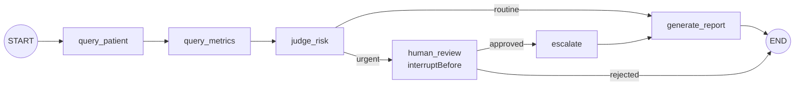
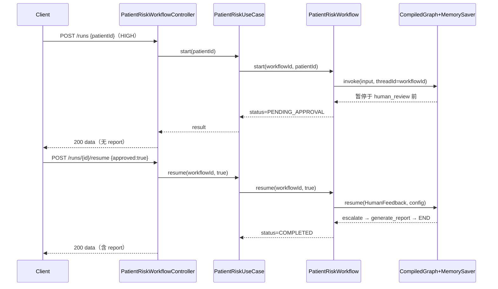

# Spec: Week 10 — Human In The Loop（高风险人工审核 → 暂停 → 恢复）

## Objective

在第 9 周 `PatientRiskWorkflow` 固定流程上接入 **Human-in-the-Loop**：当 `PatientRiskAssessor` 判定 **HIGH** 时，流程在 `human_review` 节点前**暂停**，返回 `PENDING_APPROVAL` 与当前患者/指标/风险快照；人工 **批准** 后恢复执行 `escalate → generate_report`；**拒绝** 则终止流程并返回 `REJECTED`。中/低风险路径行为与第 9 周完全一致（同步完成，不经人工节点）。

## Tech Stack

- JDK 17、Spring Boot 3.4.5、Maven（沿用 `-Djdk.17.home` / `settings-ailocal.xml` / `.mvn/maven.config`）
- `spring-ai-alibaba-graph-core:1.0.0.2`（已有）：`CompileConfig.interruptBefore` / `MemorySaver` / `RunnableConfig.threadId` / `CompiledGraph.resume(HumanFeedback)` / `getState`
- 复用第 9 周 `PatientRiskWorkflow` / `PatientRiskAssessor` / `ToolPort` / `ChatModelPort`；**不改** `FrameworkAgentGraph`

## Commands

- 不改 `JAVA_HOME`。JDK17：`-Djdk.17.home=E:\Program Files\Eclipse Adoptium\jdk-17.0.20.8-hotspot`
- 根聚合：`.\run-maven-jdk17.ps1 test`
- 单模块：`.\run-maven-jdk17.ps1 -pl apps/spring-ai-alibaba-agent -am test`
- 启动：`apps/spring-ai-alibaba-agent` 下 `.\run-maven-jdk17.ps1 spring-boot:run`

## 增量架构

### 图结构（本周改造）

- **interruptBefore(`human_review`)**：HIGH 风险走 urgent 边后，在人工节点执行前暂停
- **MemorySaver**：`threadId = workflowId`，支持 `getState` / `resume`
- **human_review 节点**：读取 `HumanFeedback.data.approved`，条件边分派 `continue` / `reject`

### 时序

## Ports / Adapters / UseCases 清单（本周增量）

| 层 | 类型 | 说明 |
|----|------|------|
| workflow.domain.model | `WorkflowStatus` | 枚举：COMPLETED / PENDING_APPROVAL / REJECTED |
| workflow.domain.model | `PatientRiskWorkflowResult`（改） | 增加 `status` 字段 |
| workflow.domain | `PatientRiskWorkflow`（改） | `MemorySaver` + `interruptBefore`；`start` / `resume` / `getRun` |
| workflow.domain.exception | `WorkflowNotFoundException` / `WorkflowNotPendingException` | 查询/恢复时的领域异常 |
| workflow.application | `PatientRiskUseCase`（改） | `start` / `resume` / `getRun` |
| workflow.controller | `PatientRiskWorkflowController`（改） | 新增 resume / get 端点 |
| workflow.dto | `PatientRiskResumeRequest` / 响应体增加 `status` | 协议体 |

## API 设计（spring-ai-alibaba-agent，端口 8084）

| Method | Path | 说明 |
|--------|------|------|
| POST | /api/v1/workflows/patient-risk/runs | 启动流程；HIGH → `PENDING_APPROVAL`，LOW/MEDIUM → `COMPLETED` |
| GET | /api/v1/workflows/patient-risk/runs/{workflowId} | 查询运行状态（待审/已完成/已拒绝） |
| POST | /api/v1/workflows/patient-risk/runs/{workflowId}/resume | 人工审核：`{ "approved": true/false }` |

详见 `docs/api/week-10-api.md`。

## Boundaries

- **Always**：仅 HIGH 风险触发 HITL；中/低风险同步完成、行为与第 9 周一致；checkpoint 用进程内 `MemorySaver`（`threadId=workflowId`）；恢复经 `CompiledGraph.resume`；中文 JavaDoc；单测 fake 端口；无密钥入库
- **Ask first**：checkpoint 落 DB/Redis；抽 ai-core `WorkflowPort`；改 `FrameworkAgentGraph`
- **Never**：改 `JAVA_HOME`；密钥入库；低风险也强制人工审核；改第 8 周代码与 demo 工具行为

## Success Criteria

- [ ] 根聚合 `test` 四模块全绿，第 8/9 周测试不回退
- [ ] MEDIUM/LOW：`POST /runs` 同步 `COMPLETED`，与第 9 周字段一致
- [ ] HIGH：`POST /runs` 返回 `PENDING_APPROVAL`，含 patient/metrics/riskLevel，无 report
- [ ] `POST /runs/{id}/resume {approved:true}` → `COMPLETED`，escalated=true，含 report
- [ ] `POST /runs/{id}/resume {approved:false}` → `REJECTED`，无 report
- [ ] 非待审 workflow 调用 resume → 409；未知 workflowId → 404
- [ ] `GET /runs/{id}` 可查询上述三种状态

## Open Questions

- checkpoint 持久化留第 12 周平台化；本周 MemorySaver 重启丢失可接受。

## ADR

| 决策 | 选项 | 选择 | 理由 |
|------|------|------|------|
| 暂停点 | interruptBefore escalate / human_review | interruptBefore human_review | 审核发生在加急/报告之前，符合「高风险任务人工审核」 |
| 存储 | MemorySaver / RedisSaver | MemorySaver | YAGNI；单测不依赖 Redis；与官方 HITL 示例一致 |
| API 形态 | 改 sync 为 SSE / 新增 resume | 保留 sync start + 新增 resume/get | 学习 HITL 核心（暂停/恢复），不引入 SSE 复杂度 |
