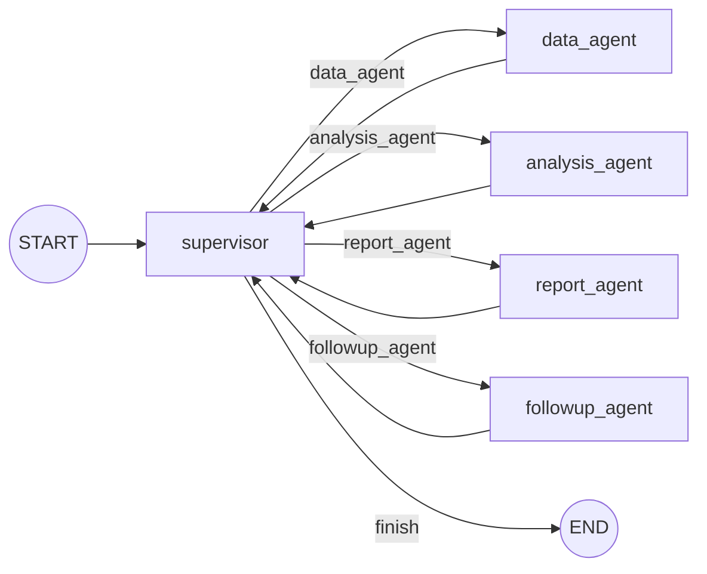
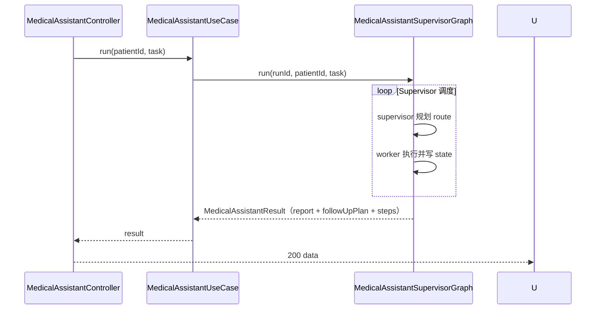

# Spec: Week 11 — Multi Agent（Supervisor + 医疗助手四角色）

## Objective

在 `spring-ai-alibaba-agent` 中新增 **Supervisor 多 Agent 编排**：Supervisor 根据共享状态调度 **数据 / 分析 / 报告 / 随访** 四个 Worker Agent，演示 Agent 角色设计与 Agent 间通信（共享 Graph State）。**不改** 第 8 周 `FrameworkAgentGraph`、第 9–10 周 `PatientRiskWorkflow`。

## Tech Stack

- JDK 17、Spring Boot 3.4.5、Maven（`-Djdk.17.home` / `settings-ailocal.xml`）
- `spring-ai-alibaba-graph-core:1.0.0.2`：`StateGraph` + 条件边 + Worker 回环 Supervisor
- 复用：`PatientRiskAssessor`、`PatientRiskToolResultMapper`、`PatientLookupTool`、`HealthMetricTool`、`ChatModelPort`、`ToolPort`、`PromptTemplatePort`

## Commands

- 根聚合：`.\run-maven-jdk17.ps1 test`
- 单模块：`.\run-maven-jdk17.ps1 -pl apps/spring-ai-alibaba-agent -am test`
- 启动：`apps/spring-ai-alibaba-agent` 下 `.\run-maven-jdk17.ps1 spring-boot:run`（端口 8084）

## 增量架构

### 图结构

- **Supervisor**：规则驱动路由（读共享 state 缺什么派什么 Worker）；每轮记录一步轨迹
- **Worker**：写回 state 后无条件回到 Supervisor
- **通信**：`OverAllState` 键值共享（patient / metrics / riskLevel / report / followUpPlan）

### 时序

## Ports / Adapters / UseCases 清单（本周增量）

| 层 | 类型 | 说明 |
|----|------|------|
| multiagent.domain.model | `SupervisorRoute` / `MedicalAssistantStep` / `MedicalAssistantResult` | 路由枚举、轨迹、结果 |
| multiagent.domain | `MedicalAssistantSupervisor` | 规则路由规划 |
| multiagent.domain | `MedicalAssistantSupervisorGraph` | Graph 编排 |
| multiagent.application | `MedicalAssistantRuntimeConfig` / `MedicalAssistantUseCase` | 运行时参数与用例 |
| multiagent.controller | `MedicalAssistantController` | REST 接入 |
| multiagent.dto | `MedicalAssistantRunRequest` / `MedicalAssistantRunResponse` | 协议体 |
| prompts | `medical-report-v1.txt` / `medical-followup-v1.txt` | 报告 / 随访系统提示 |

## API 设计（spring-ai-alibaba-agent，端口 8084）

| Method | Path | 说明 |
|--------|------|------|
| POST | /api/v1/multi-agent/medical-assistant/runs | 启动 Supervisor 多 Agent 流程 |

详见 `docs/api/week-11-api.md`。

## Boundaries

- **Always**：Supervisor + 4 Worker 均在同一 Graph；状态经 `OverAllState` 共享；工具/模型经端口；中文 JavaDoc；单测 fake 端口；无密钥入库
- **Ask first**：LLM 动态 Supervisor 路由；抽 ai-core `MultiAgentPort`；Agent 注册平台（第 12 周）
- **Never**：改 `JAVA_HOME`；改 `FrameworkAgentGraph` / `PatientRiskWorkflow`；跨模块依赖；密钥入库

## Success Criteria

- [ ] 根聚合 `test` 四模块全绿，第 8–10 周测试不回退
- [ ] `POST /runs` 返回 patient、metrics、riskLevel、report、followUpPlan 与 steps（含 supervisor + 四 Worker）
- [ ] 单测验证 Supervisor 按 state 缺项顺序调度 DATA → ANALYSIS → REPORT → FOLLOWUP
- [ ] 报告 / 随访各调用一次 LLM（fake 端口可断言 callCount=2）
- [ ] patientId 空白 → 400

## Open Questions

- LLM 结构化 Supervisor 路由留作后续增强；本周规则 Supervisor 已覆盖「角色设计 + 通信」学习目标。

## ADR

| 决策 | 选项 | 选择 | 理由 |
|------|------|------|------|
| Supervisor 实现 | LLM 路由 / 规则路由 | 规则路由 | 可测、可复现；demo 流程固定；符合 YAGNI |
| 包结构 | 新模块 / multiagent 包 | `com.aicode.framework.multiagent.*` | 与 workflow 平行，不污染既有图 |
| checkpoint | MemorySaver / 无 | 无 | 同步一次性 run，无需 HITL / 恢复 |
