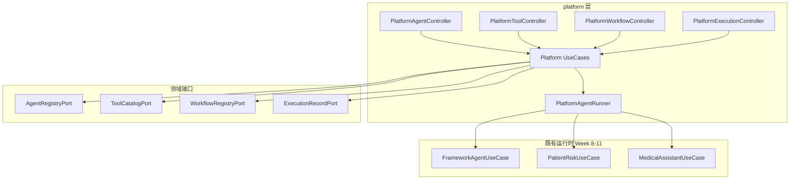

# Spec: Week 12 — Agent 平台 V1（注册 / 配置 / Tool / Workflow / 执行记录）

## Objective

在 `spring-ai-alibaba-agent` 新增 **Agent 平台 V1**：提供 Agent 注册与配置、Tool 目录、Workflow 目录、**执行记录** 的统一 REST 管理面；通过 Platform Run 入口调度既有 Week 8–11 运行时（`FrameworkAgentGraph` / `PatientRiskWorkflow` / `MedicalAssistantSupervisorGraph`）。**不改** 既有 Graph/Workflow 领域逻辑。

## Tech Stack

- JDK 17、Spring Boot 3.4.5、Maven
- 持久化：**进程内内存适配器**（`ConcurrentHashMap`），端口抽象便于后续换 PostgreSQL（YAGNI，单测零外部依赖）
- 复用：Week 8–11 UseCase / Graph / `ToolPort` / `ApiResponse`

## Commands

- 根聚合：`.\run-maven-jdk17.ps1 test`
- 单模块：`.\run-maven-jdk17.ps1 -pl apps/spring-ai-alibaba-agent -am test`
- 启动：`apps/spring-ai-alibaba-agent` 下 `.\run-maven-jdk17.ps1 spring-boot:run`（8084）

## 增量架构

启动时 `PlatformSeedDataInitializer` 预置 3 个 Agent、2 个 Tool、2 个 Workflow。

## API（端口 8084，前缀 `/api/v1/platform`）

| 资源 | Method | Path |
|------|--------|------|
| Agent | GET | /agents |
| Agent | POST | /agents |
| Agent | GET | /agents/{agentKey} |
| Agent | PUT | /agents/{agentKey}/config |
| Tool | GET | /tools |
| Tool | POST | /tools |
| Tool | GET | /tools/{toolKey} |
| Workflow | GET | /workflows |
| Workflow | POST | /workflows |
| Workflow | GET | /workflows/{workflowKey} |
| Execution | GET | /executions |
| Execution | GET | /executions/{executionId} |
| Execution | POST | /agents/{agentKey}/runs |

详见 `docs/api/week-12-api.md`。

## Boundaries

- **Always**：分层 Controller → UseCase → Port → Adapter；Platform Run 写入执行记录；中文 JavaDoc；单测 fake/内存端口
- **Ask first**：PostgreSQL/Flyway；ai-core `WorkflowPort`；改 Week 8–11 直连 API 自动落库
- **Never**：改 `JAVA_HOME`；改 Graph 编排逻辑；密钥入库

## Success Criteria

- [ ] 根聚合 `test` 全绿，Week 8–11 测试不回退
- [ ] CRUD：Agent / Tool / Workflow 注册与查询
- [ ] Agent 配置可 PUT 更新（enabled、maxIterations 等）
- [ ] `POST /platform/agents/{agentKey}/runs` 调度既有运行时并持久化 ExecutionRecord
- [ ] `GET /platform/executions` 可分页/列表查询记录
- [ ] 启动后 seed 数据可 GET 到 3 Agent + 2 Tool + 2 Workflow

## ADR

| 决策 | 选项 | 选择 | 理由 |
|------|------|------|------|
| 持久化 | PostgreSQL / 内存 Port | 内存 Port | YAGNI；8084 模块原无 DB；端口可换适配器 |
| 执行记录入口 | 改所有 API / Platform Run | Platform Run | 最小侵入；Week 8–11 API 行为不变 |
| Agent 运行时 | 动态编译 Graph / 映射既有 Bean | 映射既有 Bean | V1 只管理元数据 + 调度已实现的 3 类 Agent |
