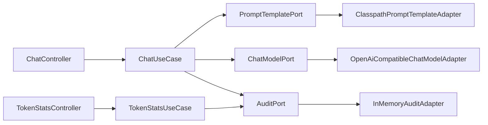

# Week 01 实现日志 — spring-ai-demo 聊天接口

- 日期：2026-08-28
- 批次：1
- 对应 Spec：docs/specs/week-01.md
- 对应阅读：notes/week-01-llm-basics.md

## 1. 本周目标

Spring Boot 聊天接口，OpenAI 兼容模型调用，请求日志与 Token 统计。

## 2. 边界

- Always：校验、system/user 分离、审计、Token 累计、中文 JavaDoc、JDK17 用 `-Djdk.17.home`
- Never：改 JAVA_HOME、Redis、PostgreSQL、RAG、登录

## 3. 增量架构



调用时序见 `docs/specs/week-01.md` 中 sequenceDiagram。

## 4. 新增类型清单

| 类型 | 名称 | 职责 |
|------|------|------|
| UseCase | ChatUseCase / TokenStatsUseCase | 编排聊天与统计 |
| Port | ChatModelPort / PromptTemplatePort / AuditPort | 模型、提示、审计 |
| Adapter | OpenAiCompatibleChatModelAdapter 等 | HTTP / 文件 / 内存 |
| Test | ChatUseCaseTest 等 14 条 | 用例、接口、映射、累计 |

## 5. RED

- 命令：先写测试后补实现（编译期引用缺失类型）
- 结果：失败（预期）
- 原因：生产类型尚未存在

## 6. GREEN

- 改动文件：`apps/spring-ai-demo/**`、`.gitignore`、`docs/specs/week-01.md`
- 命令：`mvn test "-Djdk.17.home=E:\Program Files\Eclipse Adoptium\jdk-17.0.20.8-hotspot"`
- 结果：Tests run: 14, Failures: 0, Errors: 0；BUILD SUCCESS；未改 JAVA_HOME

## 7. 重构

- 做了：Controller 经 TokenStatsUseCase 访问审计，未直连 Port
- 没做：抽公共父 POM（仅一个模块）

## 8. 质量门禁

- [x] 编译
- [x] 单测 14/14
- [x] 无密钥入库（`.env` 已 gitignore，仅 `.env.example`）
- [x] 分层未突破
- [x] public 类型中文 JavaDoc
- [x] 未改 JAVA_HOME

## 9. 验证证据

```
Tests run: 14, Failures: 0, Errors: 0, Skipped: 0
BUILD SUCCESS
Total time: 7.000 s
```

Surefire 实际 JVM：Java 17.0.20。

## 10. 风险与下周输入

- 真实联调需本机设置 `LLM_API_KEY`（不入库）
- 第2周：Prompt 模板管理、JSON 结构、Redis 上下文、三张表

## 11. 决策记录 ADR

| 决策 | 选项 | 选择 | 理由 |
|------|------|------|------|
| 模型 SDK | Spring AI / 手写 OpenAI 兼容 HTTP | 手写 Adapter | 第1周 YAGNI，换厂商只改配置 |
| 审计存储 | 内存 / PostgreSQL | 内存 | 建表是第2周 |
| JDK | 改 JAVA_HOME / `-Djdk.17.home` | 参数 | 系统 JAVA_HOME 留给 JDK8 项目 |
