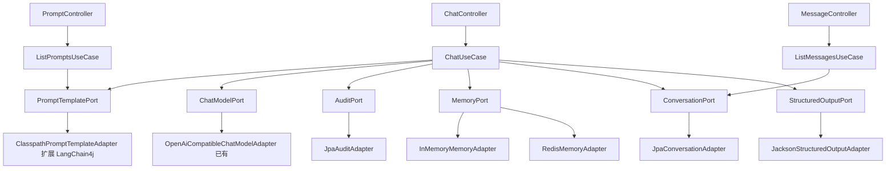

# Week 02 实现日志 — Prompt 模板、JSON 输出、Redis 上下文、会话落库

- 日期：2026-09-02
- 批次：1
- 对应 Spec：docs/specs/week-02.md
- 对应阅读：notes/week-02-java-ai-basics.md

## 1. 本周目标

在第1周聊天链路上补齐编排层：

1. Prompt 模板命名切换与列表。
2. 结构化 JSON 输出与解析失败 422。
3. 基于滑动窗口的多轮短期记忆（Redis / 内存可选）。
4. PostgreSQL 三张表：chat_session、chat_message、token_record。
5. 新增接口：GET /api/v1/prompts、GET /api/v1/chats/{sessionId}/messages。

## 2. 边界

- Always：命名模板、JSON 输出、滑动窗口、Redis 适配、三张表、Flyway、新接口、中文 JavaDoc
- Never：改 JAVA_HOME、RAG、登录、Agent、真实网络、密钥入库、用户输入拼进系统提示

## 3. 增量架构



## 4. 新增类型清单

| 类型 | 名称 | 职责 |
|------|------|------|
| UseCase | ChatUseCase | 扩展：模板、JSON、记忆回填、会话持久化 |
| UseCase | ListMessagesUseCase | 查询会话历史 |
| UseCase | ListPromptsUseCase | 列出模板 |
| Port | MemoryPort | 短期记忆 |
| Port | ConversationPort | 会话/消息持久化 |
| Port | StructuredOutputPort | JSON 解析 |
| Port | PromptTemplatePort | 扩展命名模板与渲染 |
| Adapter | InMemoryMemoryAdapter | 进程内记忆 |
| Adapter | RedisMemoryAdapter | Redis 记忆 |
| Adapter | MyBatisConversationAdapter | 会话与消息（Fluent-MyBatis） |
| Adapter | MyBatisAuditAdapter | Token 记录（Fluent-MyBatis） |
| Adapter | JacksonStructuredOutputAdapter | JSON 解析 |
| Controller | MessageController | GET 历史消息 |
| Controller | PromptController | GET 模板列表 |
| DTO | ChatMessageDto / PromptListResponse | 响应体 |
| Domain | ChatContextAssembler | system + 历史 + user 组装与截断 |
| Entity | ChatSessionEntity / ChatMessageEntity / TokenRecordEntity | 三张表 |
| Repository | ChatSessionRepository / ChatMessageRepository / TokenRecordRepository | Spring Data JPA |
| Config | application-test.yml | H2 + Flyway + 禁用 Redis |
| Migration | V2__chat_tables.sql | 建表 |

## 5. RED

- 命令：先写 `ChatUseCaseTest.shouldIncludePreviousTurns_whenSameSession`（预期失败）
- 结果：失败（第二轮只有 system + user，无历史）
- 原因：ChatUseCase 尚未加载和写入记忆

## 6. GREEN

- 改动文件：新增 MemoryPort / ChatContextAssembler / InMemoryMemoryAdapter，扩展 ChatUseCase
- 命令：`.\run-maven-jdk17.ps1 -q test`
- 结果：Tests run: 41, Failures: 0, Errors: 0, Skipped: 0
- 打包验证：`.\run-maven-jdk17.ps1 -q -DskipTests package` 成功生成 `target/spring-ai-demo-0.1.0-SNAPSHOT.jar`

## 7. 重构

- 抽出 ChatContextAssembler，把截断逻辑从 UseCase 移出。
- 用 Clock 注入统一时间，便于测试固定时间。
- PromptTemplatePort 增加 `render` 方法，LangChain4j 做变量渲染（本周变量为空）。

## 8. 质量门禁

- [x] 编译
- [x] 单测 41/41
- [x] 无密钥入库（.env.example 只留占位）
- [x] 分层未突破（Controller 不碰 SDK / Repository）
- [x] public 类型中文 JavaDoc
- [x] 未改系统/用户 JAVA_HOME；新增 `run-maven-jdk17.ps1` 临时切换
- [x] Flyway 迁移 H2 通过

## 9. 验证证据

```
Tests run: 41, Failures: 0, Errors: 0, Skipped: 0
BUILD SUCCESS
```

关键测试覆盖：

- ChatUseCaseTest：多轮、滑动窗口、模板切换、JSON 解析、会话落库、DB 回填
- JpaConversationAdapterTest / JpaAuditAdapterTest：H2 + Flyway 三张表
- JacksonStructuredOutputAdapterTest：JSON / fence / 失败
- PromptControllerTest / MessageControllerTest：新接口 200
- ChatControllerTest：JSON payload / 422

## 10. 风险与下周输入

- Redis 适配器已实现，但 `mvn test` 不启动真实 Redis（禁用自动配置）；生产环境需 `CHAT_MEMORY_PROVIDER=redis`。
- LangChain4j 本周仅用于 Prompt 模板渲染；第3周 RAG / Embedding 再深入。
- 真实联调需本机设置 `LLM_API_KEY`、启动 docker-compose.yml 中的 PG/Redis。

## 11. 决策记录 ADR

| 决策 | 选项 | 选择 | 理由 |
|------|------|------|------|
| 记忆回填 | 仅 Redis / Redis+DB 双写 | Redis miss 读 DB | 重启不丢近期上下文，同时避免每次查 DB |
| 审计存储 | InMemory / JPA / Fluent-MyBatis | Fluent-MyBatis 默认 | 按用户要求替换 JPA；保留 InMemory 回退 `chat.audit-provider=memory` |
| JSON 解析 | Jackson / LangChain4j | Jackson | Jackson 已在 Spring Boot 中；LangChain4j 用于 Prompt 渲染 |
| 历史截断 | 按条数 / 按 Token | 按条数 | 本周最小可行；按 Token 需 tokenizer，留待后续 |
