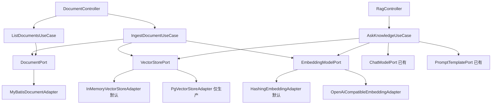

# Week 03 实现日志 — RAG 知识库（文档 → 切片 → 向量 → 检索 → 问答）

- 日期：2026-09-03
- 批次：1
- 对应 Spec：docs/specs/week-03.md
- 对应阅读：notes/week-03-rag-basics.md（待补）

## 1. 本周目标

在聊天链路上打通 RAG 最小闭环，并建立可插拔的 Embedding 层与向量库层：

1. 文档上传 → 解析切片 → 向量化 → 入库。
2. 提问 → 向量化 → 相似度检索 top-k → 注入 DeepSeek → 回答 + 来源。
3. 三个新端口：`EmbeddingModelPort` / `VectorStorePort` / `DocumentPort`，均可替换实现。
4. 新增 `rag` Prompt 模板；`document` 表 Flyway；pgvector 生产迁移（H2 测试不跑）。

## 2. 边界

- Always：全链路、端口可插拔、新增 rag 模板、document 表、RAG 接口带 sources、中文 JavaDoc、单测不打真实网络
- Never：改 JAVA_HOME、密钥入库、用户输入拼系统提示、mvn test 依赖 Docker/pgvector、意图路由、Agent/Tool Calling、登录

## 3. 增量架构



## 4. 新增类型清单

| 类型 | 名称 | 职责 |
|------|------|------|
| Port | EmbeddingModelPort | 文本向量化 |
| Port | VectorStorePort | 切片+向量存储与余弦检索 |
| Port | DocumentPort | 文档元数据持久化 |
| UseCase | IngestDocumentUseCase | 建元数据→切片→向量化→入库 |
| UseCase | AskKnowledgeUseCase | 检索增强问答 |
| UseCase | ListDocumentsUseCase | 列文档 |
| Domain | TextChunker | 固定窗口+重叠切片（纯函数） |
| Domain | RagContextAssembler | 检索片段+问题组装 user 消息 |
| Model | DocumentChunk / VectorSearchHit / DocumentMetadata | 领域值对象 |
| Exception | EmbeddingException | 向量化失败（502） |
| Adapter | HashingEmbeddingAdapter | 离线确定性向量化（默认） |
| Adapter | OpenAiCompatibleEmbeddingAdapter | OpenAI 兼容 embeddings |
| Adapter | InMemoryVectorStoreAdapter | 内存余弦检索（默认） |
| Adapter | PgVectorStoreAdapter | pgvector（仅生产） |
| Adapter | MyBatisDocumentAdapter | document 表（Fluent-MyBatis） |
| Controller | DocumentController | POST/GET /api/v1/documents |
| Controller | RagController | POST /api/v1/rag/chats |
| Config | EmbeddingProperties / RagProperties / RagRuntimeConfig | 配置映射 |
| Entity | DocumentEntity | document 实体 |
| Migration | V3__document_table.sql / db/postgresql/V4__document_chunk_pgvector.sql | 建表 |
| Prompt | prompts/rag-v1.txt | RAG 系统提示 |

## 5. RED

- 命令：`.\run-maven-jdk17.ps1 -q test`
- 结果：编译失败（9 个新测试类引用尚未实现的 `EmbeddingModelPort`、`VectorStorePort`、`DocumentChunk`、`TextChunker` 等符号，报「找不到符号」）
- 原因：生产代码未实现，属预期的编译期 RED（测试先于实现，且失败源于缺失实现而非语法错误）

## 6. GREEN

- 改动文件：domain（模型/端口/切片器/组装器）、application（3 个用例）、dto（7 个）、controller（2 个）、infrastructure（5 个适配器 + 实体 + 2 个配置类）、config（DemoConfiguration 扩展）、GlobalExceptionHandler（新增 EmbeddingException → 502）、application.yml/application-test.yml、V3/V4 迁移、rag-v1.txt
- 命令：`.\run-maven-jdk17.ps1 test`
- 结果：`Tests run: 76, Failures: 0, Errors: 0, Skipped: 0`，`BUILD SUCCESS`
- 打包验证：`.\run-maven-jdk17.ps1 -q -DskipTests package` 成功

## 7. 重构

- 切片逻辑收敛到纯函数 `TextChunker`，与用例解耦，可独立单测。
- 检索上下文组装收敛到 `RagContextAssembler`，问题始终以 user role 传递。
- 配置映射沿用第 2 周 `ChatRuntimeConfig` 模式，新增 `RagRuntimeConfig`，用例不读 Environment。

## 8. 质量门禁

- [x] 编译（`-DskipTests package` 成功）
- [x] 单测 76/76
- [x] 无密钥入库（`EMBEDDING_API_KEY` 仅环境变量；源码无 sk-/硬编码密钥）
- [x] 分层未突破（Controller 无 SDK/SQL；业务层无 SQL）
- [x] public 类型中文 JavaDoc
- [x] 未改系统/用户 JAVA_HOME；沿用 `run-maven-jdk17.ps1`
- [x] Flyway H2 迁移通过（仅 V2/V3）

## 9. 验证证据

```
Tests run: 76, Failures: 0, Errors: 0, Skipped: 0
BUILD SUCCESS
```

新增测试覆盖：

- TextChunkerTest：非重叠/重叠/空白/单块/重叠等于窗口
- HashingEmbeddingAdapterTest：维度、确定性、归一化
- InMemoryVectorStoreAdapterTest：余弦排序、空库、topK
- PgVectorStoreAdapterTest：向量文本格式、insert/search SQL（mock JdbcTemplate）
- IngestDocumentUseCaseTest：切片向量化入库、空白校验
- AskKnowledgeUseCaseTest：检索注入上下文、空库回答、空白校验
- DocumentControllerTest / RagControllerTest：接口 200/400
- MyBatisDocumentAdapterTest：H2 仓储建/查

## 10. 风险与下周输入

- pgvector 适配器与 `db/postgresql/V4` 迁移只在真实 PostgreSQL 生效；`mvn test` 不启动它（同第 2 周 Redis 策略）。生产需 `RAG_VECTOR_STORE=pgvector` 且安装 pgvector 扩展。
- 语义向量化需 `EMBEDDING_PROVIDER=openai` + `EMBEDDING_API_KEY`；默认 hashing 仅用于跑通链路，非语义检索。
- RAG 问答暂未写审计（token_record），跨端口入库非事务（入库中断可能产生孤儿切片）；留待第 4 周企业知识库 Agent 补齐事务与 Token 统计。
- 切换 `PgVectorStoreAdapter` 持久化后，换 embedding 模型（维度变化）= 对 `document_chunk` 全量重调 API；需处理批量调用（控 QPS）、幂等/断点续传、增量重算，留待第 4 周企业知识库 Agent 一起设计。
- 意图路由（先识别意图再决定是否检索）属第 5 周 Agent，本周未做。
- OCR 文本清理：千帆 markdown.text 里的图片占位符 `<div>` 会被固定窗口切片从中间切断，产生 HTML 碎片混入向量化、稀释语义并污染 sources（实测 score 最高仅 0.71）；需在切片前清理图片占位符，留待第 4 周（与文件存储功能合并，用上传后标识替换图片 URL）。
- pgvector 未接通：当前 `RAG_VECTOR_STORE=memory`，向量存内存不落库，`document_chunk` 表未建（pgvector 扩展权限/安装未解决，报 42501/42704）；接通 pgvector 后向量才进 document_chunk 表，第 4 周需补齐扩展安装与环境准备。

## 11. 决策记录 ADR

| 决策 | 选项 | 选择 | 理由 |
|------|------|------|------|
| Embedding 供应商 | 真实供应商必接 / 可插拔端口 | 可插拔端口 + hashing 默认 | DeepSeek 无 embedding；离线确定性实现可跑通全链路并单测，真实走 openai |
| 向量维度 | 可配置 / 固定 | 固定 1024 | 与 pgvector 列一致；qwen3.7-text-embedding-flash 默认维度，避免配置漂移 |
| pgvector 迁移位置 | db/migration 子目录 / 独立目录 | 独立目录 db/postgresql | Flyway 递归扫描子目录，放 db/migration 下会被 H2 测试误跑 |
| 文档元数据与向量 | 单端口 / 分端口 | DocumentPort + VectorStorePort 分置 | 接口隔离；正文+向量与元数据职责不同 |
